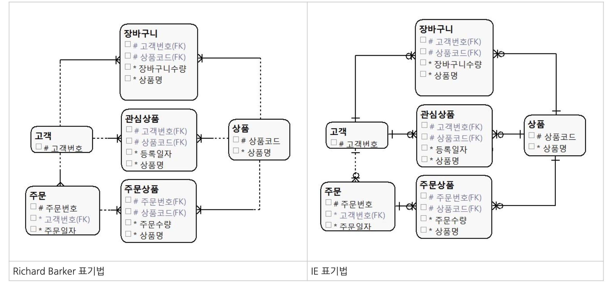
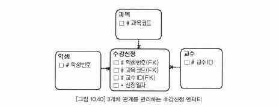
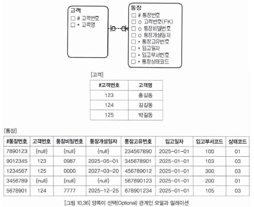
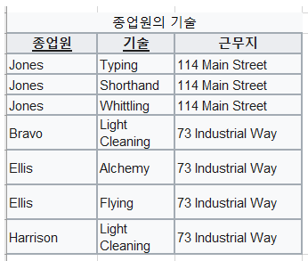

# ERD
Entity Realationship Diagram

# 툴
- erwin : 유료
- erdcloud.com :
  노란색은 pk추가, 파란색은 기본컬럼 추가
  상단아이콘은 테이블복사, 테이블색, 테이블정보, 삭제
  자동으로 쿼리를 만들어주는데 부모가 없는데 자식을 먼저 생성하는 등 순서가 안맞는 경우, 해당 RDBMS에서 지원하지 않는 함수를 쓰거나 등의 문제가 있어서 한방에 정상 실행안되므로 조금 수정해줘야한다.
  fk가 있는놈들을 나의 pk지정할때 하나씩 분리되어있는데, 로 이어줘야한다.
  1064 SYNTAX ERROR 뜨는데 만들어진 쿼리에 첫번째 CREATE 문에 이상한 스페이스가 숨어있다.

    <details>
    <summary>여러개 테이블에서 foreign키 설정하는법</summary>
    <div markdown="1">
    ALTER TABLE `brand_coffee`
    ADD CONSTRAINT `FK_brand_TO_brand_coffee_1`
    FOREIGN KEY (
       `brand_id`
    )
    REFERENCES `brand` (
       `brand_id`
    )
    ,
    ADD CONSTRAINT `FK_brand_TO_brand_coffee_2`
    FOREIGN KEY (
       `class_id`
    )
    REFERENCES `coffee` (
       `class_id`
    );


    insert into brand
    (brand_id, brand_name, brand_content, brand_logo)
    values
    ("starbucks", "스타벅스", "세계최대의 커피브랜드", "스타벅스 로고");

    insert into coffee
    ( class_id, class_name, class_content, class_img)
    values
    ("americano", "아메리카노", "커피의 기본", "아메리카노");


    insert into brand_coffee
    (brand_id, class_id)
    values
    ("starbucks", "americano");
    </div>
    </details>
- draw.io
- Exerd

# 좋은 사이트
- https://helloblog.net/%EC%82%AC%EC%9A%A9%EC%9E%90-%EA%B6%8C%ED%95%9C-db-%EB%AA%A8%EB%8D%B8%EB%A7%81/
- [엔코아 이화식](https://www.youtube.com/playlist?list=PL9gStYgm-otNZQpj2lQsOSRuiwwtEftiE)
- [생활코딩 관계형데이터베이스](https://www.youtube.com/playlist?list=PLuHgQVnccGMDF6rHsY9qMuJMd295Yk4sa)
- [OKKY ERD](https://www.erdcloud.com/d/PK2Ae7d4asTRqHpHx)


# 좋은설계
- 높은 응집도(cohesion). 낮은 결합도(coupling) => 업무의 변화에 최대한 영향을 적게받는 유연한 시스템
  좋은 설계 : 변경사항이 들어오면 변경사항만 바꾸면 되는 시스템.
          키보드만 고장나면 키보드만 갈아끼우면 되는시스템
          스페이스바만 고장나면 스페이스바만 갈아끼우면 되는 키보드.
          스페이스바가 고장나면 스페이스바만 갈아끼울수있는 키보드
  안좋은 설계 : 변경사항을 처리하기위해 기존의 잘되던것들도 뜯어 고쳐야 하는 시스템.
          키보드만 고장나면 컴퓨터를 교체해야되는 되는시스템
          스페이바가 고장나면 키보드 전체를 갈아야되는 키보드


---
# 모델링
- 정의
  복잡한 현실에서 우리가 관리할 정보를 정확히 규명하여 단순명료하게 핵심만 뽑아서 만들어내는 것.
모델링이 아무리 복잡해도 현실이 훨씬 복잡하다.
일반인이 아파트 설계도를 보면 복잡하다고 하지만 아파트 공사짓는 사람이 설계도를 보면 빠진게 많다고 불평할거다. 엔드유저는 매우 간단한 도면을 받는다.
프로그래머는 아파트를 사는 사람이 아니라 짓는사람이다.
초갓집을 지을때는 간단한 평면도 또는 설계도가 없이도 집을 지을수 있다.
그러나 대형빌딩을 지을때 설계도는 없어서는 안되고 웬만한 설계도로는 집을 지을수 없다.
창문이 어디에 있다 정도가 아니고 mm단위로 너비, 높이, 두께, 재질, 설치위치 등이 다 명시되어 있어야한다.
- '어떤 모델을 만들어야겠다' 라고 미리 생각하지 않는다. 모델링은 결과의 툴이 아니라 과정의 툴이다.
유능한 수사관은 범인이 누구인지 알고 잡지 않는다. 현장에서 하나씩 알아가면서 완성해나가는것이지 알고나서 그리는것이 아니다. 즉, 업무를 몰라도 할 수 있다는 말이다. 어느누구도 그 회사의 업무를 다 알수없다.
백지상태로 가서 해당업무를 아는 담당자에게 묻고 확인해가며 이끌어내는것이다.
- 객관화 되어야 한다. 누구도 꼼짝 못할 논리가 있어야 한다.
- 판단력이 있어야한다. 맞고 틀리는게 아니다. 최선의 답을 찾아나가는 과정이다.
  모델링적으로는 90점짜린데 개발까지 감안하면 10점짜리일수 있다.
  데이터베이스를 모르면 그 판단을 못한다.
- 방법을 안다고 해서 실제로 모델링을 할 수 있게 되는것이 아니다. 그래서 어렵다.
- 스포츠 선수는 선수로서의 기간은 짧고 이후에 코치나 감독이 된다. 모델러는 프로그래머의 노후에 가기 좋은 길이다.
모델러는 오케스트라의 지휘자다. 아무소리도 안내지만 모든 소리를 조율한다.

- 데이터가 더러우면 프로그래머가 고생한다. 그걸 다 프로그램단에서 제어해줘야 되기 때문에. 데이터가 단순하고 깨끗하면 초급도 일할수 있고 일을 시키기도 쉬워진다.
- RDB가 생기기전에는 어떤 설계를 하더라도 속도가 비슷비슷했다. 그러나 RDB는 설계에따라서 속도가 100배넘게도 차이난다.
- 현재만 봐서는 안된다. 요구는 계속 바뀌거나 생겨날것이고 직원과 회사는 변화고 사회적인 상황도 변한다. 그것들을 생각해서 설계해야한다.
- 정보는 연결되어있어야 한다. 어디에도 연결되지 않고 뚝 떨어진 정보는 없어야 한다.
- 데이터는 기업의 자산이다. 그런데 이력관리가 안되게 설계해놓은곳이 너무 많다.
예를들어 부서를 옮겼으면 현재부서만 저장되는것이 아니라 이대까지 언제 어디로 옮겼는지 내역이 저장되어 있어야한다.

- ### 목적
  - 업무내용의 정확한 분석
  - 실제 데이터베이스를 생성하는 기초

- ### 방법
  1. 기능모델링 먼저
  가장 일반적인 방법
  기능에 따른 데이터의 흐름인 DFD(Data Flow Diagram)를 보고 데이터모델설계.
  DFD는 추상적, 흐름적, 계층적이다.
  이 방법의 문제는 기능에 따라 데이터가 종속된다는 점이다.
  기능이 바뀌면 모델이 바뀌게 된다.
  급여와 사원의 데이터 구조는 유지한채로 주는 방법이 바뀌어야 되는데 주는 방법이 바뀌게 되면 데이터 구조가 바뀌게 된다.

  1. 병렬로 동시 진행
  주로 대형프로젝트에서 사용
  반드시 다수의 전문가가 있을때 사용해야 한다.
  전문가는 자기일만 잘하는것이 아니라 자기일에 영향을 미칠 요소들을 다 관리한다.
  그래서 각 분야의 전문가들이 긴밀하게 연결되어 타분야의 이상요소를 빨리 감지하여야 한다.

  1. 데이터모델링 먼저
  객관적, 구체적, 흐름없음
  업무를 잘 모르는 시점에 할 수 있어야 하기 때문에 전문적인 모델러가 필요하다.
  가장 이상적인 방법이다.

---
### 중요한 사항들
- 데이터 모델에는 시간개념이 없다. 프로세스가 아니다. 흐름이 있는게 아니다.
- 어떤 사원이 월급을 받았든 안받았든 상관이 없다. 사원과 월급과의 관계만 정해주는거다.
- 예외에 계속 집중하지 마라. 언젠가는 그얘기를 할때가 온다. 그때해야한다.
- 모델링은 무조건 1촌관계만 그려준다. 삼촌사촌 등은 명시하지 않아도 관계에 의해서 저절로 정해진다.
- 풍경을 2시간동안 열심히 머릿속에 저장하고 집에와서 그리면 그게 풍경화인가?
아무리 업무 설명을 잘듣고 정리하고 와도 집에와서 그걸 그리면 그게 뭔가
현장에서 실제 업무속에 들어가서 실시간 피드백을 들으면서 모델링을 해야한다.
- 주관이 들어가지 않고 있는 그대로를 찍는 사진이 있고, 주관적인 느낌을 담아 작품을 만드는 사진이 있다.
모델러는 작가다. 모델은 작품이다. 지금의 상황 그대로를 그려내는일을 하는것이 아니다.
- 업무가 내 한계를 벗어난다면 한층을 한번에 못올라가서 계단을 놓듯이, 내가 감당할수있는 단위로 잘게잘게 쪼개서 단위별로 완성하고 합치면 된다. 그러면 아무리 높은곳이라도 올라갈 수 있다.

---
## 팁
- 4개컬럼은 거의 모든 테이블에 들어간다.
(생성일, 생성자, 수정일, 수정자)
- 계산으로 가져올수있는 테이블은 컬럼으로 만들지 않는다.
- 날짜 이런식으로 말고 무슨날짜인지 명확하게 인지되도록.
-

# 무결성 제약조건 5가지
- NOT Null   = 빈값이 들어가선 안된다.
- unique    = 해당테이블에서 유일하게 존재해야함. 단, NULL은 여러개 있을수있음
- PRIMARY Key(기본키)  = unique && not null. 한행을 식별하기위한 기준
    - PK는 유니크와 낫널이다. (O)    유니크와 낫널이면 PK다.(X)
- FOREIGN Key(외래키)  = 참조하는 테이블(부모)에 존재하는 값들만 사용해야 함
- CHECK   = 조건에 부합하는 데이터만 입력 가능
---
# Entity (엔티티)
- 엔티티는 **집합**이다.
  (중요)메인엔티티는 **개체**든 **행위**든 하나의 순수한 집합이여야 한다.
  집합은 정의 가능한 사물 또는 개념을 의미한다. 그러나 집합이라고 다 엔티티는 아니다.
  예를 들어 '납입자'는   납입이라는 엔티티와 사람이라는 엔티티가 연결된 관계다.  '청구서' 이런거 마찬가지겠지.
- 엔티티가 잘 못뽑는다면 정의가 잘 안됐기 때문에 그런것이다.
- 엔티티 이름 짓기 매우 중요하다. 누가보더라도 어떤 집합인지 명확하게 느껴지도록.
- ### 순서
  **후보 엔티티** 뽑기 -> **키 엔티티**(부모가 없이 자기 스스로 탄생가능) -> **메인엔티티**(업무의 중심) -> **자손엔티티**
- 프로그램과 화면에서 가장 많이 다루게될것은 자손엔티티가 될것이다. 근간이 되는 데이터는 잘 변하지 않는다.
- 디비설계는 이 모델링을 가지고 데이터베이스의 테이블 형태로 변환하는 비교적 기계적인 일이다.

- ### 엔티티인지 검증(판별 규칙)
1. 동질성을 가진 집합인지(정의한 집합 테두리에 포함되는지)
1. 독립성을 가진 집합인지(부분집합이 아니여야하고 교집합이 없어야 한다.)  엔티티끼리 교집합이 생긴다면 문제가 생긴거다. 예) 가입자, 납입자
1. 가로*세로로 면적이 되어야한다.
가로(속성)가 2개이상이고, 세로(데이터)가 2개 이상이어야 한다.
1. 행위엔티티와 개체 엔티티를 합친 엔티티는 분리해야된다.
1. 최소한 하나이상의 다른 엔티티와의 관계를 가지는지
1. 식별자가 있어야한다.

---
# 기본키
- **한 테이블의 유일함을 결정짓는 속성**
- 한테이블의 기본키는 하나의 컬럼에만 지정할수있다? 맞을까? 틀릴까?
- "테이블은 오직 하나의 기본키를 가질 수 있다." 이건 정확한 정의다.
그런데 그 말을 "테이블의 PK는 오직 하나의 컬럼으로만 설정할수있다" 라고 잘못이해하는 경우가 대부분이다.
기본키는 여러개의 컬럼의 복합키로 구성될수 있다.
```
예를들어 '판매실적'을 저장하는 테이블이 있다.
어떤 판매실적을 하나의 행으로 다룰건지 그 목적에 따라 기본키가 달라지진다.
총 컬럼은 날짜, 영업사원(판매자), 판매제품, 판매처, 판매처직원, 판매제품의하나당가격, 판매제품의 수량  이 있을때
우리는 누가, 언제, 어디에, 어떤 제품을 팔았는지에 대한 판매실적을 담고 싶다고 하자.

2021-08-18-14시, 배성원, 리모콘, 흥국생명, 홍길동, 50만원, 100개
PK는 뭘로 지정해야할까?
여기서 PK가 하나가 된다면 어떻게 될까? 예를들어 영업사원이 PK이면? 판매사원별로 판매실적을 저장하는 테이블이 되는것이다.
한사람이 한날짜에 한번씩만 기록되도록 날짜와 사원번호를 넣으면? 그 사원은 판매실적을 한날짜에 한번밖에 저장 못하게 된다.
마찬가지 원리로
  같은날짜에 한사람이 하나밖에 등록하지 못하면 안되니까 판매처 추가
  같은날짜에 한사람이 한판매처에 한번밖에 등록하지 못하면 안되니까 제품 추가.
결국 날짜, 사원번호, 판매처, 제품명 4개의 조합이 복합키가 되어야 한다.
```
후보키는 유일성과 최소성을 만족시켜야함

## 인조키
마땅한 자연키가 없거나 복합키가 너무 많을때 편의를 위해 자연적이지 않고 인공적으로 부여한 키를 말한다.
PK가 너무많은 컬럼으로 구성되면 조인할때 너무 불편하다.
(조인할때는 유일한 식별을 위해 식별되는 모든컬럼을 WHERE조건에 걸어줘야 되기 때문에.)

예) 글번호, 주민등록번호
- ※주민등록번호를 회원테이블의 pk로 잡으면 생기는 문제
갑자기 주민등록번호를 보안정책에 의해 별도로 암호화해서 보관해야합니다? 하면 피똥쌈.
여기저기서 유저 참조할때 FK로 사용했다? 프로그램 전체를 다 갈아엎어야됨.

## 참조키
	- FK가 정의된 테이블이 자식 테이블이다.
	- 참조되는 테이블은 부모 테이블이다.
	- 부모테이블은 미리 생성되어 있어야 한다.
	- 부모테이블에 존재하는 값만 입력가능하도록 하는 제약조건이다.
	- 부모테이블을 참조하는 자식데이터가 있으면 부모 데이터를 지울수 없다.
		- ON DELETE CASCADE : 부모의 행이 지워지면 자식의 행도 같이 지워진다.
		- ON DELETE SET NULL : 부모의 행이 지워지면 자식의 행은 NULL이 된다.
  - 데이터타입이 반드시 일치해야한다.
  - 참조되는 컬럼은 PK 또는 UNIQUE여야 한다.
  - 비식별관계로 FK가 걸리면 ERD상에는 보이지만 실제 제약조건으로는 안걸린다.
---
# 모델링의 순서
- 요구사항 분석 -> 개념적 모델링(주제별 핵심엔티티, 관계) -> 논리적 모델링(정규화. 모델링의 핵심) -> 물리적 모델(실제컬럼명, 데이터타입, 길이, 실제저장공간, 분산, 인덱스 설계, 성능최적화) -> DB스키마 구현후 스크립트 파일로 보관 -> 테스트데이터 입력
- 논리적 모델링까지는 어떤 데이터베이스를 쓸건지는 전혀 생각하지 않는다.
[좋은예제](https://rutgo-letsgo.tistory.com/138)

- 실무에서 가장 요긴하게 사용될 논리모델과 주제영역은 완전하게 연결되는것이 이상적.
- 주제영역이란 기업이 사용하는 데이터의 최상위 집합. 예를들어 인사, 자재, 판매, 재무 등
- 논리적 모델링이 전체 모델링 과정중 가장 오랜시간이 소요된다.
- 논리모델링에서는 속성명을 한글로 표현한다.

 - 논리 모델링에서 물리 모델링으로 넘어오면서 고려하는 작업
   -Super/Sub 관계의 엔티티를 몇 개의 테이블로 만들 것인가
   -배타적(Arc) 관계 엔티티의 외부키(Foreign Key)를 몇 개로 할 것인가
   -성능 향상을 위해 테이블을 추가해야 할 것인가 혹은 통합해야 할 것인가
   -통계 작업을 위해 합계(Summary) 테이블 같은 임시성 테이블을 몇 개로 할 것이며, 유일키를 무 엇으로 할 것인가
   -테이블의 칼럼을 다른 테이블에 중복할 것인가, 중복한다면 어떤 애플리케이션이 관련되어 있는 가, 인덱스의 설정, 스냅샷(Snapshot) 또는 뷰(View) 등의 객체가 필요한가
   -분산 환경에서 테이블을 중복할 것인가, 중앙에 필요한 테이블을 따로 가져갈 것인가
   -데이터가 분산 환경에서 이동 시 문제를 어떻게 해결할 것인가


 - 속성의 추가 VS 엔티티의 추가
   우리가 했던거 기능5를 넘어서는 기능이 추가되면 계속 컬럼을 추가하는 작업을 해줘야했잖아. (배경을 모른다면 색깔로 생각하자.)
   이것을 모델1이라고 하자.
   그래서 기능테이블을 따로 뺐는데 이걸 모델2라고 하자.
   모델1에서 모델2로 진화한것이 아니다. 어느모델이 더 좋고 나쁜것이 아니라 우리 상황에 더 적합한것이 좋은거다.
   모델1은 직관적이다.
   모델2는 추상화되었다. 확장이 쉽다.


# 데이터 설계
데이터 모델을 그릴때는 '행위(동사)', '대상(목적어)', '주체(주어)'를 구분하라.
예) 행위에 의한 관계 : 강사, 강의한다, 수강생.
예) 존재에 의한 관계 : 사원, 소속된다, 부서
DB모델링이라는것은 데이터의 관계를 눈으로 볼수있도록 모델링하는것.

## ER모델
  Entity Relationship Model.    ERD의 D는 Diagram
  요구사항으로부터 얻어낸 정보들을 개체, 애트리뷰트, 관계성으로 기술하는 개념적 데이터 모델.

  학생 한명은 개체(Entity),  네모(□)로 표현. 후에 테이블이 된다.
  개체가 갖는 속성(Attribute)는 원(○)으로 표현. 후에 컬럼이 된다.
  개체간의 관계(Relation)는 마름모(◇)로 표현. 후에 pk와 fk가 된다.


  바커표기법가 IE표기법이있다. 김이사님이 쓰는건 IE표기법.
  바커표기법은 한쪽에서 나가고, 다른쪽에서 나간걸 합친것.
  


## [관계](http://wiki.gurubee.net/pages/viewpage.action?pageId=26743462)
  IE표기법을 기준으로 설명.
  관계는 무조건 그 행을 유니크하게 구분할 수 있어야 하기 때문에 조인할때 한쪽의 테이블 기본키에 해당하는 컬럼을 모두 가져와야 한다.
  관계는 존재에 의한것인가 행위에 의한것인가 2가지로 구분된다.
  관계명(Membership), 관계차수(Cardinality), 관계선택사양(Optionality) 3개를 표기해줘야한다.
  애매한 동사를 피하고 현재형으로 표현한다.
  예)


## Cardinality(카디널리티). 관계차수. Degree
- 3가지 1:M,   M:M,   1:1
- 1은 세로선, N은 까치발로 표현
- 예) 1:1 담임, 교실,    1:N 글-댓글,  부서-사원    N:M 주문, 제품
- 1:M관계가 90%. 수평관계보다 수직관계가 많다.
  1:N 관계는 자식테이블에 FK로 집어넣어 관계를 표현한다.
- M:M관계는 모델링이 진행되는 과정의 덜풀린것이다. M:M은 최종물리모델에서는 구현될 수 없기 때문에 모델링이 끝나면 M:M관계 없어야한다. 다대다 관계를 실제로 구현하기 위해선 각 테이블의 PK를 FK로 참조하고 있는 **연결테이블**(**관계테이블**, **관계해소테이블**)을 사용해야 한다.
        M:M관계에는 업무가 녹아있는 거다. 업무의 깊이가 깊으면 M:M을 풀면 계속해서 M:M이 나온다.
        M:M을 관계에서 관계엔티티로 언제 풀거냐 하는걸 잘 결정해야한다.
    )

2개체 M:M


3개체 M:M


3개체 M:M해소


## Optionality
연관되는 엔티티의 값이 반드시 존재해야하는지(Mandatory), 존재하지 않아도 되는지(Optional)를 의미
없어도되면 Optional의 동그라미로 표현


아래그램과 같이 양쪽이 선택이면 의무적인 관계가 없는것과 마찬가지이지만 연관관계는 존재하므로 관계선을 삭제하는것은 바람직하지 않다.

상위엔티티쪽의 옵셔널리티가 필수가 되는것이 좋다.
아래와같이 바꾸면 통장과 고객, 고객에게 발급된 통장이 되어 엔티티의 성격이 명확해진다.


대부분의 경우 1:n관계에서 n쪽에는 optional이 붙게 된다.이는 물리적 구현이 어려워서이기도 한다.

관계는 Cardinality, Selectivity, 방향 이 세 가지 요소로 구성된다. 기호가 어디에 붙냐가 정말정말 헷갈리는데 **목적어 방향**에 붙는다고 생각하자.

주어쪽은 하나(One) 또는 각(Each)로 읽는다.
목적어쪽은 아래와같다.
( 목적어쪽에 선 하나 : 하나의 A는 하나의 B로 구성되어있다,
  목적어쪽에 삼발이 : 하나의 A는 N개의 B로 구성되어있다.
  목적어 쪽에 허수아비 : 하나의 A는 0개 또는 1개의 B로 구성되어있다,
  목적어쪽에 O에삼발이 : 하나의 A는 0개 또는 N개의 B로 구성되어있다.
또 쉽게 알아낸것은 수많은 자식들이 당신만 바라보고있어요. n:1관계. 1쪽이 부모. 많은놈이 1쪽을 참조한다.)

    예) 부서는 사원을 여러명 가진다. 사원쪽에 까치발.
       사원은 하나의 부서에만 소속될수있으면 부서쪽에 한발.
       사원이 여러 부서에 소속될수 있으면 부서쪽에 까치발.
       사원은 한개의 부서에 반드시 소속되어야 하면 선하나.


### 실제 구현
관계는 PK와 FK로 구현된다.
1:N은 볼것도없이 1쪽의 PK를 N쪽이 FK로 가져가면 된다.
1:1은 누구에게 FK를 줄지 애매하다. 의미를 뜯어봐야한다. (회원, 휴면회원 테이블)
N:M은 어디에 PK, FK를 주더라도 모순이 생기기 때문에 즉, 실제로 불가능하기 때문에 중재자가 필요하다.

###설계의 정합성은 형식으로 판단한다.
내용(데이터)는 이해를 돕기위한 참조일뿐.
그래서 설계를 잘하려면 업무를 몰라야 한다라는 말이 있다. 추상화된 형식으로 확장성 높도록.
더이상 추가할게 없는것이 아니라 더이상 제거할것이 없을때 설계가 완성된다.
###설계는 제약의 표현이다.
제약하지 않은건 다 가능하다고 봐야한다. 고객이 거기에 0 안들어와요, null 안들어와요. 이런거 믿지말고 시스템적으로 제약을 해야한다. 반드시. 안그럼 뒤통수 세게 맞는다.

## 식별관계와 비식별관계(실선과 점선)
- ## 식별관계 = ## 실선
  Identifying Relationship. 부모가 없으면 존재할수 없는 관계.
  데이터의 정합성(자식테이블에 데이터가 있으면 부모에 반드시 있음을 보장)
  키상속. 부모의 pk가 자식의 pk로 들어오는 경우.양쪽의 키가 모두 기본키일때.
         반드시 부모엔터티가 있어야 자기자신의 엔터티가 생긴다.
         키를 상속했다는 말은 너의 모든 데이터를 내가 빠짐없이 사용하겠다는 말.
	부모데이터가 자식어딘가에서 참조되고 있다면 못지운다.
	자식데이터는 지울수있다.
  요구사항이 변경되었을경우 구조변경이 어렵다.
  1:m관계가 계속 식별로 연결된다면 자식으로 갈수록 pk의 갯수가 계속 늘어나는 문제가 있다.

- ## 비식별관계 = ## 점선
  참조하되 기본키가 아닌 일반키로 참조.
  변경되는 요구사항을 유동적으로 수용할 수 있다.
  부모데이터와 독립적인 자식 데이터를 생성할 수 있다.
  데이터 정합성을 지키기위해 별도의 비지니스 로직이 필요하다.
    (부모의 pk만 가져오는것이지, 부모의 일반컬럼들을 자식엔터티로 내려받는다는 보증이 안되었기 때문에 정확한 정보를 위해서는 안해도되는 조인을 해야된다.)
  키상속 아님.부모의 pk가 자식의 일반속성이 되는 경우. 한쪽만 기본키일대.
         부모가 없어도 자식이 생길수있다. 자식은 남기고 부모가 먼저 소멸될 수 있다.
	부모데이터, 자식데이터 제각각 지울수있다.
  (즉, 데이터 무결성을 보장하지 않으며 자식데이터가 존재해도 부모데이터가 없을수있다는 말)

- 식별관계와 비식별관계중 무엇을 선택해서 연결하는지는 높은 내공을 요구한다.
기본적으로는 다음조건에 해당할 경우 비식별자관계로 만들면된다.
약한관계, 자식테이블의 독립적pk가 필요, sql이 너무복잡하게 만들어져서 개발생산성이 저하됨.
ERD클라우드에서 비식별관계는 실제 물리적으로는 구현되지 않는다. 설계를 보고 화면에서 콤보박스를 만들든가 하는식으로 해결. 반드시 정합성을 유지해야하는 경우만 식별관계를 쓰고 웬만하면 비식별로 설계하는 것을 권장.


- 선택적 비식별관계와 필수적 비식별관계
  NULL이면 선택적 비식별관계
  NOTNULL이면 필수적 비식별관계
  선택적 비식별관계는 NULL을 허용하므로 조인할때 외부조인을 사용해야 한다.
  필수적 비식별관계는 NOT NULL로 항상 관계가 있음을 보장하기 때문에 내부조인만 사용해도된다.

  => 필수적 비식별관계를 하느냐 식별관계를 하느냐의 판단 기준
  1. 식별관계로 묶다보면 자식테이블의 기본키 컬럼이 점점 늘어난다.
  결국 조인할때 SQL이 복잡해지고 기본키 인덱스가 불필요하게 커질수 있다.
  자연키컬럼의 조합일경우 식별관계가 좋고
  인조키(대리키)일경우 필수적 비식별관계가 좋다. 비지니스 요구사항은 시간이 지남에 따라 변하기 때문.
  2. 데이터의 정합성이 중요할경우 식별관계
  예) 수강내역은 학생이 없다면 존재의 의미가 없다. 그리고 하나의 학생은 여러 수강내역을 가질수있다.

## ERD표기법
- Baker표기법(DA#)
  DA표기법은 영국 컨설팅회사 CACI에 의해 처음 개발되었고 리차드 바커에 의햇 지속적으로 업그레이드 되었다. 오라클에서 Case Method로 채택하여 사용.
  Mandatory 반드시 저장해야될 속성에는 *로 표시, 일반적인 Optional속성에는 o로 표시.
  관계는 실선을 잘라서 반반씩 표현한다.
- IE Notation표기법(ERWin)
  IE표기법은 Information Engineering Notation은 1981년 발표되었고 80년대 중반 James Martin에 의해 체계가 정리되어 본격적으로 활용되었다. 까마귀발 모델(Crow's Foot Model)이라고도 한다.
  식별자는 식별선 위에 따로 표기한다.

---
### 함수적 종속성
- X(결정자)의 값을 알때 하나의 Y(종속자)를 바로 식별할수 있는 관계
  X가 Y를 함수적으로 결정한다.  Y는 X에 함수적으로 종속되어 있다.
  A는 B라는 한명의 파트너만 만나야 하고, B는 여러파트너를 만날수 있을때 A는 B에 종속적이라고 표현한다.
- #### 부분적 함수 종속
  속성집합 Y가 속성집합 X의 전체가 아닌 일부의 키에도 함수적으로 종속된다.
- #### 이행적 함수 종속
  말이 어려운데 삼단논법 같은것이다.
  학번 -> 학부, 학부 -> 등록금 일 경우 학번 -> 등록금은 논리적으로는 말이 되지만,
  학부에 따라 등록금이 결정되는 것이지 학번에 따라 결정되는것은 의미상 이상하다.

---
## 슈퍼타입과 서브타입
(Extended ER모델. 확장적 개체-관계 다이어그램)
부자관계가 아니다. 부분집합관계.   예) 고객테이블의 개인고객, 법인고객.  별도의 엔티티가 생성되지 않는다.
->논리적 모델링에서 테이블을 설계할때 각각의 테이블로 설계하는 방법이 있고 슈퍼타입/서브타입으로 설계하는 방법이 있다.
엔티티를 일반화 하면(공통점을 묶으면) 슈퍼타입이 생긴다. 상세화하면 서브타입이 생긴다. 서브타입은 슈퍼타입의 부분집합이다. 즉 중복속성을 제거하기 위해 슈퍼타입으로 만든다.

슈퍼타입과 서브타입의 구분자를 통한 관계는 1:0,1관계다.
즉, 1:n관계가 되면 그건 슈퍼타입, 서브타입 관계가 아니다.
슈퍼타입 서브타입은 is a 관계다. 개는 동물이다.
마스터 디테일 관계와 헷갈리지마라. 마스터 디테일은 1:0,1,n관계지.
마스터 디테일은 has a 관계다.  폴더, 파일 개념.  폴더는 파일을 가지고있다.
1:0,1,n 관계를 1:1,n 관계로 강제할수있는 물리적인 constraint는 없다. 예를들어 마스터를 넣으면 반드시 디테일을 넣어야 한다. 이런 제약은 디비상으로 못건다.
때문에 erd에서 1:1,n관계로 표현되어도 물리적으로는 사실 다 1:0,1,n관계다.

어떤 서브타입이 적합한지를 결정해주는 속성을 **구분자**라고 부른다.
예를들면 고객테이블의 고객구분코드에 의해서 개인테이블과 법인테이블이 구분된다.
그리고 대부분 subtype 구분자는 하드코딩 된다. 테이블로 쪼갰어도 테이블명을 하드코딩할수밖에 없는것과 마찬가지.
ERwin은 슈퍼타입과 서브타입을 자동으로 변환해주는 기능을 가지고있다.(Rollup)
- #### TYPE1( rolldown )
  슈퍼타입없이 **모두 서브타입**으로. 슈퍼타입에 있던 컬럼 분배시켜 다 내리고 구분코드 없애면된다.
  - 예
    정규직사원, 임시직사원
  - 장점
        - 개별 서브타입을 사용하는 요건이 많을때 효과적.
        - 각 엔티티의 크기가 줄어든다.
        - 슈퍼타입, 서브타입의 조인이 필요없으므로 성능에 유리
        - null값 갖는 속성 줄어든다.
  - 단점
        - 동시에 조회하는 요건이 있을때 SQL복잡해지고 성능에서 불리해진다.
      속성이 반복됨으로써 넓은 의미로 1정규형이 아니다.
  - 유의
  확실하게 상호베타적일때 쓸 수 있다. 즉, 완전별개지만 같은 컬럼들이 있는것 뿐. 상속받지 않아도 ducktype처럼 쓸수 있을때 의미를 갖는다. 오리처럼 걷고 행동하면 그건 오리라고 결정.
- #### TYPE2( Rollup )
  **슈퍼타입**으로 통합(모델을 통합하는것이므로 역정규화)
      예: 사원
      장점 : 조회SQL이 단순해지고 성능이 좋아질때가 많다.
            개발과 운영이 단순해진다. 무결성에 유리하다.
            복잡한 관계가 없어지고 엔티티의 수가 감소해 ERD관리가 용이하다.
      단점 : 크기 증가, NULL을 가진 속성 많아짐, 업무가 변경되면 영향도 증가, 엔티티의 정체성 희석
- #### TYPE3( identity )
  슈퍼타입, 서브타입 **혼합**
      예
      사원, 정규직사원(사원에 있는 컬럼은제외), 비정규직사원(사원에 있는 컬럼은제외)
      장점 : 핵심 조회 요건의 성능이 좋아질때가 많다
           모델에 업무 규칙이 표현되므로 가독성이 좋아진다.
           추가업무에 대한 영향도 줄어든다. 변경요건이 각 엔티티에 분산되기 때문.
           집계나 DW의 요건을 만족할 가능성이 커진다,
           데이터 저장을 가장 효율적으로 사용한다.
      단점 : 조인, 유니온 등으로 성능 효율이 떨어진다.
          ERD관리가 어려워진다.
          조회 쿼리가 복잡함.
          insert시 sql이 2번 호출됨.
      유의 : 이것이 정상적인 설계패턴.
        슈퍼타입에 속한 공통속성들만 접근하는 빈도가 높은 경우
        슈퍼타입과 서브타입 각각 별도의 관계를 맺은 엔티티들이 존재하는 경우
        업무적으로 변화가능성이 높아 유연성을 확보할 필요가 있는 경우

## 통합
- 정의 : 유사한 성격의 데이터, 동질성을 가진 데이터를 더 큰 주제로 합치는 것
- 목적 : 확장성이 좋은 유연한 모델을 작성함으로써, 요구사항의 변경에 따른 모델 변경을 최소화
- 예 : 학생, 교사 엔티티만 있었는데, 행정직원 엔티티, 청소용역 엔티티 등등 업무가 커짐에따라 엔티티가 추가된다.
- 장점 : 확장성, 유지보수의 효율성, 분석설계 시간과 비용 단축, 개발의 용이성, 모델의 단순성, 모델의 가독성
- 단점 : 데이터의 집합의 성격 희석, 데이터베이스 성능과 관리(인덱스가 깊어지고 널값이 많아짐), 가독성이 떨어짐, 마이그레이션이 어려워짐


---

http://wiki.gurubee.net/pages/viewpage.action?pageId=28606676
-> 정규화의 분할과 역정규화의 분할의 차이점
 : 정규화의 분할은 필수불가결한것. 원래 나뉘어져야 할것이 잘못설계되어 입력,수정,삭제 이상 등이 발생하므로 반드시 분할해야 하는것이다.
 역정규화의 분할은 설계의 잘못이 아니다. 모델링상으로는 합치는것이 올바른 모델링이지만 쿼리문의 단순화, 성능의 향상등 운영의 필요성에 의해 분할하는 것.
 역정규화가 하나도 되어있지 않으면 개발자가 너무 복잡한 쿼리를 짜야한다.

숙제2. 권한 테이블(업무시스템코드, 권한코드)
메뉴 테이블(메뉴아이디)가 있고, 그걸 이어주는
메뉴별권한 테이블(메뉴아이디, 업무시스템코드, 권한코드)가 있을때,
메뉴별 권한 테이블의 업무시스템코드와 권한코드에 들어갈수있는것과 들어갈수 없는것 예시들.
대리키로 만들고 일반칼럼으로 설계했을때의 데이터는?  중복가능한 차이가 있다.
->외래키는 새로운 데이터를 넣고자 할때 항상 참조테이블에 값이 있다는것을 보장하는 역할을 한다. null가능하다.

숙제3. 메뉴별권한에 계속 사용자의 요구가 늘어날것을 예상하면 어떻게 설계해야하나?
확장성과 유연성.
->
확장성이 좋은 유연한 모델을 구축할 수 있는지는 모델러의 주요한 능력.
'정규화'를 통해  모델을 분리하는 것.
'일반화' 공통적이거나 필수적인 것은 상위로 묶어내는 것. 추가될만한 기능들을 컬럼이 추가되게 끔 하지않고 데이터로 추가되게끔 설계할때 공통점을묶어서 테이블로 미리 만들어놓는것이 좋다.
관계형데이터베이스 RDBMS는 확장이 용이한 장점이 있단다.
1. 기타 기능이 30개라면 어쨌든간에 30개를 다 DB에 넣을수밖에 없는데 메뉴별권한에 다 넣어? 라고 하셨는데 공간의 낭비가 문제인듯.
그래서 첫번째 대안 : 부모, 자식관계로 만들어 필수기능 같은 공통적인 부분은 묶는다.
2. 기능테이블을 만들어 기능마다 쓰는 사용되는 YN들을 묶고 그 키를 참조한다.


설계는 제약의 표현이다. 왜 이렇게 하는지 왜에 대해서 계속 물어라.
팁1. 다른테이블로부터 유도돼서 데이터가 채워지는 테이블이면 정규화할 필요가 없다.
팁2. 정상이라고 판단 하는 기준은 무엇인가? 목적과 형식.
    이것이 제대로된 설계인가를 양적인것을 기준으로는 판단하기도, 설득하기도 어렵다. 증명이 안된다.
즉, 사업자 번호가 바뀌면 새로운 사업자라고 판단하는 행정시스템에서는 사업자 번호를 키로 잡는것이 정상
  사업자 번호가 바뀌더라도 기존사업자라고 판단하는 행정시스템에서는 사업자 번호가 키가 아닌것이 정상
팁3. 이론과 성능이 다 뛰어나도 일반적이지 않아 설계 사용자들을 이해못시키면 안좋은 설계.
<매우 중요팁>. 실제 RDB에서는 m:n 관계는 primary key 제약조건에 위배되므로  연결 테이블을 사용하여 1:n:1의 관계로 변환한다.
예를 들어 사용자가 (A,1)을 넣었는데 참조되는 A(A는 Forein key)에 데이터가 없었다면 커밋할때 에러를 뱉어내고 콜백할수 있게 할수 있는가?  없다. 그러나 어플리케이션단에서는 가능하다.
양쪽의 PK를 연결테이블의 FK로받아오는 방법이 있고,
독립적으로 생성되는 ID를 대리키로 사용하는것을 더 권장한다. 두개의 테이블에 종속되지 않고 더 유연하게 개발할 수 있다.

팁4. 관계를 생각할때는 테이블로 생각하지말고 한 행을 기준으로 생각하면 쉽다.
    예를들어 학생 목록이 아니라 학생 한명.
    수업목록이 아니라 수업 하나.

팁5. 논리적으로 생각할때 연결 테이블은 생각하지 않는다.
    바로 철수는 국어, 영어, 수학 수업을 수강한다로 인식해라.
팁6. n:1으로 생각하지말고 1:n으로 생각하는게 훨씬 쉽다. 1인놈을 기준으로.
팁7. 테이블을 추가하는건 시스템에 영향을 덜준다. 키구조나 컬럼을 바꾸는건 큰 영향을 준다.
팁8. join할때는 기계적으로 key와 조인하는지 확인.  아니면 듑난다. 목표자체가 의도적인 카티션일 경우는 예외.
팁9. 통산 말단 테이블을 추가하는것은 기존테이블의 컬럼 추가보다 영향도가 적다. 다른곳에서 참조되는 테이블의 추가는 영향도 크다.
팁10. 1:1을 1:M으로 잘못그린 경우는 오류를 발견하기 어렵고 시스템이 별 문제없이 운영될수 있지만, 반대로 1:M을 1:1로 잘못 모델링한 경우는 오류를 발견하고 수정할 가능성이 농후하다.
이것은 필수적인 관계를 선택적인 관계로 모델링하면 지나치기 쉽고
반대로 선택적인 관계를 필수적인 관계로 모델링하면 발견되기 쉽다와 동일하다.
그럼 도출되는 원리는 강한관계를 약한 관계로 잘못 모델링하면 오류를 발견하기 어렵고,
약한관계를 강한관계로 잘못표현한 경우는 바로 발견될 확률이 높다.


<8월 7일 금요일. 3번째 강의>
## 소프트웨어 공학의 대원칙
1. 추상화의 원리 -> 성질을 분해하고 공통된 걸 묶는다.
2. 형식화의 원리 -> 시스템처럼 반복적이게 만든다.
3. 분할과 정복의 개념
4. 계층화의 개념

-무언가를 잘됐냐 안됐냐를 판단할때는 '합목적성'에 의해.
-형식이 내용으로 치환될수록 유연성이 올라간다.
  필드(형식. 컬럼)를 레코드(내용. 로우)로 바꾸면 유연성이 올라간다.
  (내가 생각하는 관점이랑 반대라서 유의해야 한다.)
  컬럼은 같은종류의 의미를 갖는 데이터들을 저장하기 위한 항목이고 필드를 하나 없애고
  단순히 데이터가 하나 늘어난거니까 이런관점에서는 당연히 유연지는게 맞네.
  리코드는 설계할때 알수없다.

  ### 숙제4. 그냥 컬럼에 유니크, 널가능 넣었을때
     -> null은 중복가능으로 계속들어갈수 있다.
     -> 복합키로 유니크라면?
     기존에 유니키 1개였는데 2개컬럼으로 바꾸니 제약조건 기존의것만 같아도 제약조건 위배,  2개였던거 다시 한개로 줄이니 제약 (RULEUSER.SYS_C0025723)을 사용 가능하게 할 수 없음 - 중복 키가 있습니다.
       ALTER의 메커니즘에 대한 이해가 더 필요함.
     기존 복합키를 지우고 새로 2개컬럼을 추가하니까 두개묶음으로 같아야 유니크로 구분. 예상했던 대로.
     그리고 부분적 null은 계속 들어갈수 있다.(null, null)계속 행추가로 들어가고, (2,null), (2, null) 행은 추가로 들어갈 수 없다!

     제약조건의 추가 : alter table 테이블명 add [CONSTRAINT 별명] 제약유형 (컬럼명);  //별명을 안지으니 SYS_C0025721 같이 자동으로 들어가네.
     제약조건의 삭제 : alter table 테이블명 drop constraint 별명;
     컬럼추가 : alter table 테이블명 add(컬럼명 데이터타입(데이터크기))
   숙제5. 슈퍼, 서브 설명할수있을정도로.


### 인덱스(INDEX = 색인. )
정의 : 데이터베이스 분야에서 검색속도를 높이기 위해 사용하는 하나의 기술
    - 인덱스를 쓸지말지 판단하는것은 density(데이터의 밀도 = distinct count / full count)에 의해 결정된다. 성별같은건 인덱스로 만들어도 효용이 없다. 전체데이터중에 내가 가져올 데이터가 높을때 써라. range가 아니라 unique로 가져오면 최대의 index활용도란 말이겠지. 통상 5% 내외면 index가 낫고 5%를 넘으면 전체를 읽는게 낫다. 디스크의 작은 영역을 자주 읽는다. 디스크는 i/o시간이 대부분의 시간을 차지한다.
    - 인덱스는 데이터가 들어갈때마다 물리적으로 새로운 위치에 저장된다. 링크트 리스트 자료구조같다.
- where절에서 사용되는 컬럼을 인덱스로 만든다.
- 정렬하는데는 통상 n log(n)의 시간이 걸린다. 이건 수학적으로 증명된거다. 더 빠른건 없다.
  인덱스를 쓸때도 마찬가지로 이렇게 걸리고 log4정도나 log5정도로 맞춘다.(B+ tree index일때)
- 트리의 깊이 = log 밑=노드의갯수 위 = 데이터의 갯수 와 같다.(아 텍스트라서 표현이 어렵네)
이렇게 만들어놓은것이 인덱스이고, 이걸 탐색트리라고 한다. 실제 구현방법은 여러가지가 있다.
- 같은 테이블에 같은 SQL이지만 결합 인덱스를 어떻게 생성하는가에 따라 속도나 검사횟수가 완전히 달라지니까 신중히 생성하여야 한다.
- 인덱스는 범위스캔(Range Scan)을 한다. 해당 범위를 넘어서는 값을 만나면 멈춘다.
-인덱스에는 여러종류가 있는데 일반적으로 <B+tree(이진탐색트리)>를 사용한다.
  B- Tree의 확장개념으로 B+tree의 경우 브랜치 노드에 key만 담아두고 data는 담지 않는다. 오직 leaf node에만 key와 data를 저장하고 leaf끼리 Linked list로 연결되어있다.
       = B는 Balanced . leaf block의 깊이가 모두 동일하게 균형잡혔다는 말. 최대차이가 최대깊이와 1차이.
         +는 leaf node끼리 연결된것을 의미.
         이런특징때문에 범위탐색을 하기가 매우쉽다.
         Root(경로의 출발점), Branch(리프노드까지의 경로), Leaf(실제데이터가 저장)
      또 해시인덱스, 풀 텍스트 인덱스, R 트리 인덱스, 함수 인덱스, 비트맵 인덱스 등이 있다.
인덱스추가 : CREATE INDEX 인덱스명 ON 테이블명(열명1, 열명2, ...)    //테이블 생성시
            ALTER TABLE 테이블명 ADD INDEX(필드명(크기))        //기존 테이블에

인덱스 삭제 : DROP INDEX 인덱스명;     //스키마 객체인 경우
            DROP INDEX 인덱스명 ON 테이블명;     //테이블 객체인 경우

-인덱스가 있을 시 오라클은 인덱스에 먼저  쓴 후 본테이블에  쓴다.
-인덱스 분리 현상이라는것이 있다.
delete시 테이블에는 해당 데이터가 지워지지만 인덱스에서는 지워지지않고 안쓴다고 체크만 된다.
즉 쓰지는 않는데 용량은 그대로 가지고 있다. 이런식으로 안쓰는 데이터 정보가 많아진 망가진 인덱스는 아무리 인덱스를 써도 속도성능을 제대로 보장받지 못한다. 그래서 가능하다면 주기적으로 인덱스 리빌드 작업을 해주는 것이다.
update시도 테이블에서는 수정 한번이지만 인덱스에서는 삭제, 삽입 두번을 해준다.

### 공통코드
목적 : 특정테이블에 종속되지 않고 CRUD가 쉽게 테이블을 별도로 분리
특징 : 코드, 명만 다룬다. 다른 본질적인 속성 없다.

### 주문 결제
쿠팡 : 장바구니 -> 구매하기 -> 주문/결제 (결제하기 버튼)
통닭 주문하고 결제
장바구니에 있는거중에 '항목'과 '갯수'를 선택하고 구매하기.
구매하기에서 결제정보, 배송지정보, 포인트, 쿠폰등을 입력하고 결제하기
구매와 주문(결제)은 1:1 관계

### 첨부파일(이미지첨부)
첨부파일쪽이 자식테이블.
첨부파일번호pk.
대상 fk
원본파일명, 저장파일명, 크기, 4개컬럼, 삭제여부

### 탈퇴

1. 탈퇴여부 컬럼,     2. 탈퇴회원 테이블로 관리       3. 진짜 db에서 지우기
탈퇴후 재가입이 정상적으로 되어야 하고
탈퇴한 사람의 글은 db에 남겨둬야되고
         화면에서도 탈퇴한사람의 아이디를 그대로 보여주기(추적을 위해) < -> 화면에서는 '삭제된 글입니다' 라고 보여주기
공지를 해줘야한다. 탈퇴를 하더라도 db에서 어느내용까지는 회사가 언제까지 보유할건지


방법. 아직 미완성임.
<방법1. 같은아이디로 가입가능>
회원가입 : 회원가입에서  "ggoomter"로 넘어오면 db에는 uuid에 1_ggoomter로 저장하고 이놈을 pk로 지정
		그	 번호는? id중복검사할때 탈퇴테이블도 방문하여 계산가능.
		//현재 id중복검사 버튼을 누르면 회원테이블에서 userId를 select한다.
탈퇴 :
	회원처리 : 회원테이블의 유저정보("1_ggoomter")를  탈퇴테이블에 insert하고 회원테이블에서는 delete하기
    탈퇴후 글 조회 : 글에 저장된 userId를 회원테이블에서 select해서
						 있으면 그거 그대로 보여주기.
						 없으면 탈퇴테이블에서 select하고 옆에 (탈퇴) 라고 붙여주기//옵션
    탈퇴후 같은 아이디로 회원가입 : 회원가입에서  "ggoomter"로 넘어오면 2_ggoomter로 됨.


<방법2. 같은 아이디로 다시는 가입못함.>
UNIQUE, NOTNULL이 안걸린 탈퇴 테이블을 만든다.
(회원테이블에 NN이 걸려있는건 삭제할수없기때문에 그대로 탈퇴테이블에 본뜨고 회원테이블에서는 삭제하기 위해)
hong(id) 홍길동(닉네임)이 글 작성후 탈퇴하면 유저테이블에는 행자체를 완전 지우고 탈퇴테이블로 기존정보 옮김.
hong이라는 id로 재가입 못함.  (회원테이블에 아이디가 남아있기 때문에)
그러나 전화번호 닉네임등은 탈퇴테이블에는 있지만 회원테이블에 없기 때문에 유니크라도 중복가능.


<8월 19일 수요일. 5번째 강의>
저번 숙제 이어서. 기능 확장 관리를 쉽게 하려면 어떻게 설계해야하는가?
-> 권한이 있는 버튼들을 화면과 매핑하는 법
    1. id에 prefix나 postfix붙임
    2. class 부여.  권한코드가 R이면 retrive class, A이면 add_btn class 등으로.
    3. custom attribute부여
교차실체란 ?
-> Association Entity. M-N 관계를 해소하기 위해 중간에 관계를 맺어주는 테이블.

<숙제1> 지금 설계 그대로 사용자가 쉽게 권한 세팅 할 수 있는 화면 설계서 만들기.
->


<숙제2> 어떤 특정 프로그램에 대해서 못쓰게 하고싶은 권한 회수를 쉽게 하는 설계방법. SQL단까지.
예를들어 권한1 은 프로그램A에 대해서 Read, Add, Save 권한이 있고
        권한 2는 프로그램A에 대해서 Read, Add, Delete 권한이 등록돼있을때
        권한2를 지우고싶으면 어떻게 해야되고 어떻게 되는가?
-> 프로그램 단위로 GROUP BY MAX해서 1이면 해당기능이 있는거고,


  ### 외래키 제약조건
어떤 프로퍼티를 외래키로 지정할때 제약조건은 4가지 경우가 있을수 있다.
key이냐 아니냐, null이 되냐 안되냐 에 따라 2x2
그런데 key이면 무조건 not null이기 때문에 사실 '3가지'다.
    즉 외래키의 제약조건으로는
    1. key이면서 not null
    2. key가 아니면서 not null
    3. key가 아니면서 null가능(예 : 사원테이블의 부서)
    1번에서 2번은 치환이 가능하다. 만드는 방법은 대리키(모조키)를 지정하고 양쪽의 key를 not null 조건으로 컬럼으로 가져오는거다. 그러나 관용적으로 쓰는 정석은 1번이다. 2번을 쓸경우 이 논리성을 설명할수 있어야 한다.


## 정규화 Normalization
- 정규화는 RDB(관계형 데이터베이스)에서 가장 중요한 개념.
- 평범한 사람도 이 방법을 적용하면 천재적인 표를 만들어주는 개념.(관계형 데이터베이스에 어울리는 표로 만들어주는방법)
- 정규화된 정도를 정규형(normal form)으로 표현하는데 6단계까지 있다.
- 번역은 정규화이지만 영어로는 nNomalizatio이고 뜻도 정상화의 개념에 더 가깝다. 반대는 abNormal(아노말리. 이상).
  정상적이고 이상이 없다는것은 데이터가 중복되지 않았다는 것.

- 정규화가 필요한 이유 : 불필요한 데이터 중복으로 인한 공간낭비, 여러 부작용(Anomaly. 이상) 최소화.
  - 삽입이상 : 새 데이터를 삽입할때 불필요한 데이터도 함께 삽입해야 하는 문제, 또는 뭔가를 하기전에는 삽입 할수가 없다.
  - 갱신(변경)이상 : 중복 튜플중 일부만 변경되어 데이터가 불일치하는 모순이 발생하는 문제
  - 삭제이상 :  튜플을 삭제하면 연관된 데이터까지 함께 삭제되는 데이터 손실의 문제

- 예시
  - 정규화 수행전


  - 정규화 수행후
고객명, 고객구분코드, 관심종목, 고객등급은 유일한 고객을 식별하면 따라서 오는놈들이라서 고객 분리


- 비공식적 표현으로는 3NF가 되었으면 정규화되었다고 한다.
(실무에서는 거의 3NF까지 적용하여 사용. 뒤부터는 학술적으로 사용)
- 제 N형 정규형을 만드는것을 제N 정규화 라고 한다.

  - #### 1NF(제1정규형)
  Atomic Columns까지 만족. 한 셀에는 <원자값의 데이터>로만 구성되어야 한다. 데이터 리스트 안된다. 형식이 동일하여야 한다.
    계약테이블을 따로 두고 계약번호를 키로 두고 계약일을 하위컬럼으로 두고 고객테이블에서 계약번호를 FK연결.
  예) 제품테이블에 제품ID(PK), 색깔, 크기, 가격
  한샘대리석테이블001   검은색, 은색, 흰색


  - #### 2NF(제2정규형)
  No Partial dependencies까지 만족(부분종속성이 없어야한다.)
  기본키를 제외한 나머지 모든 속성이 기본키에 완전 종속되어야 한다.
  모든행은 식별자의 모음으로(일부 식별자가 아닌) 완벽하게 구분되어야 한다.
  모든 백성들이 <**왕족의 집단**>에 의해 통제되느냐? 일부 왕족에 의해서만 통제되는놈이 있으면 분리해야됨. 왕족의 그룹이 하나로써 동작해야됨. 합성키의 일부분과 종속관계인 속성이 있으면 안된다.
  

  <부분적 함수 종속을 없애는 과정>. 어떻게? DISTINCT PROJECTION을 통해.
  PROJECTION은 SELECT의 반대개념. 행으로 가져오는게 아니라 열로 가져오는것.
  테이블을 분리하고  쪼갠 테이블을 연결시켜주는것이 바로 외래키.

  - #### 3NF(제3정규형)
  No transitive dependencies까지 만족.(이행적 함수 종속이 없어야한다.)
  하나의 왕족 그룹 말고 백성을 컨트롤 할수 있는 <**숨은왕**>이 있느냐?
  쉽게말하면 식별자를 제외한 나머지 속성들간에 종속이 존재하면 안된다.
  이제 문제가 끝일까? 아니다. 후보키를 여러개 가지고 있는 관계에서는 이상현상이 생길 수 있다.
  예) 화면에 글의 제목, 설명, 날짜, 글쓴이ID, 글쓴이 이름, 글쓴이 레벨이 있다면
  글 테이블에 저게 다 있게 되면 글쓴이 ID로 글쓴이 이름과 글쓴이 레벨을 알수있기 때문에 제3정규형이 아니다.
  초보를 위해서 더 자세히 설명하자면 글쓴이 이름과 레벨은 테이블의 컬럼으로는 존재하지 않아야 되고 조인을 통해서 데이터는 가져와야 된단 말이다.

  - #### BCNF = STRONG 3NF
  <결정자이면서 후보키가 아닌것 제거> 즉 모든 결정자가 KEY인경우 BNCF다. 관심사를 잘 분리했고 3정규형까지 왔으면 BCNF를 만족시키지 않는 형태가 나오지 않는다.
     해결법 : 두개의 릴레이션으로 구분하고 결정자역할을 했던 속성을 키로 해준다.

  - #### 4NF(제4정규형)
  <다치종속 제거> 다치종속이란 두개의 독립된 애트리뷰트가 1:N으로 대응하는 관계.
  일반적으로 BCNF 정규화까지 진행하면 자동적으로 5NF까지 만족하는데 모든속성이 키이면 결합종속성(키 자체에 다중성이 포함되었을때 나타나는 중복)이 발생한다.
  즉, 원자형으로 구성하다보니 같은 데이터가 중복되어 나타날때 해당부분을 릴레이션 나누면 된다.
  예1) (*)회원번호, 이름, 주문도서 이라면
  회원번호, 이름 릴레이션과
  회원번호, 주문도서 릴레이션으로 구분해야한다.
  예2) 개설교과목 테이블이 과목, 교수, 교재로 이루어졌다면
  교과목 교수, 교과목교재로 분리되어야 한다.
  다시 말하지만, 관심사별로 잘 구분되지 못했을때 발생한다.

  - #### 5NF(제5정규형)
  4NF를 실행했을때 나뉘어진 모든 엔티티들이 원래 엔티티의 하위키이며 더 분해할 경우 기존 정보가 손실되어 더이상 분해될수 없는 경우.
  조인종속성 이용

  ## 역정규화 (반정규화. denormalization)
- 정의 : 데이터를 중복시키거나 그룹핑함으로써 데이터베이스의 성능을 향상시키는 기법
(쉽게말하자면 데이터의 중복을 허용하는 것)
- 배경 : 정규화를 하면 테이블이 쪼개지기 때문에 데이터를 사용할때 join을 하게된다. 그런데 join은 비싼 작업이다.
즉, 읽기의 성능이 희생된다. 그때 최후의 수단으로 표의 구조를 바꾸는 것이 역정규화다.
- 목적 : 조회 성능 향상이 유일한 목적
- 방법
  - 완전하게 정규화된 견고한 모델을 구축한 이후, 성능부진을 유발하는 요건이 존재할때 선택적으로 채택한다.
  - 중복된 데이터의 비정합성이 생기므로 정합성을 맞추는 작업이 필요하다.
  - 단순히 조인을 피하고자, 사용의 편의를 위해 중복속성을 사용해선 안된다.
- 단점 : 정합성이 깨지고 품질의 저하, 쓰기성능 저하, 데이터의 성격이 불명확해짐, 모델확장성 저하, 개발의 어려움
때문에 아래의 대안들을 먼저 생각해보고 여의치 않을때 역정규화 하는것이다.
- 대안
  - 뷰 사용
  - 인덱스나 힌트 사용
  - 파니션으로 데이터 분리
  - 애플리케이션영역의 캐시 활용


### 정규화와 역정규화 사이 그 어딘가
- 이상이 없다면 현실은 너무나 복잡하고 혼란스럽다.
- 이상이 현실을 외면한다면 이상은 쓸모가 없다.
- 엄격하면서도 자유롭고, 자유로우면서도 엄격하게

---
### 상속
DB는 상속을 지원하지 않으므로 논리 모델에서 설계된 상속을 물리모델로 구현할 방법이 필요하다.
3가지 방법이 있다.
1. 각각의 테이블로 변환하는 조인전략(슈퍼타입, 서브타입 테이블)
2. 통합 테이블로 변환하는 단일 테이블 전략
3. 슈퍼타입의 컬럼들을 서브타입들로 다 내리는 전략


### 예약 시스템
누가(*), 언제(*), 무엇을(*), 몇개


### 엔코아 대표
부모(의미상의 주어)의 자격이 있으면 내가 값이 많든 적든 키로 끄집어 내야한다.
예를들어 공정타입 어트리뷰트가 있고 공정제어 엔티티가 있으면,
공정타입은 의미상의 주어가 될수 있다. 이럴때는 끄집어내야한다.
가지가 없다고 부모를 죽여버리면 자식이 태어날수가 없게 된다. 나폴레옹 아버지를 죽여버리면 나폴레옹 없다. 역사가 변한다. 함부로 버리면안된다.
-'견물생심' : 물건을 보면 마음이 생겨난다. 그냥 보면 모르는데 딱 찝어서 질문하면 답해준다. 좋은 지도관이 해야할 방법. 업무를 많이 하면 이런데서는 이렇게 하던데 당신들은 안할거냐?
이실직고를 하도록 유도심문을 해야한다. ㅋㅋ
-집합을 명확히 해야한다. 정확한 실체를 알아야 한다. 예를들어 학생이
신분이 학생인 사람이라면 엔티티지만
강좌를 신청한 사람이라면 엔티티가 아니라 릴레이션
-복잡한 업무를 단순하게 만드는것이 실력. 업무를 모르고도 리드 해서 결정해나갈수있다.
-키엔티티, 메인엔티티는 전체의 1/3이 절대 안넘는다. 골조다. 골조가 무너지면 다무너진다.
땅바닥에 있는걸 세우려면 조인트로 묶어야지. 그것이 릴레이션쉽.
- 관계는 3개다. 내가 보는 너의 관계, 너가보는 나의 관계, 제3자가 보는 관계.
심증을 들이댈때는 3자관계. 물증을 들이댈때는 1자관계.
경우의 수가 너무 많기 때문에 용의선상에 오른놈에게 물증을 검사해야지.
- 아닌 케이스 하나만 들이대면 증거가 된다.
- 사원과 부서를 봤을때 하나이상의 부서를 가진 사원이 있느냐 없느냐? 이건 질문 자체가 잘못됐다.
이렇게 질문하면 제대로 답못한다. 근무이력을 볼거냐? 현소속으로 볼거냐? 에 따라 명확해진다.
이렇게 뭔가 답이 명쾌하지않으면 그전단계의 뭔가를 빼뜨린거다.
부서가 없는 인턴이나 외부사원도 인사부나 총무부에 소속되게 하는 비지니스 룰이 실선을 만들기 위함이다.
-보편타당성을 지켜야 한다.
삼발이쪽(자식)에서는 실선.  부모가 반드시 있어야 한다.
한줄쪽에서는 점선. 부모는 자식이 있어도되고 없어도된다.
직선으로 안만들어지면 Business Rule을 만들어서 연결해줘야한다.
-관계라는 건 항상 쌍이다. 나는 항상 1명뿐이다. 때문에 1:몇관계가 성립하지 n:몇관계 이런거 없다.
-기본형을 외워두고 기본형을 그리면 80점은 먹고 들어간다.
예를들어 부모쪽은 점선에 1개, 자식쪽은 실선에 N

### UID
Unique Identifier. UID가 없으면 테이블이 아니다.
상속(uid바 있음), 단절(uid바 없음)
A(할아버지), B(아빠), C(자식)
일때 A와 B사의 가로선 BAR는 B가 아니라 C가 받는다.
B이하의 모든 가족을 불러모아 가족회의를 해야한다.
상속의 원리에 의해서 아빠를 통해서 할아버지로 가는것이 아니라 바로 할아버지에 접근할 수 있다.
매우 중요한 원리다.

why 질문은 계속 why 질문을 부른다.
왜라는 질문을 할수없는 공부상태면 질문자체를 할수없고 더이상 배울수없다.
답변을 하기위해서 일련의 모두 공통으로 받아들일 상황에 기반해야한다.

<SQL>
1. 컬럼검색
SELECT * FROM ALL_TAB_COLUMNS WHERE LOWER(컬럼명) LIKE LOWER('%포함텍스트%') AND OWNER = 'OTC'

2. 커멘트 검색
SELECT * FROM ALL_COL_COMMENTS WHERE LOWER(COMMENTS) LIKE LOWER('%포함텍스트%') AND OWNER = 'OTC'


--------------10월 13일 ------------------
플랜을 볼때는 술어정보가 중요하다. Predicate information
쿼리에서 1=0을 했는데 fileter는 Null is not null로 된다. 쿼리 트랜스포메이션이 일어났다.
오라클에서 null is not null이 가지는 의미는 실행경로상에서 제거하겠다는 얘기다. 쉽게말해서 sql자체를 통째로 실행시키지 않겠다는 말.
이게 중요한것은 결과를 보고 실행안시키겠다고 하는게 아니라 구문만 분석하고도 오라클이 미리 알고 실행을 안시키는 것이다.
특정한 경우에 a테이블의 결과를 없게 만들면.
반드시 상수를 넣어야 한다. 변수면 무조건 풀스캔한다.

바인드 변수를 안쓸때 더 유리한 대표적인 케이스 2개중 하나가 이경우고
한경우는 한쪽으로 데이터가 치우친 경우다. 인덱스를 쓸지말지를 결정해야 할때.

------------tns-----------------
tnsName과 SID는 다른거였다. SID를 설정에 mybatis설정에 넣어야 한다.


<--책 추천 -->
1. EXPERT ONE-ON-ONE ORACLE - 토마스카이트
2. effective oracle
3. 조나단 루이스(교과서적), 조동욱(OPTIMIZING ORACLE OPTIMIZER) 같이


<--쿼리 실행 순서-->
from ~ // 조회대상 테이블  *필수 실행순서 : 1
where ~ // 조회할 행을 제한 실행순서 : 2
group by ~ // 조회된 행을 그룹핑 실행순서 : 3
having ~ // 그룹함수를 사용해서 행을 제한 실행순서 : 4
select ~ // 조회할 컬럼  *필수 실행순서 : 5
order by ~ // 조회된 행을 정렬 실행순서 : 6

<기본 오라클 구조적 함수>
현재 접속 DB계정에 생성되어있는 테이블 확인
SELECT * FROM tab;

테이블 구조 확인
DESC table_name;
