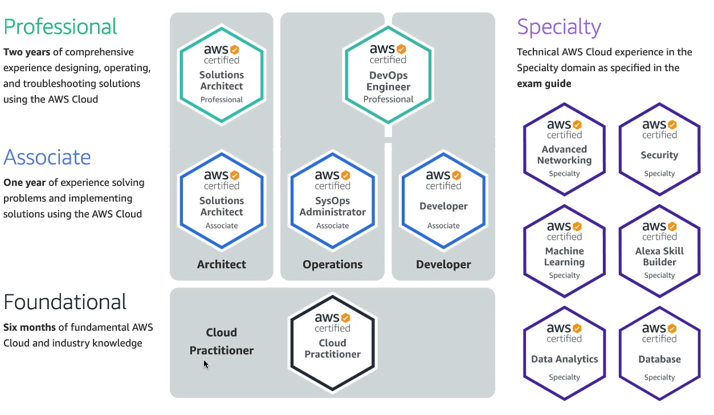
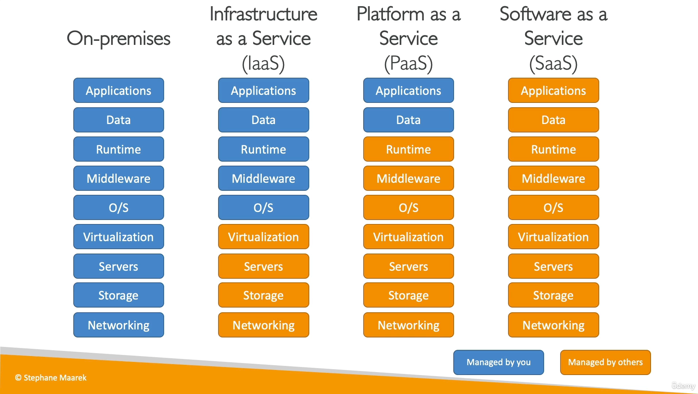

# aws
200개가 넘는 서비스가 있다.
12개의 AWS Certified 자격증이 있다.

기초(Foundational)레벨에는 Cloud Practitioner
그 위에 Associate레벨
그 위에 Professional레벨과 Specialty레벨

---
# 학습
udemy 유료강의. AWS Certified Cloud Practitioner CLF-C01 시험     강사 : Stephane Maarek

# 계정생성
https://portal.aws.amazon.com/billing/signup#/start/email
2022년 5월9일에 만들어뒀던 ggoomterHuman@gmail.com  xxxx3#  사용해서 학습.
카드, 핸드폰, 이메일 등 실제유저 확인한다.

### 강의자료 다운로드
https://courses.datacumulus.com/downloads/certified-cloud-practitioner-zb2/

### 웹사이트 구동원리
알고있어서 정리안함
서버 : CPU, RAM, 하드, DB
      라우터, 스위치, DNS

### 전통적인 서비스
서버 구매,  창고나 방, 거실 등에 설치,  소프트웨어적 설치, 전기세 지불,   쿨링시스템,   유지보수 인원,
추가나 교체시 오랜 시간(주문, 연결, 배포),   확장의 어려움(시간, 공간),  문제발생시 대응할 모니터링 팀,
정전, 지진, 화재 등에 대한 보험

### 클라우딩 컴퓨팅
컴퓨팅 파워, 데이터베이스 스토리지 , 어플리케이션, 기타 IT 리소스를 온디멘드로 제공하는 것
핵심은 온디멘드. 필요할때 얻는 것. 요청한만큼만 비용지불. 사용이 끝나면 비용지불도 끝
정확한 유형과 크기를 프로비저닝 할수 있다.  //사용자의 요구에 맞게 시스템 자원을 할당, 배치, 배포해 두었다가 필요 시 시스템을 즉시 사용할 수 있는 상태로 미리 준비해 두는 것
Gmail, Dropbox, Netflix 등이 클라우드 서비스

Private Cloud : rackspace
Public Cloud : MS Azure, Google Cloud, AWS
Hybrid Cloud : 자체인프라와 Public의 혼용

- 5가지 특징
1. On-demand self service
2. Broad network access
3. Multi-tenancy and resource pooling
4. Rapid elasticity and scalabiliy
5. Measured service

- 6가지 장점
1. Trade capital expense(CAPEX) for operational expense(OPEX)
2. benefit from massive economies of scale
3. Stop guessing capacity
4. Increase speed and agility
5. Stop spending money running and maintaining data centers
6. Go global in minutes

- 유형   as a Service의 단축어인 aaS는 고정.  IPS로 기억하자.

0. On-premises
1. Infrastructure as a Service (**IaaS**)   서비스형 인프라
    네트워킹, 컴퓨터, db저장공간을 원시형태로 제공
    레고를 조립하듯 높은 유연성
    예) EC2,  GCP, Azure, 
2. Platform as a Service (**PaaS**) 서비스형 플랫폼
    기본인프라를 관리할 필요가 없음
    배포와 애플리케이션 관리(데이터와 애플리케이션)에만 집중
    예) Elastic Beanstalk,  Heroku, GCP, Windows Azure
3. Software as a Service (**SaaS**) 서비스형 소프트웨어
    서비스제공업체가 완전히 운영하고 관리
    예) Rekognition,   Gmail, Dropbox, Zoom

## 비용
3가지 기본가격이지만 모두 종량제(컴퓨팅 시간, 스토리지 양, 네트워크가 나갈때만)
시간의경과, 1년에 1번, 정액 같은 보기는 아님.

## AWS의 역사
2002년 Amazon.com 내부에서 시작. 
아마존의 인프라는 그들의 핵심 역량 중 하나였고 우리가 아니라 다른사람들을 위해 서비스로 출시하면 어떨까?
2004년 첫번째 서비스인 SQS출시
2006년 SQS, S3, EC2
2019년 가트너의 시장조사에 따르면 세계1위 리더이고 시장점유율 47%. 2등인 Microsoft는 22%


### AWS 인스트럭터
https://infrastructure.aws/
- **리전** : 데이터 센터의 집합. 세계각지에 구역을 나눈 이름. ue-east-1,  eu-west-3 같은것들
       대부분의 서비스들은 그 리전에 국한된다.
       선택기준 : 상황에 따라 다르다. (법률, 지연시간, 해당서비스가 그 리전에서 지원하는지, 요금)
- **가용영역** : 리전내에 존재. 대부분 3개를 가지고있고 최소는 2, 최대는 6.   
            시드니의 리전은 ap-southeast-2 인데   거기에 가용영역은 ap-southeast-2a, ap-southeast-2b, ap-southeast-2c
            각각의 가용영역은 여분의 **전원을 갖춘 네트워킹**, **통신기능을 갖춘 데이터 센터**로 이루어져있다.
            각각의 가용영역들이 재난발생에 대비해 서로 분리되어 있다.
- **엣지로케이션** : 전송지점. 216개가 넘는 포인트들이 있다.

### 스코프
글로벌서비스 : IAM(Identity and Access Management), Route 53(DNS service), CloudFront(CDN), WAF(Web Application Firewall)
리전스코프 : 대부분의 AWS서비스.  EC2, Elastic Beanstalk, Lambda, Rekognition

## 콘솔
- 오른쪽위 리전선택기 (가장 서비스하기에 가까운 지역 선택)
  - Global로 돼있을때는 리전을 선택할 필요가 없다는 말. 규칙이라기 보다는 예외
  - 어느 리전의 콘솔을 보느냐에 따라 컨텐츠가 다르다.
- 12시방향 검색창
- 왼쪽위 New EC2 Experience 토글스위치를 통해 과거의 GUI로 변환할 수 있음

### 공동책임모델
AWS클라우드에서 보안에 대한 책임분배를 정의하는 것
- AWS의 책임 = SECURITY OF THE CLOUD
- 개발자의 책임 = SECURITY IN THE CLOUD
그리고 이용목적제한방침에 동의해야함. 불법적, 공격적, 유해한 콘텐츠, 보안위반, 네트워크 남용, 이메일이나 다른유형의 메세지 남용 안됨.
---

> ec2, mysql, github, putty 연동
https://victorydntmd.tistory.com/338

리눅스 폴더 삭제 rm -rf 폴더명


--- ec2의 가격정책
1년동안 매달750시간 프리티어는 무료.
예약 인스턴스는 1년동안 미리 선금지불하면 최대 75% 할인
온디맨드는 쓰는만큼 탄력적으로 돈내는거
업로드는 공짜. 나갈때 돈나감.  한달동안 1기가까지는 무료

## 용어 
- AMI : Amazon Machine Image. OS, WAS, 앱이 포함된 템플릿
- IAM : Identify and Access Management.  AWS에서 생성 및 관리하고 있는 모든 서비스를 안전하게 제어하기 위한 계정 관리 서비스
- SCP : Secure Copy Protocol. 리눅스 운영체제에서 사용하는 파일전송 프로토콜.
- VPC : Virtual Private Cloud. 가상네트워크제공. 
        EC2등 서비스자원을 생성하면 기본적으로 생성되며, 사용자별로 VPC에 할당되어 서비스가 이루어진다.
- RDS : Relational Database Service. 
- GPL : General Public License
- AZ : Availability Zone.  가용영역
- MFA : Multi-Factor Authorization. 인증할때 여러 매체를 활용하는 인증방식.
- S3 : Simple Storage Service. 아마존 스토리지 관리를 위한 대표적인 서비스.

### api
https://docs.aws.amazon.com/


# ec2
Elastic Computue Cloud. 쉽게말해서 아마존으로부터 컴퓨터를 한대 빌리는것.(호스팅)
https://jiwontip.tistory.com/45?category=367314
1. 아마존 회원가입(무료계정) 전화로 인증번호 4개 치는게 빠름
2. 오른쪽 위 서버 위치 한국으로 옮기기
3. 서비스 검색창에서 ec2, rds 검색해서 즐겨찾기 하기
4. 가상머신(인스턴스) 시작	(//계정만들자 마자 바로는 안됨)
    1. freetier만 선택 체크하고 기본 t2.micro.   //t2는 서비스 유형. micro는 성능.
    2. AMI(인스턴스 구성을 가진 템플릿) 선택. 제일 익숙한걸로. 그런게 없으면 제일 보편적인 우분투
        **레드햇, 페도라, centOS계열, amazon linux는 yum사용**
        **데비안, 우분트 계열은 apt-get 사용**
    3. 넥스트하다보면 디폴트 크기는 8기가인데 30기가 까지 무료로 늘릴수있음.
    4. 시작하기 누르면 기존키페어 선택또는 키페어 생성 창
        (이미 받은 키가 있으면 그거 선택하면 됨)
        받은키가 없으면 새 키페어 생성. 텍스트치고 '키페어 다운로드' 하면 .pem 파일 받음.(퍼블릭키)
        2022년에 보니까 이제 ppk바로 다운로드 생겼네.
        기억하기 쉬운곳에 저장하고 인스턴스 시작.
        비밀번호 대신 이 키페어 파일을 쓸것이고 절대로 잊어버리면 안된다.
    5. putty로 접속해보기. 퍼블릭 dns와 ppk파일 연동해서.
       계정 : ubuntu / 키를 받았기 때문에 비번 필요없음

    ### putty
    SSH접속 프로그램이며 .pem파일을 못읽기 때문에 .ppk파일로 변환하는 작업 해줘야함.
    1. [다운로드](https://www.chiark.greenend.org.uk/~sgtatham/putty/latest.html)
    2. puttygen.exe실행
    3. RSA선택후 load후 키 선택
    4. save private key 경고창 예
    5. putty.exe 실행
    세션의 host에 ip주소넣고
    Connection-SSH-Auth 탭에 방금만든 ppk파일 로드하고 Open
    EC2인스턴스가 우분투일 경우 아이디는 ubuntu


5. 네트워크및 보안 탭
해당인스턴스와 연결된 보안그룹에 가서 inbound규칙 열어주기
최소한으로 열어주려면 사용할 http서버와 ssh 20포트 2개 열어주면 된다.
적당히 열려면 http(all ipv4), https(all ipv4), ssh(22), mysql, oracle 등

5. 왼쪽 사이드바에 탄력적 ip찾아서 할당
작업 - 탄력적 ip주소 연결(릴리즈는 해제/삭제)
이제 서버(컴퓨터)만 받은것이다. 여기에 웹서비스가 가능하도록 설정해야한다.
아래 putty에서부터 제대로 다뤄보자.

6. 인스턴스 껐다 켜면 ip주소가 바뀐다. 안바뀌게 하고싶으면 탄력적ip설정
인스턴스 id클릭해서 오른쪽위 '연결' 버튼 누르면 우리가 받은 리눅스 서버에 접속하는 여러가지 방법들이 나옴. 웹에서 접속할수도 있음.
따로 프로그램으로 접속하려면 putty같은 ssh클라이언트 깔아야됨. putty를 사용하기위해 아래 마저 해주면됨.

### putty
폰트, 포트 등 설정을 바꿨으면 현재 상태 그대로 저장해야지 저장안하면 다음에 켰을대 또 디폴트다.
https://mozi.tistory.com/191
1. putty 설치 https://victorydntmd.tistory.com/338
2. puttyGen 실행  load 로 .pem 가지고오고 Save privateKey 버튼 클릭
3. putty실행
    HostName에 탄력적ip 주소 넣고  port는 디폴트인 22  connectionType은 SSH
    Connection- SSH - Auth  찾아보기에서 방금만든 .ppk 불러오기
    Session탭에 이름넣고 저장한다음 open
    처음 계정  : 우분투 서버일때는 ubuntu, 아마존 리눅스일때는 ec2-user
3. 접속했으면 sudo apt update;(우분투)
    sudo apt-get upgrade;(우분투)
    sudo yum update;      //현재 깔수있는 프로그램 리스트를 업데이트
4. 자바 설치 https://kitty-geno.tistory.com/25
    설치가능한 버전 확인 : sudo yum list | grep jdk
    오픈jdk는 1.8버전이 최신이네.. sudo yum install java-1.8.0-oepnjdk
    is this ok 물어보면 y 입력
    java -version 으로 확인

5.  환경변수 설정
    which java   하면 /usr/bin/java 나옴
    readlink -f /usr/bin/java
    위의 readlink명령어로 나온경로가 JAVA_HOME에 등록될 경로다.
    /usr/lib/jvm/java-1.8.0-openjdk-1.8.0.312.b07-1.amzn2.0.2.x86_64/jre/bin/java 가 나오는데 _64까지 복사하자.
    sudo vim /etc/profile    shift g (맨마지막으로이동)
            export JAVA_HOME=/usr/lib/jvm/java-1.8.0-openjdk-1.8.0.312.b07-1.amzn2.0.2.x86_64
            export PATH=$PATH:$JAVA_HOME/bin
            export CLASSPATH=$JAVA_HOME/jre/lib:$JAVA_HOME/lib/tools.jar

6.  깃 설치
    sudo yum install -y git
    git --version

7.  배포하기
    ~경로에서 mkdir apps
    cd apps/
    git clone 깃주소
    cd 프로젝트명
    ll

8.  빌드하기
    sudo chmod 777 ./gradlew
    ./gradlew build
        실패. invalid source release: 11
        11버전으로 바꾸는법 : https://lemontia.tistory.com/941
        ```
        /usr/bin/java 가 /etc/alternatives/... 를 가르키는 것을 볼 수 있다.
        가르키는 이유는 yum 방식을 통해 java를 설치하게 되면 버젼 관리 대상으로 들어가기 때문이다.
        리눅스에서는 버전관리를 위한 명령어를 제공하는데 그것이 바로 alternatives 라는 명령어이다.
        업무적으로 JDK 버전을 바꾸어 줘야하는 상황이 오면 일일히 $JAVA_HOME, java, javac, javadoc, jar … 등 손이 가는 데가 많다.
        alternatives --config java
        sudo alternatives --config javac
        이후 /etc/profile 이나 / .bash_profile 에서 $JAVA_HOME을 새로 설정
        하고 변경내역 저장 : source /etc/profile

        테스트에서 에러 나서 테스트 제외하고 빌드하는법
        ./gradlew build -x test
        ```
    cd build/libs/
    ll

9.  타임존 변경
    sudo rm /etc/localtime
    sudo ln -s /usr/share/zoneinfo/Asia/Seoul /etc/localtime
    date 로 확인


10. 서버실행
    SpringBoot는 톰캣 서버가 내장되어있으므로 jar파일(빌드된 파일)만 실행시켜주면 됨
    만들어진 jar파일을 var/www/ 에 넣어줘야한다.
    cp 복사할곳
    java -jar 파일명.jar   이렇게 하면 세션이 끊어지면(cmd창을 끄면) 서버의 가동도 끊기기 때문에 백엔드에서 동작하도록
    nohup java -jar 파일명.jar &

11. 웹에서 접속
    동적ip와 포트번호 잘쳐주고 inbound설정해줬으면 들어가짐.

## ec2에 깃헙 장고 프로젝트 올리기
참고 : https://nerogarret.tistory.com/46
readme.md파일 안만들면 로컬리파지터리 그대로 리모트로 올리기 쉽다.
ubuntu로 ec2까지 만들고 putty로 연결.
mkdir srv
sudo chown -R ubuntu:ubuntu /srv/
git clone [레포지토리 주소]
WSGI(Web Server Gateway Interface) server를 설치해야한다.
    가상환경 세팅      sudo apt-get install python3-venv
    가상환경 만들기    python3 -m venv myvenv
    가상환경 활성화 가상환경만든 위 풀더에서 source myvenv/bin/activate

로컬의 프로젝트 폴더 들어가서 
 패키지백업 : pip freeze > requirements.txt
 하면 현재 환경의 의존 라이브러리들이 저 파일에 써진다.

우분투에서
 패키지설치 : pip3 install -r requirements.txt
 

python3 manage.py runserver 0:8080
퍼블릭dns주소:8080 접속해도 아직 로딩만 되고 페이지 안뜸

1. setting.py의 ALLOWED_HOSTS = ['*']

2. ec2의 보안탭의 인바운드 규칙 tcp 8080 추가해주고
https연결 안되기 때문에 http로 바꾸고 ip주소:8080 해주면 접속된다.

3. 로그를 보면 400에러뜨면서 http만 제공되는데 hpps로 접속하려고 하고있다고함. https접속되게 하려면 SSL인증서 다운받고 nginx(웹서버)나 uWSGI(WAS)에 적용 해야되는데 너무 어려움. 현재는 주소에 https로 시작하는것을 http로 바꾸면 접속된다.

//백그라운드로 실행하려면 
실행법 : nohup 명령어 &
종료하는법 : ps -ef | grep 포함문자열
			kill -9 번호
## ec2에 깃헙 장고 프로젝트 올리기
참고 : https://nerogarret.tistory.com/46
readme.md파일 안만들면 로컬리파지터리 그대로 리모트로 올리기 쉽다.
ubuntu로 ec2까지 만들고 putty로 연결.
mkdir srv
sudo chown -R ubuntu:ubuntu /srv/
git clone [레포지토리 주소]
WSGI(Web Server Gateway Interface) server를 설치해야한다.
    가상환경 세팅      sudo apt-get install python3-venv
    가상환경 만들기    python3 -m venv myvenv
    가상환경 활성화 가상환경만든 위 풀더에서 source myvenv/bin/activate

로컬의 프로젝트 폴더 들어가서 
 패키지백업 : pip freeze > requirements.txt
 하면 현재 환경의 의존 라이브러리들이 저 파일에 써진다.

우분투에서
 패키지설치 : pip3 install -r requirements.txt
 

python3 manage.py runserver 0:8080
퍼블릭dns주소:8080 접속해도 아직 로딩만 되고 페이지 안뜸

1. setting.py의 ALLOWED_HOSTS = ['*']

2. ec2의 보안탭의 인바운드 규칙 tcp 8080 추가해주고
https연결 안되기 때문에 http로 바꾸고 ip주소:8080 해주면 접속된다.

3. 로그를 보면 400에러뜨면서 http만 제공되는데 hpps로 접속하려고 하고있다고함. https접속되게 하려면 SSL인증서 다운받고 nginx(웹서버)나 uWSGI(WAS)에 적용 해야되는데 너무 어려움. 현재는 주소에 https로 시작하는것을 http로 바꾸면 접속된다.

//백그라운드로 실행하려면 
실행법 : nohup 명령어 &
종료하는법 : ps -ef | grep 포함문자열
			kill -9 번호


---

- 프로세스의 pid확인
 리눅스에서는 ps -ef | grep 프로세스이름    ps -eo command | grep ]$ | sort
 윈도우 cmd에서는 tasklist | findstr "프로세스이름"
- 프로세스 죽이기
kill -9 프로세스번호

- 단일 파일을 로컬에서 원격지로 보내기
 scp [옵션] [파일명] [원격지_id]@[원격지_ip]:[받는 위치]
예)  scp testfile2 root@192.168.159.129:/tmp/testclient


---
##### <스프링부트가 아니라 스프링이나 jsp로 한 경우 - 시작>
톰캣설치. 스프링부트로 했다면 내장톰캣이라서 설치 필요없다.
<wget 설치 방법>
1. 다운받기 wget 주소.tar.gz		//톰캣에서 링크주소 복사. https://dlcdn.apache.org/tomcat/tomcat-9/v9.0.55/bin/apache-tomcat-9.0.55.tar.gz
2. 압축풀기 tar -zvxf 압축파일이름.tar.gz
3. 압축풀린곳의 bin폴더밑의 startup.sh파일 실행
설치위치는 /home/ubuntu/apache-tomcat-9.0.55다.


<apt-get 설치방법. 안됨 >
    sudo apt-get install tomcat9			//톰캣9 설치
    sudo /usr/share/tomcat9/bin/version.sh  //버전확인
    sudo ufw allow 8080/tcp					//uncomplicated firewall에 8080포트 등록
    sudo service tomcat9 start				//톰캣 실행


자기 ip복사해서 브라우저에서 주소:8080 으로 접속해서 톰캣 첫화면 뜨는지 확인.
안뜨면 inbound 사용자정의 8080 추가

netstat안돼서 설치. sudo apt install net-tools
netstat -npl	//톰캣 서버 실행중인지 확인


톰캣 고양이 화면 뜨는걸 완료했으면 앞으로 할일은 ftp로 프로젝트 파일을 WAS(톰캣)에 올리는것과
데이터베이스도 내컴퓨터에있던것을 서버에 구축하는것이다.
# war업로드
1. 파일질라 클라이언트 다운로드
2. 키 추가 (설정 - sftp - 가지고있는 .pem파일 추가)
3. 새사이트 추가 (sftp, 키추가, 사용자는 ubuntu)
4. 톰캣 폴더의 webapps 폴더안에 war파일 갖다놓고
5. 브라우저에서 ip주소:8080/war파일이름  치면 접속됨


##### <스프링부트가 아니라 스프링이나 jsp로 한 경우 - 끝>
---


위의거 다 했으면 jenkins 로 자동 배포 해볼수 있고
docker 도 공부해볼수 있다.
### jenkins
https://ywook.tistory.com/33
https://blog.nachal.com/1633
1. 만든 EC2에서 새 키 페어 생성하고 키 페어 다운로드


## RDS
Relational Database Service
자동백업(자동 스냅샷)을 하지않도록 유의해야한다. 100만원넘게 나온다.
아마존에서 디비를 운영하는 2가지 방법이 있다. EC2인스턴스에 직접 설치, 운영하는방법과  RDS를 이용한 인스턴스 생성.
DB와 어플리케이션을 한서버에 설치해야하는 특별한 제약이 없는한 2번째방법이 좋다.
1. 서비스 - RDS - 데이터베이스 생성 버튼 클릭
    Region(지역) 선택
    db엔진 선택
    db인스턴스 크기 선택(프리티어)
    db식별자 설정, 마스터계정 설정
    스토리지 설정
    아래로 내리다가 퍼블릭 어세스 꼭 '예'로 설정
    최종관리자 아이디, 비밀번호 까먹지 않기.
2. 생성했으면 dbeaver로 접속해보자.(생성하는데 좀 시간걸림. 너무많이 걸린다싶으면 새로고침)
Hostname에 엔드포인트 전체 복사해서 입력
ServiceName 에 orcl(19라면)
Role은 Normal로 아까만들었던 계정으로 접속하면됨.
Username은 RDS생성할때 입력했던 마스터 계정

3. root계정말고 다른계정을 쓴다면 user생성하고 권한주고
주의해야할점은 localhost뿐만아니라 %에도 줘야한다는 점이다.
사용하는 보안그룹(default) 의 inbound 위치 everywhere 추가

human_suwon.naver.com
비번 xxxx3#

오라클root 아이디 : ggoomter
비번 :하던대로


#### IAM
> Identity and Access Management
- 사용자를 생성하고 그룹에 배치하기 때문에 '글로벌 서비스'에 해당
- **루트계정은 오직 계정을 만들때만 사용되어야 한다.*
  - 그러므로 aws를 접속하면 가장 먼저 할일을 IAM콘솔에 들어가서 계정을 만드는 일이다.
  - 그룹만들고 권한 부여하고 
  - 비번 등 설정하고 Download.csv 다운  //사용자들의 자격증명정보
  - 대쉬보드에서 AWS Account에 보면 Id와 Alias가 있다.
  - 개인용 Sign-in URL을 별도로 주기도하고,  로그인할때 IAM user 선택해서 id나 별칭 입력해서 들어올 수도 있다.
  - 로그인시는 3가지정보(id나별칭, username, 비번)이 필요
- 그룹으로 묶을수있다.  그룹에는 다른그룹은 못들어가고 사용자만 배치할 수 있다.  개발팀, 운영팀 같이
  - 그룹에 포함되지 않은 사용자는 당연히 있을 수 있다.
  - 한명이 서로다른 그룹에 속할 수도 있다.
- 목적 : Permissions(권한)
- AWS는 최소권한의 원칙을 적용한다. 꼭 필요한 이상의 권한을 주지 않는다.

    ##### IAM의 구조
    - JSON형태
    - SID : Statement 에 대한 id
    - Effect : 해당 Statement에 대한 접근을 Allow할지 Deny할지
    - Principal : 이 정책이 적용될 account/user/role
    - Action : 이 정책이 허용하고 거부할 액션들
    - Resource : 이 정책이 적용될 리소스 리스트
    
    ##### IAM 실습
    여러가지 권한줘보고 뺏고 접속하고 기능 실행해보기
    ##### IAM MFA (Multi Factor Authentication)
    보안을 높이기 위한 2가지.  비밀번호 정책, 다요소인증
    ##### MFA 실습
    IAM콘솔에서 Access management / Account settings / Change password policy
    root계정일때는 로그인후 오른쪽위 계정이름 / My Security Credentials / MFA
    Authy = 폰의 QR코드로 인증
    그 하드웨어를 절대 잊어버리면 안된다.

##### AWS 접속
이때까지 웹으로만 접속했지만 사실 3가지가 있다.
1. AWS 콘솔
2. CLI
3. SDK

######  엑세스키
엑세스 키 아이디는 유저네임과 같고
시크릿 엑세스 키는 패스워드와 같다.


##### VPC
Vitual Private Cloud. 가상 사설 클라우드.


#### Beanstalk (EB) 실패
- 서버에서 개발된 웹 애플리케이션 및 서비스를 간편하게 배포하고 조정할 수 있는 서비스
- AWS 상에 코드을 업로드하기만 하면 용량 프로비저닝, 로드 밸런싱, Auto Scaling, 애플리케이션 상태 모니터링에 대한 정보를 자동으로 처리해주는 서비스
1. 프로젝트 준비 :  장고프로젝트가 담긴 깃헙 리파지토리
1. 아마존 계정준비
aws회원가입
서울로 리전 변경
aws 계정에 IAM사용자를 추가하여 자격증명(Credential) 발급
>    - aws 콘솔에 로그인 한 뒤 상단 nav의 username을 누르시면 dropdown 메뉴가 나옵니다. 여기서 ‘내 보안 자격증명’ 클릭
- 사용자이름 seoulHuman   엑세스키(프로그래밍방식) 체크 다음
- 그룹생성
  beanstalk검색하고 AWSElasticBeanstalkFullAccess 해라는데 없어서 제일위에꺼

     - 새 액세스 키 만들기. credentials.csv라는 파일이 자동 다운로드
2. beanstalk생성하고 로컬 zip파일 업로드
3. 그냥 이렇게만 하면 502 에러뜬다.
4. https://testdriven.io/blog/django-elastic-beanstalk/ 시키는대로 하다가 django.config 파일의 경로가 달라서 맞춰줌
5. EB CLI설치
pip install awsebcli --upgrade --user
환경변수 PATH 등록 C:\Users\human\AppData\Roaming\Python\Python39\Scripts
eb --version 으로 깔린거 확인
eb init -p python-3.6 앱이름
credentials aws-access-id 랑 넣으라고 함
csv의 3번째와 4번째

---
<샘플 정보>
ggoomter
human_suwon@naver.com  xxxx3#   328314143063
ggoomter2@gmail.com  xxxx3#   177318059854 2022년 5월9일 ec2, rds 삭제
name human_tester
(ip주소 54.180.120.40)gradle

