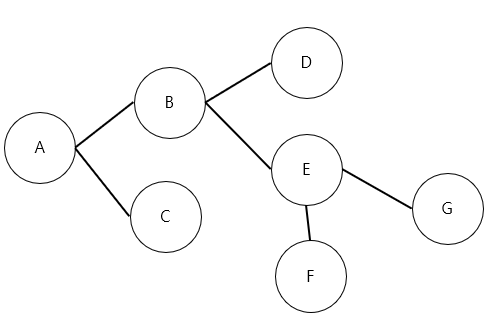
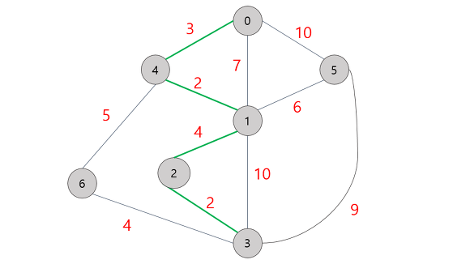

> 알고리즘이란?
제한된 공간과 제한된 시간으로 데이터를 어떻게 효율적으로 처리할지를 정해놓은 로직

>알고리즘 공부시 주요포인트
- 시간복잡도        //수행시간
- 공간복잡도        //메모리 사용량
- 어떤 자료구조를 쓰는게 좋은지

- 일반 개인 pc에서 연산횟수가 5억을 넘어가면 c언어 기준 1~3초, python기준 5~15초.
- 코딩테스트에서 시간제한은 통상 1~5초. 특별히 시간명시가 없다면 약 5초

> 알고리즘 테스트시의 순서
1. 지문 읽고 컴퓨터적 사고
2. 요구사항(복잡도) 분석
3. 문제 해결 아이디어 찾기      //일반적으로 핵심 아이디어를 캐치하면 소스는 간단한 형태로 출제함
4. 소스코드 설계 및 코딩

> 현업에서 코딩테스트에 있는 문제를 푸는 경우는 거의 없다. 대부분 이미 잘 만들어진 애를 가져와서 쓴다.
그럼 왜 기업들은 코테를 보는가?
코딩을 얼마나 정확하고 효율적으로 작성했는지는 둘째,
첫째는 자료구조와 알고리즘에 대해서 얼마나 이해하고, 시간-공간 복잡도에 대한 이해가 있는지 확인하기 위해서다.

> 문제풀다보면 자기만의 좋은 스타일, 노하우같은게 생길건데 그것을 팀노트라고한다. 라이브러리화 해서 관리 해놓길. 
  대회에 일정용량만큼 가져갈 수도 있다.

## 사이트
- 해외
  - leetcode.com 
  - codeforces.com
  - topcoder.com
  - codechef.com
  - hackerrank

- 국내
  - 백준 acmicpc.net
  - 코드업 codeup.kr
  - 프로그래머스 programmers.co.kr
  - 소프트웨어 익스퍼트 아카데미 swexpertacademy.com

#### 공부
카카오 기술블로그에서 카카오 기출풀이

#### 알고리즘 코딩테스트에 적합한 프로그래밍언어
1위 : 파이썬 : 일반 기업. 코드가 짧고 라이브러리가 많아 편리하다. 매우강력한 기본 자료형
      C++ : 조금이라도 더 성능이 좋아야되는 대회용에 적합
2위 : 자기가 할수있는 언어
    //자바는 코드가 길기 때문에 불리하나 보통 자바로 시작한사람이 많기 때문에 새로운 언어익히기보다는 그냥 그거 쓰면된다.

#### 개발형 코딩테스트에 적합한 프로그래밍언어
1위 : 파이썬
2위 : 자바
3위 : C++
4위 : C

#### 개발환경
[리플릿](https://repl.it/languages/python3) : 회원가입도 필요없고 소스 공유도 쉽다.
[파이썬튜터](http://pythontutor.com/visualize.html)


### 시간복잡도
- big O //가장빠르게 증가하는 항만 고려
  - 왼쪽으로 갈수록 좋음    O(1), O(logN), O(N), O(NlogN), O(N^2), O(N^3), O(2^n)    오른쪽으로 갈수록 안좋음
- 1초라면 일반적인 기준은 다음과 같다. N의 범위가
  - 500 : O(N^3)
  - 2000 : O(N^2)
  - 100,000 : O(NlogN)
  - 10,000,000 : O(N)


## 강의
**강추**[이것이 코딩을 위한 코딩테스트다.](https://www.youtube.com/watch?v=m-9pAwq1o3w&list=PLRx0vPvlEmdAghTr5mXQxGpHjWqSz0dgC&ab_channel=%EB%8F%99%EB%B9%88%EB%82%98)


# 코딩테스트
- Tree까지는 기본이다. 문제를 본적 있든 없든 현장에서 풀수 있어야 한다.
- 그래프 이상 넘어가면 본적이 있냐없냐가 중요하게 된다.
- 코드 깔끔하게 짜느냐.
- 풀수있냐 없냐가 아니라 어떻게 풀려고 노력하는가. 주먹구구식이 아니라 효율적으로. 안푸는것보다는 주먹구구식으로라도. 힌트를 요구해라.
힌트를 믿지않고 자기세계에 빠진사람은 코칭이 안되는 사람이라서 탈락

# 길찾기 알고리즘
알고리즘의 대부분이 길(데이터)을 그래프, 트리, 배열의 자료구조로 내기때문에 선행지식이 필요하다.
자료구조, 알고리즘, 실제구현 3박자가 다 갖춰져야 할수있다. 인서울 전공자중에 20%정도 가능
2019년 카카오 코딩테스트 나올정도

유의 : 한국인이 수학에서 배운 (행, 렬)   과 프로그래밍의 영어의 ROW, COL이 반대다.
예를들어 1, 1, 1, 1, 1
         1, 1, 1, 1 ,1
         얘를 (5,2) 라고 생각하겠지만   프로그래밍에서는 (2,5)다.

이론공부한다음  Maze보고,  RatMaze

[자바 코드 예제](https://tumblery.tistory.com/61)
[자바로 개념설명 예제](https://scshim.tistory.com/241)
## DFS (Depth First Search)
깊이 우선 탐색
- 더이상 탐색할수 없을대까지 최대한 깊숙히 탐색을 한후 다음 경로 탐색
- 모든노드를 방문하고자 하는 경우에 사용
- 해당노드에 방문했는지 여부를 반드시 검사해야함. 안하면 무한루프 가능성 생김.
- 동작원리 : **스택**
- 구현방법 : 인접행렬, 인접리스트, 재귀호출
    인접행렬이란 그래프에서 어느꼭지점들이 변으로 연결되었는지 나타내는 정사각 행렬 (방향이 없는 2차원배열이라면 대각선으로 대칭이된다. 방향이 있는 배열이라면 대칭아니고.)


-> A, B, D,-(B)   E, G,-(E), F,  -(E),-(B)  C

## BFS (Breadth First Search)
너비 우선 탐색
같은 깊이에 해당하는 노드부터 탐색하고 더탐색할 수 없으면 더 깊은 노드 탐색

-> A, -,  B, C,  - ,  D, E, -, F, G
- [파이썬구현](https://steadily-worked.tistory.com/495)
- 동작원리 : **큐**
- 구현방법 : 큐

## 다익스트라 (데이크스트라)
Dijkstra(네덜란드의 과학자 에츠허르 다익스트라)
BFS와 유사하나 간선사이 가중치가 있는 그래프에서 최단경로를 계산할때 사용

-> 0,4,1,2,3
이때의 비용은 11
최소거리가 맞는지 알기전까지 모든 경로를 본다.

- 시간복잡도 : O(|V|제곱)       V는 꼭지점의갯수
    응용알고리즘이 많다.
- 코드로짜려면?
1️⃣  출발 노드를 선택
2️⃣  최단 거리 테이블 내 모든 값을 '무한'으로 초기화
3️⃣  방문하지 않은 노드 중에서 최단 거리 테이블 내 최단 거리에 있는 노드를 선택
4️⃣  선택한 노드를 거쳐 다른 노드로 가는 거리를 각각 계산
5️⃣  최단 거리 테이블 내 노드별 거리가 계산한 값보다 클 경우 계산한 값으로 해당 노드의 거리를 갱신
6️⃣  위 과정 중 3️⃣~5️⃣ 과정을 반복

- 파이썬코드
```python
# '무한'을 의미하는 값으로 10억을 활용
INF = int(1e9)

# 노드와 간선의 개수를 각각 입력받기
n, e = map(int, input().split())

# 시작 노드 번호를 입력받기
start = int(input())

# 노드별로 연결된 노드 정보를 저장할 리스트 선언
graph = [[] for i in range(n+1)]
# 방문 이력을 저장할 리스트
visited = [False] * (n+1)
# 최단 거리 테이블: 초기에는 모든 값을 무한으로 초기화
distance = [INF] * (n+1)

# 간선 정보 입력받기
for _ in range(e):
    # 노드 A에서 노드 B로 가는 비용이 cost
    n_a, n_b, cost = map(int, input().split())
    graph[n_a].append((n_b, cost))

# 방문하지 않은 노드 중에서 가장 최단 거리가 짧은 노드 번호 반환
def node_choice():
    min_v = INF
    # 최단 거리가 가장 짧은 노드 번호(=인덱스)
    idx = 0
    for i in range (1, n+1):
        if distance[i] < min_v and not visited[i]:
            min_v = distance[i]
            idx = i
    return idx

def dijkstra(start):
    # 시작 노드의 최단 거리 및 방문이력 초기화
    distance[start] = 0
    visited[start] = True
    # 시작 노드와 연결된 각각의 노드 간의 거리
    for i in graph[start]:
        distance[i[0]] = i[1]

    for i in range(n-1):
        # 최단 거리가 가장 짧은 노드를 선택하고 방문처리
        n_now = node_choice()
        visited[n_now] = True

        # 현재 노드를 거쳐 다른 노드까지의 거리 계산
        for j in graph[n_now]:
            c = distance[n_now] + j[1]
            # 최단 거리 테이블 갱신 가능여부 체크
            if c < distance[j[0]]:
                distance[j[0]] = c

# 다익스트라 알고리즘 구동
dijkstra(start)

for i in range(1, n+1):
    # 노드를 방문할 수 없는 경우, '무한' 값 출력
    if distance[i] == INF:
        print("INF")
    # 노드를 방문할 수 있을 경우, 최단 거리 출력
    else:
        print("{}번 노드까지 최단 거리: {}".format(i, distance[i]))


```

## Best-First Search

## 플로이드-워셜(Floyd-Warshall)
노드의 갯수가 적을때는 다익스트라 보다 낫다.
적다는게 어느정도를 말하는건가?

## A* 알고리즘 (에이스타)
다익스트라 알고리즘을 확장하며 만들어지졌으며 우선순위 큐가 사용된다.
다익스트라를 현실세계에 적용하려면 수많은 아날로그적인 거리를 전부 노드화시키기에는 매우 복잡한 문제가 있으며,
정체구간, 정체시간 등에 의한 다양한 변수가 있기때문에 사용한다.

## 알고리즘 판단 기준
- 일반적으로 깊이우선 탐색보다 너비우선 탐색이 짧다.
- 모든경로의 weight가 같을경우 너비우선 탐색이 항상 최단경로.

## 코드로 짜려면?
- DFS, BFS는 이미 방문한곳을 기억해서 같은길을 반복해서 돌지 않아야한다.

[연습문제](https://kjwan4435.tistory.com/69)
[이것이 취업을 위한 코딩테스트다 _동빈나](https://www.youtube.com/playlist?list=PLRx0vPvlEmdAghTr5mXQxGpHjWqSz0dgC)


## brute force 알고리즘
생각없이 제일 직관적으로 모든 경우를 다 대입해서 푸는 알고리즘


# 정렬알고리즘
- O(n제곱)
  - 버블 : 1,2비교하여 정렬.  2,3 비교하여 정렬.  3,4 비교하여 정렬... n-1번째와 n번째 정렬.        한바퀴 끝나면 n-2번째와 n-1번째까지.    한번 돌때마다 마지막 하나가 정렬확정됨. 거품이 올라오는형상.
    - 파생 : 칵테일정렬. 홀수번째는 앞부터 짝수번째는 뒤부터 훑는정렬. 앞뒤로 섞는게 칵테일을 섞는것과 비슷해서 붙여짐.
  - 선택 : 한번 끝까지 훑어서 가장 작은놈을 첫번째 확정.    그 다음 훑어서 가장 작은놈을 두번째로 확정.   버블정렬보다 2배정도 빠르다.
    - 파생 : 이중선택정렬. 최소와 최대를 동시에 찾아서 양끝을 한칸씩 줄이며 반복. 반복횟수가 반으로 줄어든다.
  - 삽입 : 인간에게 뭔가를 정렬하라고 하면 무의식적으로 사용하는 알고리즘.  이미정렬된놈에서 새로운놈이 들어올때 적절한 위치에 끼워넣고 뒤에놈은 한칸씩 밀어내는 방식.
- O(n log n)
  - 병합
  - 힙
  - 큅
  - 트리


### 논리연산
XOR 은 미끼다..
살이 통통하게 올랐는가, 사냥하기쉬운가  둘다 통과하면 미끼다.


## 노하우
- 지수표현식  1e9는 10억을 나타내는데 e를 쓰면 기본이 실수이기 때문에 정수로 쓸때는 int(1e9) 이런식으로 쓰자.
- 실수연산 오차 조심해야됨.  round사용