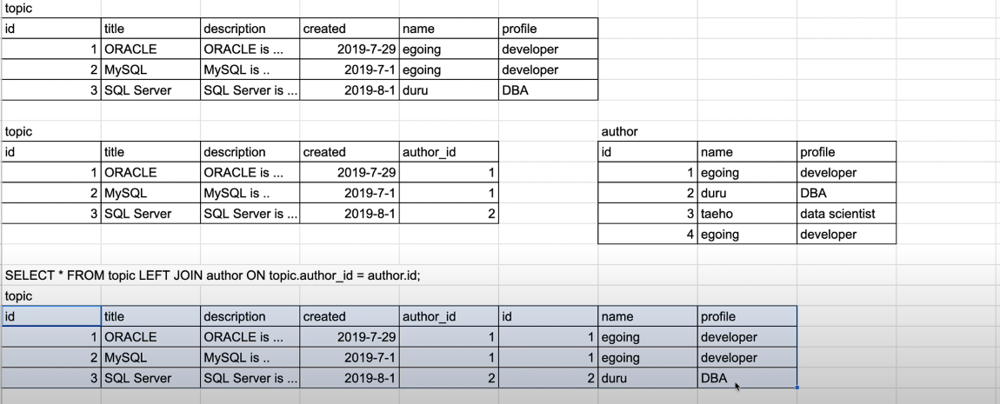

## 공부
https://www.youtube.com/playlist?list=PLVsNizTWUw7GCfy5RH27cQL5MeKYnl8Pm
[정미나 SQL중급](https://www.youtube.com/playlist?list=PLyQR2NzLKOCbOYNJHKpCax4ija38yCqBN)

## SQL이란?
Structured Query Language - 구조적 질의 언어
쿼리는 대소문자 구분 안하는데 일반적으로 대문자로 사용한다(대문자를 쓰는것이 관습). 문자열"값"은 당연히 대소문자 구분한다.
    - 자바, js : 카멜케이스 : String userName ="홍길동";
    - db : 스네이크 케이스 : varchar USER_NAME = '홍길동';
1986년 ANSI(American National Standards Institute), 1987년 ISO(International Organization for Standardization)의 표준이됨


### dbeaver
ctrl enter : 커서가 있는 한줄 실행
블록 지정후 alt x : 선택된 줄 모두 실행
오토커밋 : window - 설정 - 연결 - 연결유형 - autocommit 취소
인코딩변경 : window - 일반 - 작업공간 - utf8 로 변경


### 서버와 클라이언트
오라클 1억정도하는데 한대의 컴퓨터에서만 사용하는건 엄청 낭비지
때문에 보통 서버에 올려놓고 다른곳에서는 접속해서 사용한다.
인터넷에 연결되어있는 통신기기 한대를 호스트라 하기때문에 우리가 많이 보던 hostname이 바로 접속하려는 서버 이름을 말하는것임을 알수있다.
서버에게 접속하고 요청하는 역할을 하는 프로그램을 오라클 데이터 베이스 클라이언트라고 한다. SQLPlus, DBeaver, WorkBench, sql developer, toad 등


### RDBMS
Relational Database Management System.
1.                       SELECT DISTINCT Country FROM Customers   //고객테이블에서 국가를 중복되지 않게 가져옴
2.                       SELECT * FROM (SELECT DISTINCT Country FROM Customers);  //
3. SELECT Count(*) FROM (SELECT DISTINCT Country FROM Customers);
4. SELECT Count(*) AS DistinctCountries FROM (SELECT DISTINCT Country FROM Customers);


### 스키마
Schema. 어떤 사용자가 생성한 모든 데이터베이스 객체들을 보관하고 있는 논리적인 컨테이너.
스키마의 이름은 그 사용자의 이름과 같다.
현재 세션의 접속 스키마 변경 : ALTER SESSION SET CURRENT_SCHEMA = 스키마명;
스키마 권한(조회, 입력, 수정, 삭제 등)을 유저별로 부여하여 관리.
실무가면 DBA(데이터베이스관리자)가 개발자별로 계정을 만들어서 준다.


## 테이블
데이터가 저장되는 공간. 행과 열로 이루어져있다.

## SELECT
SELECT 컬럼명 FROM 테이블명;
DISTINC : 중복을 제거하고 보여줌
WHERE : 조건절.
  =           동등검색.
  like 'S%'   패턴검색. S로시작하는 아무문자열
  IN (요소, 요소, 요소)
  AND
  OR
  NOT
  ORDER BY 기준1, 기준2  ASC(오름차순)|DESC(내림차순)
예제) SELECT * FROM Customers
WHERE City='Berlin' OR City='München';

sql에서 null 은 is와 is not으로 비교해야한다.

#### DESC
DESCRIPTION
테이블 구조 참조.

#### ALIAS 별칭, 별명
긴것을 짧게 쓰기위해서 이름을 바꾸는 것.
문법 : 진짜이름 AS 바꾼이름
      AS는 생략가능.
- 실행순서상 SELECT구에서 지정한 별명은 WHERE구에서 쓸 수 없고 ORDER BY에서는 쓸 수 있다.
- 테이블에 AS를 쓰면 에러가 난다. 테이블의 AS는 키워드를 쓰지말고 그냥 띄워서 쓰면된다.


### Relation 과 join
관계 = 관계형 데이터베이스에서 가장 중요한것
    가장 중요한것은 정규화로 천재적인 표를 만드는 것
    그 다음으로 중요한것은 표들을 용도에 맞게 분해하고 결합하는 것

하나의 거대한 표를 관심사별로 쪼개서 연결하면 -> 하나를 바꾸면 종속적인 모든요소들이 자동으로 변하는 효과를 얻을 수 있다. 쓰기가 너무 좋아졌다.
  그러나 읽기가 너무 불편해졌다. 계속 찾아서 가져와야 되니까. 항상 장단점이 발생한다.
  공학은 그것을 합쳐서 장점만 합친것같은 효과를 얻는것.
  쪼개져있지만 읽을때는 결합된것처럼 읽도록 하는것.
  그것이 바로 join이다. join은 바로 초심자의 출구. 중급자의 입구
  이것으로 인해 RDBMS가 데이터베이스 시장을 지배하고 있다고 해도 과언이 아니다.

## 오라클 제약조건
- PRIMARY KEY  =  UNIQUE && NOT NULL
  - //UNIQUE && NOT NULL 이라고 pk는 아니다.
- FOREIGN KEY
  - 다른테이블의 pk를 참조할때
- UNIQUE
- NOT NULL
- CHECK   종류와 값 제한
- DEFAULT

## 기본키 (PK)  
PRIMARY KEY(프라이머리키. 주키)
한 테이블 내에서 유일하게 존재하게 하는 컬럼들의 조합.
테이블의 유일한 행을 식별하도록 한다. (식별자)
역할 : 중복방지, 매우빠른 조회, 


> SQL문은 크게 DDL, DML, DCL로 분류한다.
## 테이블조작 DDL(Data Definition Language)
    **CREATE, ALTER, DROP, TRUNCATE**
        - CREATE TABLE 테이블이름(
            컬럼명 데이터타입 조건,
            컬럼명 데이터타입 조건,
            ...
        );
        - ALTER TABLE 테이블명 DROP PRIMARY KEY;   -- 기본키를 지워준다.
          ALTER TABLE 테이블명 ADD CONSTRAINT PK명 PRIMARY KEY (컬럼명1, 컬럼명2,...);   -- PK를 생성한다.
        - Drop은 테이블자체를 삭제
        - Truncate는 테이블을 초기 정의상태로 되돌림
        - 모두 오토커밋

## 데이터 조작 DML(Data Manipulation Language)
    데이터의 CRUD
    ** SELECT, INSERT, UPDATE, DELETE **
        - SELECT 컬럼명 FROM 테이블명 WHERE 조건;
        - # INSERT문
          INSERT INTO 테이블명(컬럼1, 컬럼2, ...) VALUES( 데이터1, 데이터2, ...)
          INSERT INTO 테이블명 VALUES(데이터1, 데이터2, ...)
          다중insert : INSERT INTO 테이블명 VALUES (데이터들,,,,)(데이터들,,,,)(데이터들,,,,)
        - # UPDATE문
          UPDATE 테이블명 SET 컬럼명=바꿀값 WHERE 조건;  //조건안넣으면 모든해당컬럼이 수정되니까 유의해야한다.
        - # DELETE문
          DELETE FROM 테이블명 WHERE 조건;   //조건안넣으면 다지워지니까 유의해야한다.
    ** Merge문
       - MERGE INTO 테이블
         USING 비교할테이블 또는 서브쿼리
         ON 조건문
         WHEN MATCHED THEN
          만족시문장
          예를들어 UPDATE SET 컬럼 = 값
         WHEN NOT MATCHED THEN
          비만족시문장
          예를들어 INSERT 컬럼 VALUES 값


## 데이터 제어어 DCL(Data Control Language)
    접근이나 권한
    **GRANT, REVOKE, COMMIT, ROLLBACK**

## 기본문법 2
- 범위지정 : BETWEEN 시작 AND 끝
- NOT : != 또는 <>
- null은 일반연산자로 비교할수없다. IS NULL 과 IS NOT NULL 사용해야함.
- count, min, max, sum, avg
- LIKE '문자열%'    
     %가 붙은쪽에는 아무글자나 와도 상관없다는 뜻.
     언더바 _ 는 아무글자 한자리를 차지하게함
     예) select * from tbl_board where title like '%아디다스%'; 는 TITLE에 아디다스가 포함된 글자
- CONCAT : concatenation. 문자열의 연결이라는 뜻. concat(문자열1, 문자열2)
오라클에서는 || 로도 이어주지만 mysql에서는 논리연산자 or의 의미다.
- REPLACE :문자열 치환 
  REPLACE(문자열, 바꿀문자열, 바뀔문자열)
- 논리여산자는 쿼리의 순서와 관계없이 (), NOT, AND, OR 순으로 처리된다.

### @
MYSQL에서 변수를 선언할때 사용한다. 사용자변수라고 한다.
하나의 커넥션안에서만 공유된다. 그러니 항상 변수값을 초기화하는 작업을 잊지말아야한다.
문법 :
    <정의>
    SET @변수명 = 값;         또는 SET @변수명 := 값;         또는 SELECT @변수명 := 값;
    /* =는 SET안에서만 할당연산자로 쓰이고 SET외에서는 비교연산자로 쓰인다. */

    <호출>
    @변수명

- 프로시저를 사용하기전에 반복문을 사용해서 간단하게 1씩 증가한 데이터 넣는거 해보자.
set @bbsNum := (select MAX(bbsID) from BBS);
INSERT INTO bbs.bbs
(bbsID, bbsTitle, userID, bbsDate, bbsContent, bbsAvailable, VIEWCOUNT)
VALUES(@bbsNum+1, @bbsNum+1||'번글', 'ggoomter', '2021-11-13 19:42:52', '아무내용', 1, 0);


### 제약조건일때 삭제
1. 
SET FOREIGN_KEY_CHECKS=0; -- to disable them 
제약조건 잠시 죽인뒤에 삭제후에 다시 제약조건 살리기
SET FOREIGN_KEY_CHECKS=1; -- to re-enable them

2. 제약조건만들때 on delete cascade;


#### 집합연산자
UNION = 합집합(중복 제거됨)
UNION ALL = 중복항목도 다 합침
    //UNION은 sort unique를 내부적으로 실행하기 때문에 pk로 인해 unique가 보장된 상황일때는 union을 쓰지말고 union all을 하는게 성능상으로 좋다.
INTERSECT = 교집합        //연산자 없이 JOIN으로도 처리가능
MINUS = 여집합. 차집합.   //연산자없이 OUTER JOIN으로도 처리가능

#### 집계함수(그룹함수)
'그룹별'로 그룹핑된 결과를 리턴한다.
GROUP BY가 없이는 컬럼을 집계함수와 같이 사용할 수 없다.
- COUNT(expr)   //행의갯수.  21억개까지만 세진다. 더 큰건 count_big()
- MAX(expr)
- MIN(expr)
- AVG(expr)
- SUM(expr)
- VARIANCE(expr)      VAR()     분산
- STDDEV(expr)        STDEV()   표준편차
- ROLLUP(expr1,expr2...)
- CUBE(expr1,expr2...)
//주의 : where절은 group by 이후에 수행된다.

- # GROUP BY
그룹별로 데이터를 묶어서 처리할때 사용한다.
집계함수와 함께 사용되는 경우가 대부분이다.
WHERE 다음, ORDER BY 전에 위치해야한다.
예) SELECT COUNT(CustomerID), Country
FROM Customers
GROUP BY Country;
  ### HAVING절
  where와 비슷하지만 집계함수는 where전에 작동되기 때문에 그때 적용할 조건이 HAVING


총합 또는 중간합계가 필요하다면 GROUP BY절과 함께 ROLLUP() 또는 CUBE()를 사용하면 된다.
<rollup>

<cube>
롤업과 비슷한 개념이지만 다차원 정보의 데이터를 요약하는데 더 적당하다.
예를들어 물품별 소합계, 색상별 소합계
컬럼순서 상관없이 해당 컬럼들에 소계, 합계, 총계를 구해준다.
group by 각각해서 union all 하고 순서대로 null 매겨가며 group by 한것까지 union all한것과 같다.
예)
SELECT prodName, color, SUM(amount) as 수량합계
  FROM CUBETBL
 GROUP BY CUBE (color, prodName)


#### 분석함수
- RANK() OVER(ORDER BY절)   //공동순위의 개념. 2위가 3명이면 3명이 공동2위, 다음은 3위가 아니라 5위가됨.
- DENSE_RANK() OVER(ORDER BY절) //공동그룹의 개념. 2위가 3명이면 3명이 공동2위.  다음은 3위
- ROW_NUMBER() OVER(ORDER BY절)
- NTITLE(expr)
- 누적 집계
  - SUM() OVER()
  - AVG() OVER()
  - MIN() OVER()
  - MAX() OVER()
  - COUNT() OVER()
- LAG(expr, offset, 디폴트값) OVER(ORDER BY절)
- LEAD(expr, offset, 디폴트값) OVER(ORDER BY절)   //후행로우의 값 반환
- FIRST_VALUE(컬럼) OVER(ORDER BY절)  //처음값
- LAST_VALUE(컬럼) OVER(ORDER BY절)   //마지막값
- 비율함수
  - RATIO_TO_REPORT(expr)


- 형변환
Transact-SQL에서 CAST() / CONVERT()

### rownum
mysql에는 rownum이 없기 때문에 변수를 사용한다.
3가지 방법이 있다.
1. set으로 초기화한후 조회
SET @rownum:=0;
SELECT
  @rownum:=@rownum+1 as no,
  테이블명.*
FROM 테이블명

2. where절에서 초기화
SELECT
@rownum:=@rownum+1, b.*
FROM buyingboard b
WHERE (@rownum:=0)=0;

3. FROM절에서 초기화
SELECT
@rownum:=@rownum+1, b.*
FROM buyingboard b, (SELECT @rownum:=0) TMP;

### 함수

<문자열>
- CONCAT(데이터, 데이터)    MYSQL에서 문자열 결합. SQL SERVER는 +, Oracle, PostgreSQL은 ||
- SUBSTR(데이터, 시작, 끝)  문자열 자르기. MYSQL에서는 SUBSTRING
- LENGTH(문자열)   문자열의 길이 반환
- TRIM(옵션위치, 옵션특정문자, 데이터)      공백 제거.  옵션위치값은 LEADING/TRAILING/BOTH
  LTRIM(데이터, 옵션데이터)    왼쪽공백제거. 옵션이 있으면 공백이 아니라 왼쪽에서 옵션만 지운다.
  RTRIM(데이터, 옵션데이터)    오른쪽공백제거. 옵션이 있으면 공백이 아니라 오른쪽에서 옵션만 지운다.
- CURRENT_TIMESTAMP  시스템날짜.   날짜간뺄셈 오라클에서는 -, MySQL에서는 DATEDIFF()
- TRUNC(값, 숫자)  숫자까지 소수점 자름
- CHR(아스키코드)   해당 아스키코드를 문자로 리턴
- LOWER(문자열)    문자열을 소문자로 변환
- UPPER(문자열)    문자열을 대문자로 변환
- REPLACE(문자열, 변경전문자열, 옵션변경후문자열)   파라미터가 2개일때는 1param에서 2param제거.  3개일때는 2param을 3param으로 치환

<숫자>
- ABS(수)   절대값반환
- SIGN(수)   부호반환.  양수이면1, 음수이면-1, 0이면0
- ROUND(데이터, 자릿수)    반올림. 매개변수가 없으면 소수점 첫째자리에서 반올림
                        -2면 백의 자리로 반올림
- TRUNC(수, 옵션자릿수)   지정된 소수점 자릿수까지 버림.   기본값은 0이라 정수만 반환
- CEIL(수)    소수점이하의 수를 올림한 정수 반환
- FLOOR(수)   소수점이하의 수를 버림한 정수 반환
- MOD(수1, 수2)     수1를 수2로 나눈 나머지 반환

<날짜>
- SYSDATE   현재의 년월일시분초.  nls_date_format에 따라서 형태는 달라질수 있음
- EXTRACT(단위 FROM 날짜데이터) 특정단위만을 숫자로 출력
- ADD_MONTHS(날짜, 개월수)

<명시적 형변환>
- TO_NUMBER(문자열)
- TO_CHAR(수 또는 날짜, 옵션포맷)
- TO_DATE(문자열, 포맷)


## 중급 문법
- 조건문  CASE (조건 또는 값)
          WHEN 값1 THEN 표시값
          WHEN 값2 THEN 표시값
          ELSE 표시값
           END

    예제)  SELECT ANIMAL_TYPE,
            CASE
                WHEN NAME IS NULL
                THEN 'No name'
                ELSE NAME
                END AS NAME
              , SEX_UPON_INTAKE
            FROM ANIMAL_INS
            ORDER BY ANIMAL_ID

- NULL처리
IFNULL(컬럼, 표현할값)  //컬럼이 NULL이면 표현할값으로 표시
오라클에서는 NVL, NVL2

- #### CASE WHEN
~이면 ~이고, ~이면 ~이다.
가져온값을 조건에 따라 보여주거나 그값을 변환할 필요가 있을때 사용
가독성이 좋고 기능이 더 많기 때문에 decode보다 권장(DECODE는 통계 데이터를 다룰때 많이 사<)
만족하는 조건이 없으면 null 리턴
반드시 END 로 끝내야 한다.
문법은 2가지가 있다. 
문법1. : CASE 
            WHEN 조건식1 THEN 값1
            WHEN 조건식2 THEN 값2
            [ELSE 값3]
        END

문법2 : CASE 
          WHEN 조건식1 THEN 결과1
          WHEN 조건식2 THEN 결과2
                    .......
          WHEN 조건식n THEN 결과n
          [ELSE 결과3]
      END

예제      , CASE WHEN deptno = '10' THEN 'New York'
            WHEN deptno = '20' THEN 'Dallas'
            ELSE 'Unknown'
       END AS loc_name
예제2     CASE a.CLOSE_YN WHEN 'Y' THEN '[폐강] ' ELSE '' END + a.SUBJNM as SUBJNM

- 반복문같은. 단일 열 값과 다른 값의 범위의 비교
서브쿼리의 리턴값이 2개 이상인데 비교하려고 할때 사용
ANY : 하위 쿼리 값 중 하나라도 조건을 충족하는 경우 TRUE를 반환
ALL : 모든 하위 쿼리 값이 조건을 충족하면 TRUE를 반환
예) SELECT NAME, HEIGHT FROM USERTABLE WEHRE HEIGHT >= ANY (SELECT HEIGHT FROM USERTABLE WHERE ADDR = '경남')


#### 계층형쿼리
한개의 테이블에서 내부적으로 정의한 순서에 의해 구조화하는 방법
<문법>
START WITH 최상위조건
CONNECT BY 계층조건

<노하우>
- WHERE보다 CONNECT BY가 먼저 실행되기 때문에 어차피 걸 조건이라면 WHERE보다 START WITH에 거는 것이 성능이 좋다.
- 부모가 반드시 있어야 하는것은 아니다. 부모와 자식간의 '관계'가 있어야 하는 것이다.
- START WITH도 필수고 아니다.  시작점을 붙이지 않으면 모든곳이 시작점이 된다. 심지어 NULL까지 포함해서. 

<매우 실수하기 쉬운 것>
CONNECT BY 조건에 키들을 다 넣어줘서 유일하게 해줘야 한다. 그렇지 않으면 카티션 발생한다.

    - 실전용 계층형 쿼리
    **LPAD("값", "총 문자길이", "채움문자")**
    LPAD(' ', 4*(LEVEL-1)) || 원래컬럼 AS 원래컬럼   --레벨별 들여쓰기

    보통은 START WITH 컬럼 IS NULL
    CONNECT BY PRIOR 현재(자식)노드 = 부모노드  -- 상위계층부터 아래로
    CONNECT BY PRIOR 부모컬럼 = 현재(자식)컬럼   -- 부모방향으로 올라가는 역방향
예제1)
SELECT D.ID, D.NAME, D.UPPER_DEPT_ID  FROM DEPT D
--START WITH D.UPPER_DEPT_ID IS NULL
CONNECT BY PRIOR D.UPPER_DEPT_ID = D.ID;

예제2)
```sql
with data AS(
    select 1 as comment_no, 1 as board_no, 2 as user_no, 0 as secret_yn, '1번째 댓글' as content, null as parent, 1 as depth, sysdate as write_date, null as modifier, sysdate as modify_date, 'n' as delete_yn from dual union all
    select 3 as comment_no, 1 as board_no, 2 as user_no, 0 as secret_yn, '댓글' as content, 1 as parent, 2 as depth, sysdate as write_date, null as modifier, sysdate as modify_date, 'n' as delete_yn from dual union all
    select 4 as comment_no, 1 as board_no, 2 as user_no, 0 as secret_yn, '댓글' as content, 1 as parent, 2 as depth, sysdate as write_date, null as modifier, sysdate as modify_date, 'n' as delete_yn from dual union all
    select 2 as comment_no, 1 as board_no, 1 as user_no, 0 as secret_yn, '댓글' as content, null as parent, 1 as depth, sysdate as write_date, null as modifier, sysdate as modify_date, 'n' as delete_yn from dual union all
    select 5 as comment_no, 1 as board_no, 1 as user_no, 0 as secret_yn, '댓글' as content, 2 as parent, 2 as depth, sysdate as write_date, null as modifier, sysdate as modify_date, 'n' as delete_yn from dual union all
    select 6 as comment_no, 1 as board_no, 1 as user_no, 0 as secret_yn, '댓글' as content, 2 as parent, 2 as depth, sysdate as write_date, null as modifier, sysdate as modify_date, 'n' as delete_yn from dual union all
    select 22 as comment_no, 1 as board_no, 1 as user_no, 0 as secret_yn, '댓글' as content, null as parent, 1 as depth, sysdate as write_date, null as modifier, sysdate as modify_date, 'n' as delete_yn from dual union all
    select 26 as comment_no, 1 as board_no, 2 as user_no, 0 as secret_yn, '댓글' as content, 22 as parent, 2 as depth, sysdate as write_date, null as modifier, sysdate as modify_date, 'n' as delete_yn from dual union all
    select 28 as comment_no, 1 as board_no, 1 as user_no, 0 as secret_yn, '댓글' as content, 26 as parent, 3 as depth, sysdate as write_date, null as modifier, sysdate as modify_date, 'n' as delete_yn from dual union all
    select 29 as comment_no, 1 as board_no, 2 as user_no, 0 as secret_yn, '댓글' as content, 26 as parent, 3 as depth, sysdate as write_date, null as modifier, sysdate as modify_date, 'n' as delete_yn from dual union all
    select 24 as comment_no, 1 as board_no, 1 as user_no, 0 as secret_yn, '댓글' as content, null as parent, 1 as depth, sysdate as write_date, null as modifier, sysdate as modify_date, 'n' as delete_yn from dual union all
    select 25 as comment_no, 1 as board_no, 1 as user_no, 0 as secret_yn, '댓글' as content, null as parent, 1 as depth, sysdate as write_date, null as modifier, sysdate as modify_date, 'n' as delete_yn from dual
)

SELECT  comment_no,
        board_no,
        user_no,
        secret_yn,
        LPAD('ㄴ', 2*(depth - 1)) || content AS content,
        parent,
        depth,
        write_date,
        modifier,
        modify_date,
        delete_yn
 FROM data
WHERE board_no = 1
  AND delete_yn = 'n'
 START WITH depth = 1
CONNECT BY PRIOR comment_no = parent;
```


## JOIN ## 조인
https://opentutorials.org/course/3884
https://coding-factory.tistory.com/87
- 목적 : 자신이 검색하고 싶은 컬럼이 다른 테이블에 있을경우 여러개의 테이블을 마치 하나의 테이블인 것처럼 활용해야할때 사용
- 그럼 왜 하나의 테이블에 그 컬럼들을 두지 않고 여러개의 테이블에 나눠놨나요?  select는 조금 불편해지지만 데이터의 수정이 혁신적으로 좋아지기 때문.
- 수행원리


- 조인을 하기위한 조건
  각 테이블에 조인키로 사용할수 있는 컬럼이 존재해야 한다. 즉, 짝꿍이 있어야한다.

A테이블에 5개,  B테이블에 3개.   교집합은 2개라고 치자.
- 종류 : 1. INNER JOIN (내부조인. 동등조인)  교집합(완전히 같은것만)검색   2개
        1. OUTER JOIN (외부조인)   LEFT, RIGHT 교집합과 차집합의 합     A LEFT JOIN B라고 하면 (2 + 3) = 5
           조인조건에 만족하지 않는 행들도 null로 출력
        2. CROSS JOIN   모든 경우의 수      3*5 = 15
        3. FULL OUTER JOIN  합집합          (5+3-2) = 6
        4. SELF JOIN     자기와 복제한 자신을 조인    5*5 = 25\
        5. NATURAL JOIN
        심화
        6. NESTED LOOP JOIN : 중첩 FOR문과 같은 원리
                  예) 아이돌 테이블이 바깥 테이블, 멤버테이블이 안쪽 테이블
                  안쪽 테이블에서 JOIN 하는 컬럼이 인덱스에 걸려있지 않으면 굉장히 비효율
        7. SORT MERGE JOIN : 중첩 FOR문과 비슷한데 JOIN컬럼을 기준으로 SORTING을 시킨후에 조인
                  안쪽 테이블에 적절한 인덱스가 없어서 NESTED LOOP JOIN을 쓰기에 너무 비효율적일때 사용.
                  또는 EQUAL조인이 아니라 범위로 조인할때
        8. HASH JOIN : 뭔지 몰라도 많이 들어봤을 것이다.
          배치에서 쓰기 좋다. 대용량 테이블을 조인할 때
          HASH영역으로 올라갈때 JOIN컬럼을 기준으로 해시함수가 적용되기 때문에 키컬럼에 중복값이 없을수록 성능에 유리
          HASH영역에 들어가는 테이블의 크기가 충분히 작아야지 성능에 유리하다.
- 문법 : 테이블A JOIN문 테이블B ON A.기준키 = B.기준키
  - 2가지 문법으로 나뉜다. 안시조인과 오라클조인
  - ANSI SQL
```SQL
SELECT e.LAST_NAME 
     , d.DEPARTMENT_NAME 
  FROM EMPLOYEES e  
  JOIN DEPARTMENTS d 
    ON e.DEPARTMENT_ID = d.DEPARTMENT_ID 
;
```

  - ORACLE SQL
```SQL
SELECT e.LAST_NAME
     , d.DEPARTMENT_NAME
  FROM EMPLOYEES e
     , DEPARTMENTS d
 WHERE e.DEPARTMENT_ID = d.DEPARTMENT_ID

오라클 조인에서 아우터 조인은 where에서 기준이 아닌 테이블쪽의 컬럼뒤에 (+) 붙여준다.
;
```
- 유의해야될점 : 모든 PK가 조인에 참여해야한다.
- join on에서의 조건과 where에서의 조건의 차이
on : 조인을 하기전에 필터링(결합의 조건)
where : 조인을 한 후 필터링(결합한 이후에 필터링)
- 조인의 수행원리
  - NESTED LOOP JOIN
    이너 테이블에서 JOIN 컬럼이 인덱스에 걸려있지 않으면 굉장한 비효율이 발생된다.
    한건마다 풀스캔을 해야되기 때문에. 때문에 대량의 데이터에는 적합하지 않다.
  - SORT MERGE JOIN
    JOIN컬럼을 기준으로 sorting을 시키고 난 뒤에 조인을 실행한다.
    예) 조인하려고 하는데 멤버테이블이 굉장한 대용량이라고 치자.
    그럴 때 그룹 테이블을 build input으로 삼아서 hash 영역에 저장해놓는다.
    멤버테이블이 읽히면서 조인이 되는 원리.
    해쉬영역으로 올라갈때는 join컬럼을 기준으로 hash function이 적용되기 때문에 key컬럼에 중복값이 없을수록 성능에 유리하다.
    해쉬영역에 들어가는 테이블의 크기가 충분히 작아야 한다. 해쉬영역을 벗어날 정도로 큰 테이블이라면 오히려 디스크 영역을 사용하기 때문에 성능에 몹시 불리하게 된다.


## 오라클과 MYSQL 데이터타입 차이
https://kimvampa.tistory.com/72


### DESC 테이블명
테이블 구조 확인


## WITH절
> 오라클9버전 이후 사용가능. '이름이 부여된 서브쿼리'라고 생각하면된다.
> 임시테이블을 만든다는 관점에서 VIEW와 비슷한데  VIEW는 한번만들어놓으면 DROP할때까지 없어지지 않지만 WITH절은
실행할 쿼리내에서만 실행된다.
- 복잡한 SQL에서 동일블록에 대해 반복적으로 SQL문을 사용할경우 그 블록에 이름을 부여하여 재사용하여 쿼리성능을 높인다.
- 문법 : WITH 임시테이블명 AS(
      쿼리
     )
     SELECT 할일 FROM 임시테이블명
- 서브쿼리의 결과값을 도출하는데 비용이 좀 들고 데이터양이 많으면 with절로 빼는것이 좋다.
  temp영역에 따로 저장하기 위해서 io가 발생하기 때문에. 오라클은 PGA영역에 먼저 올리는 방식을 도입했다.
- WITH절은 CTE(Common Table Expression)을 표현하기 위한 구문이다. 
  CTE는 비재귀적과 재귀적 2가지가 있다.


## 뷰 view
뷰는 사용자에게 접근이 허용된 자료만을 제한적으로 보여주거나
보정작업, 처리과정, 테스트 등의 임시적인 작업을 위해
하나이상의 기본테이블로부터 유도된 '가상 테이블'이다.
가상 테이블이기 때문에 물리적으로 구현되어 있지 않다.
뷰는 SELECT문으로 이루어져 있다.
바로가기같은 개념이다. 테이블이 아니지만 뷰를 통해 작업하면 내부적으로 테이블과 연결된다. 그래서 뷰를 통해 데이터를 변경해도 원본이 변한다.
<목적>
조인문의 사용 최소화로 사용상의 편의성을 최대화 한다.
테이블을 숨기고 접근을 불가하게 해서 보안증가
<사용>
자주 사용하는 쿼리가 있다면 매번 테이블에서 가져오기 보다는 뷰로 만들어놓고 참조하면 편리하다.
<문법>
--고객 테이블에서 주소가 서울시인 고객들의 성명과 전화번호를 서울고객이라는 뷰로 만들어라--
- 생성
CREATE VIEW 이름
                AS SELECT 서브쿼리
(WITH CHECK OPTION 제약조건명
WITH READ ONLY)

예) CREATE VIEW 서울고객(성명, 전화번호)
  AS SELECT 성명 전화번호
  FROM 고객
  WHERE 주소 = '서울시';
- 컴파일 : ALTER VIEW 이름 COMPILE
- 수정 : REPLACE
- 삭제 : drop view 뷰이름
- [생성된 모든 테이블이나 뷰 확인법](https://stormpy.tistory.com/108)


## STORED PROCEDURE ## 스토어드 프로시저 ## 프로시저
- MYSQL에서 프로그래밍 언어처럼 SQL을 다룰수 있도록 하는 기능
- 문법
  - 정의
    DELIMITER //
    CREATE PROCEDURE 이름()
    BEGIN
      문장;
      문장;
    END //
    DELIMITER;
  - 호출
    CALL 이름();
    

#### <![CDATA[쿼리]]
마이바티스에서는 cdata구문을 많이 쓴다. 쿼리문에 문자열 비교연산자나 부등호를 처리할 때가 있는데 괄호인지 비교연산자인지 확인이 안된다.
이외에도 특수문자를 사용하는데 제한이 있다.
CDATA안에 들어가는 문장을 문자열 그대로 인식하게 한다.

#### 테이블 스페이스
오라클에서 테이블 및 다른 오브젝트를 저장하는 논리적 공간.
하나의 테이블 스페이스는 물리적으로 하나 이상의 데이터 파일로 구성된다.
사용자의 테이블 스페이스 접근 권한에 주의.
- 용도별로 구분 :  시스템 테이블 스페이스(SYSTEM, SYSAUX)와 비 시스템 테이블 스페이스(USERS, EXAMPLE, TEMP)로 나뉜다.
- 기능별로 구분 : 영구 테이블 스페이스(SYSTEM, SYSAUX, USERS, EXAMPLE), 언두 테이블 스페이스(UNDOTBS1), 임시테이블스페이스(TEMP)로 나뉜다.
- 대부분의 테이블 스페이스는 시스템이나 사용자가 저장을 원하는 유저오브젝트를 저장하는 영구 테이블 스페이스다.
  언두는 롤백 또는 읽기 일관성이 목적
  유저의 눈에는 테이블에 저장된 것 처럼 보이지만 오라클이 테이블스페이스를 활용하여 OS에 DATA FILE로 저장한다.

## SELECT문의 논리적 실행 ## 순서
<요약>
from ~ // *필수.   조회대상 테이블이 있는지, SELECT권한이 있는지.   실행순서 : 1
where ~ // 조회할 행을 제한.                실행순서 : 2
group by ~ // 조회된 행을 그룹핑.           실행순서 : 3
having ~ // 그룹함수를 사용해서 행을 제한.   실행순서 : 4
select ~ // *필수.  조회할 컬럼이 있는지.    실행순서 : 5
order by ~ // 조회된 행을 정렬.             실행순서 : 6

//SELECT의 순서를 보면 알겠지만 SELECT * FROM 한거랑 SELECT 컬럼 하나 한거랑 사실상 비용 거의 같다.  큰 비용은 IO에서 들기 때문에
//집계함수같은거 할때 SELECT에서 별명 지정하지만 GROUP BY에서는 사용못한다.

예)
```SQL
SELECT mdate,
       team1,
       SUM(CASE WHEN teamid = team1 THEN 1 ELSE 0 END) AS score1,
       team2,
       SUM(CASE WHEN teamid = team2 THEN 1 ELSE 0 END) AS score2 
  FROM game
  LEFT JOIN goal
    ON (id = matchid)
GROUP BY mdate,team1,team2
ORDER BY mdate, matchid, team1, team2
```
<디테일>
FROM  //테이블의 존재, 해당권한이 있는지를 체크한다.
ON
JOIN
WHERE
GROUP BY  //SELECT보다 빨리 실행되기 때문에 ALIAS지정 해놓은거 못쓴다.
CUBE | ROLLUP
HAVING
SELECT  //일단 다 가져와서 SELECT를 하기 때문에 컬럼하나를 가져오나 다가지고오나 IO비용은 거의같다.
DISTINCT
ORDER BY  //SELECT보다 늦게 실행되기 때문에 ALIAS 지정 해놓은거 사용가능
TOP


## 컬럼명 일괄변경
참고소스
SELECT CONCAT('ALTER TABLE ', TABLE_NAME, ' CHANGE `', COLUMN_NAME, '` `', UPPER(COLUMN_NAME), '` ', COLUMN_TYPE, ';') FROM INFORMATION_SCHEMA.COLUMNS WHERE TABLE_SCHEMA = '{your schema name}';

실행하면 아래와 같은 문장이 실행된다.
SELECT로 문자열을 만들고, 조건에 해당하는 테이블의 컬럼에서 바꿀컬럼과 타입
ALTER TABLE USER CHANGE `phone_no` `PHONE_NO` varchar(20);
ALTER TABLE USER CHANGE `tel_no` `TEL_NO` varchar(20);
ALTER TABLE USER CHANGE `email` `EMAIL` varchar(50);
ALTER TABLE USER CHANGE `device_id` `DEVICE_ID` varchar(20);
ALTER TABLE USER CHANGE `reg_id` `REG_ID` varchar(512);


<기본 오라클 구조적 함수>
현재 접속 DB계정에 생성되어있는 테이블 확인
SELECT * FROM tab;

테이블 구조 확인
DESC table_name;


<에러. from 키워드가 필요한곳에 없습니다.>
알리아스에 알리아스썼다.

<테이블 또는 뷰가 존재하지 않습니다.>
테이블 이름앞에 tablespace빠졌을거다.

<부적절한 식별자>
컬럼에서 쓰는 해당 테이블을 from에 안넣었다.

<누락된 표현식>
줄 지우다가 , 가 남아있을 가능성이 높다.

<무결성 제약조건에 위배됩니다.>
어이없는거. insert테이블을 하려고하는곳이아니라 으문곳에 넣고있었음

<sql 명령어가 올바르게 종료되지 않았습니다.>
union all 썼으면 order by를 맨끝에만 줘야함.


<부적절한 열유형>
not null인데 null일때도 뜬다.


고급예제 : 사용자 입력값 외화입출금여부가 N이면 KRW만 보이고 Y면 외화만 보이고 ALL이면 다보이도록
내가 계속 잘못하던것1
AND SETL.SETL_CRNC_CODE =
     CASE :foreignYn
     WHEN 'N' THEN 'KRW'
     WHEN 'Y' THEN NOT 'KRW'
     WHEN 'ALL' THEN SETL.SETL_CRNC_CODE
     END

내가 계속 잘못하던것2
AND (Case
    WHEN :foreignYn = 'N' THEN SETL.SETL_CRNC_CODE = 'KRW'
    WHEN :foreignYn = 'Y' THEN SETL.SETL_CRNC_CODE != 'KRW'
    ELSE            THEN SETL.SETL_CRNC_CODE = SETL.SETL_CRNC_CODE
    END )

잘못하던거 3
CASE :foreignYn
WHEN 'N' THEN SETL.SETL_CRNC_CODE = 'KRW'
WHEN 'Y' THEN SETL.SETL_CRNC_CODE != 'KRW'
ELSE SETL.SETL_CRNC_CODE = SETL.SETL_CRNC_CODE
END

정답
AND 1 = CASE WHEN :foreignYn = 'N' AND SETL.SETL_CRNC_CODE = 'KRW' THEN 1
               WHEN  :foreignYn = 'Y' AND SETL.SETL_CRNC_CODE! = 'KRW' THEN 1
               WHEN  :foreignYn = 'ALL'                                                                          THEN 1
               ELSE 0
        END


<LEFT JOIN>
C Left Join D on C.id = D.id  왼쪽이 기준
ansi형태로 c.id = d.id(+) 는 왼쪽이 기준.


#### NULL
- (**중요**)NULL이 포함된 사칙연산의 결과는 항상 NULL이다.
- 집계함수에서 NULL은 대상에서 제외된다.
- NULLIF(인수1, 인수2)  인수1과 인수2가 같으면 NULL을 반환. 같지않으면 인수1을 반환
- COALESCE(expr1, expr2, expr3)
  > expr1이 null이 아니면 expr1,  null이면 COALESCE(expr2, expr3)을 반환.
  > 이런식으로 재귀적으로 호출된다.  모두 null이면 null을 반환

#### NVL
> NVL(인수1, 인수2)
  // 인수1의 값이 NULL이면 인수2 반환, NULL이 아니면 인수1 반환
  // MSSQL은 ISNULL(인수1, 인수2)
> NVL2(컬럼, 있을때값, 널일때값)
  //null이 아닌경우 지정값1을  출력하고, null인 경우 지정값2을 출력

<파라미터로 null넘어오면 전체 조회>
// NULL인경우 1로 반환됩니다. 결국 WHERE 1 LIKE '%' 이기 때문에 항상 참
WHERE NVL(컬럼명, 1) LIKE DECODE(:파라미터명, NULL, '%', :파라미터명)


<중요팁>
where 조건넣기 전에 join조건부터 확실하게 먹여라.
갯수부터 깔끔하게 가져오는지 체크


<이력 테이블에서 max만 가져오기>
keep(dense_rank {last|first} order by <>) , over(partition by XX)

SELECT MAX(A) (DENSE_RANK FIRST ORDER BY B [ASC|DESC]) FROM 테이블A
컬럼B로 정렬한후 가장 큰 값이 있는 행의 컬럼 A를 가져오는 것
GROUP BY 절에는 B가 빠지는게 포인트

# 인덱스 # index
사전그대로 '색인'이라는 뜻이다.
데이터베이스 테이블에 대한 검색속도를 높여주는 목적을 가진 자료구조다.
인덱스를 사용하지 않고 전체를 탐색하는것을 full scan이라고 한다.
목적 : 테이블의 '검색' 속도 향상
      10페이지짜리 책이라면 굳이 목차나 색인이 필요없을것이다. 괜히 종이낭비다. 그러나 10000페이지 짜리 책이라면?
예  : 동물관련책의 뒷페이지에 색인에 하마 --- p.5
      데이터베이스책의 뒷페이지 색인에 데이터베이스 --- p.1,2,3,4,5,30,50
장점 : 조회속도가 빨라지기때문에 성능향상, 전반적인 시스템의 부하 감소  (조회작업이 CUD작업에 비해서 훨씬 빈번하게 일어나기 때문)
단점 :  - 인덱스가 적용된 컬럼에 I, U, D작업이 수행되면 추가연산을 해줘야하기 때문에 오버헤드 발생 (책에서 그 단어를 없애버리면 색인에서도 없애줘야한다.)
      - 인덱스를 관리하기 위해 테이블의 약 10%에 해당하는 저장공간이 추가로 필요하다. (책에 색인이 있으면 그만큼 페이지수가 늘어나는것과 같다.)
      - 인덱스를 관리하기 위한 추가 작업이 필요하다. (정렬된 상태를 계속 유지시켜줘야한다, 원본과 index두군데를 수정작업 해줘야한다.)
      - 인덱스를 잘못 사용하는 경우 오히려 성능이 저하되는 역효과가 발생할 수 있다.
            과장해서 예를들면, DATABASE관련 책에 DATABASE가 인덱스라면... 
       또한 UPDATE, DELETE연산시 기존의 인덱스를 삭제하지 않고 '사용하지 않음' 처리를 하기때문에 U,D작업이 빈번할경우 실제 데이터는 10만건인데 인덱스는 100만건이 넘을수 있다.
왜 사용하지 않음 처리를할까?  회원탈퇴를 해도 회원을 db에서 지우지않고 사용하지 않음 처리를함,
            게시글을 삭제해도 게시글에 올렸던 첨부파일을 지우지않고 사용하지 않음 처리를함.
원리 : 인덱스를 구현하기 위해서는 여러가지 자료구조를 사용할 수 있다.
      인덱스로 지정한 컬럼(key)과 해당컬럼에 해당하는 rowId로 구성된다.
      자주사용되는 컬럼들의 값을 해당 주소값과 같이 보관하는것을 인덱스라고 한다.
      대표적으로 해시테이블과 B+TABLE
      해시테이블은 유일한값을 활용한 동등연산에 특화되어있기때문에 부등호 연산이 자주사용되는 검색일경우 적합하지 않다.
      해시테이블이 가능하다면 O(1)이라고 매우 빠른 검색을 지원한다.

      B+Tree는 자식노드가 2개이상인 B Tree를 개선시킨 자료구조이다.
      O(log2n)

      B*Tree는 대부분의 DBMS, 특히 오라클에서 중점적으로 사용하고있는 가장 보편적인 인덱스다.

특징 : - DBMS는 index를 항상 최신의 정렬된 상태로 유지해야 빠르게 탐색할 수 있다.
       - 데이터의 규모가 큰 테이블에 사용하면 좋다.
       - CUD작업이 자주 발생하지 않는 컬럼에 사용해야 한다.
       - JOIN이나 WHERE, ORDER BY에 자주 사용되는 컬럼에 사용하면 좋다.
       - 당연히 데이터의 중복도가 낮은 컬럼에 사용해야 한다.
만드는법 : 테이블내의 1개 또는 여러개의 컬럼을 이용하여 생성할 수 있다.
      처음에 생성 : **CREATE INDEX 인덱스명 ON 테이블명(컬럼명)**
      기존테이블에 추가하기 : **ALTER TABLE 테이블명 ADD INDEX(컬럼명(크기))**
      생성시 추가하기 : **CREATE TABLE 테이블명(  블라블라 INDEX (컬럼명)(크기))**
      인덱스 삭제 : **alter table 테이블명 drop index 인덱스명**
인덱스 조회 : show index from 테이블명;
사용하는법 : 옵티마이저가 알아서 사용한다.
        실행계획 봤을때 풀스캔 아니게 됐는지 확인해보자.
인덱스의 종류 : B(Balanced)-Tree Index, Bitmap Index, IOT Index, Clustered Index
성능비교 : 인덱스를 넣고 안넣고의 성능비교를 하려면 수십만개 이상의 레코드가 필요. 데이터가 적으면 미미하거나 오히려 인덱스가 있는것이 더 느림

## 힌트
- 인덱스 태우는법 : SELECT절 첫줄에 힌트주석 /*+ */를 작성하여 적절한 인덱스를 매핑시켜주면된다.
예) SELECT /*+ INDEX(a EMP_IDX02) */
       a.empno
     , a.ename
     , a.hiredate
  FROM emp a
예2) /* + USE_HASH(tab) */
- 복합인덱스 힌트 부여하는법 : /*+ INDEX(emp EMP_IDX02) */
- 옵티마이저의 실행계획에 영향을 미친다.
- 힌트를 잘못사용하거나 오타가 난다거나 해도 에러가 나지는않고 무시한다.
- 유의 : 기본적으로는 힌트를 사용하지 않는 것이 좋다. 옵티마이저의 기본 판단을 믿으면서 쿼리작성을 해야하기 때문에
- 쿼리를 작성하고 실행계획을 확인했을 때 예상보다 훨씬 많은 I/O가 생기거나 느릴때   어느 구간에서 부하가 걸리나 확인하고, 원인을 분석하고 거기에 맞는 힌트를 적절하게 사용
- 즉, 쿼리 작성단계보다는 튜닝 단계에서.


### synonym(시노님)
>동의어. 테이블, 뷰, 시퀀스 등의 객체 이름 대신 사용할 수 있는 다른 이름을 부여하는 역할의 객체.
- 사용이유 : 주로 테이블 이름이 너무 길어 사용하기 불편할때
- 문법 :
    - CREATE [PUBLIC] SYNONYM 이름 FOR 사용자.객체명;
    - DROP SYNONYM 이름;

### 오라클 시퀀스
CREATE SEQUENCE 스키마명.시퀀스명
       INCREMENT BY 1
       START WITH 1
       MINVALUE 1
       MAXVALUE 9999
       NOCYCLE
       NOCACHE
       NOORDER;


#### 가운데 순위 뽑기
http://www.gurubee.net/article/51308


<윈도우함수>

갯수세기 : count
    COUNT(*) 로 하면 null도 하나씩 세고
    COUNT(컬럼명)을 하면 null값은 제외하고 센다.
    COUNT(DISTINCT(컬럼명))을 하면 중복되지 않고 NULL은 제외한 값만 센다.
    COUNT() OVER(PARTITION BY 컬럼, 컬럼)  : 각 그룹별로 쿼리를 따로 작성하지 않아도됨


### 외래키 설정
<오라클에서 외래키 생성>
1. 테이블생성시
CONSTRAINT [FK명] foreign key([FK가 될 컬럼명]) references [PK가 위치하는 테이블] ([PK컬럼명])
예) CONSTRAINT fk_midx foreign key(midx) references memberA (midx)  --외래키 지정문
1. 테이블생성후
ALTER TABLE [FK를 생성시킬 테이블명]
ADD CONSTRAINT [FK명] foreign KEY(FK가 될 컬럼명) references [PK가 위치하는 테이블] ([PK컬럼명]);

<외래키 삭제>
ALTER TABLE [삭제할 FK위치한 테이블명] drop constraint [삭제할 FK명];


### EXISTS, NOT EXISTS
내부적인 처리과정이 JOIN보다 복잡해 성능이 떨어지니 되도록이면 JOIN을 사용하자.


### 트리거  ### Trigger
트리거를 A테이블에 생성해놓고 이벤트가 발생되면 생성된 트리거가 변경할 B테이블
<생성법>
테이블 우클릭 - 트리거 - 트리거 생성
BEFORE 또는 AFTER 를   INSERT, UPDATE, DELETE에 걸 수 있다.
베이스 코드가 만들어지면 수정하면된다.
  //문법이 조금 이상하다.  
  IF INSERTING THEN
    INSERT INTO 트리거가바꿀테이블명 VALUES (:NEW.ID, :NEW.COL1, :NEW.COL2, SYSDATE);
  END IF;
  이런식
수정했다면 컴파일하고 테스트

비지니스 로직을 트리거에 삽입하는것은 권장하지 않는다. 숨어있기 때문에.
유지보수, 트랜잭션 관리의 어려움
심한곳은 아예 트리거 사용을 금지하기도 한다.


#### TOP
TOP(10)               //10개
TOP(0.1)  PERCENT     //0.1%
TOP(10) WITH TIES     //같은 순위의 타이도 출력
SELECT 문 FROM 테이블명 TABLESAMPLE(5 PERCENT);     //대략 5%만 보기


#### OFFSET
지정한 행의 수만큼 건너뛴 후에 출력
주로 ORDER BY와 같이 사용된다. 예를들어 10명을 뽑은뒤 5등부터 8등까지만 출력 
SELECT userId, name, birthday from userTable ORDER BY birthday
OFFSET 4 ROWS   //4개 건너뛰어라
FETCH NEXT 4 ROWS ONLY  //4개만 보여줘라

#### SELECT INTO
테이블을 복사해서 사용할 경우 주로 사용
일부열만 복할 수도 있다.
//제약조건은 복사되지 않는다.


# MSSQL
> GO : 일괄처리배치의 단위
  - 이전에 쓰인 GO다음부터  다음 GO 이전까지를 실행한다.
  - 이전에 선언한 변수뒤에 GO가 들어오면 리셋된다.
  - 사용권한이 필요없는 유틸리티 명령어
> 변수
  - 선언 : DECLARE @변수명 데이터타입
  - 사용 : @변수명
> 임시 테이블
  - tempdb에 임시적으로 만들어지고 Session이 끝나면 자동삭제된다.
  - 테이블 이름앞에 #을 붙여주면 된다.
  - #은 지역임시.   ##은 전역임시
> IDENTITY
테이블의 속성이 IDENTITY로 지정되어 있다면 INSERT에서는 해당열이 없다고 생각하고 입력하면 된다.
그러면 자동으로 1부터 증가하는 값을 입력해준다.
  - 현재 IDENTITY값을 확인하려면 SELECT IDENT_CURRENT ('테이블명')
> SEQUENCE
