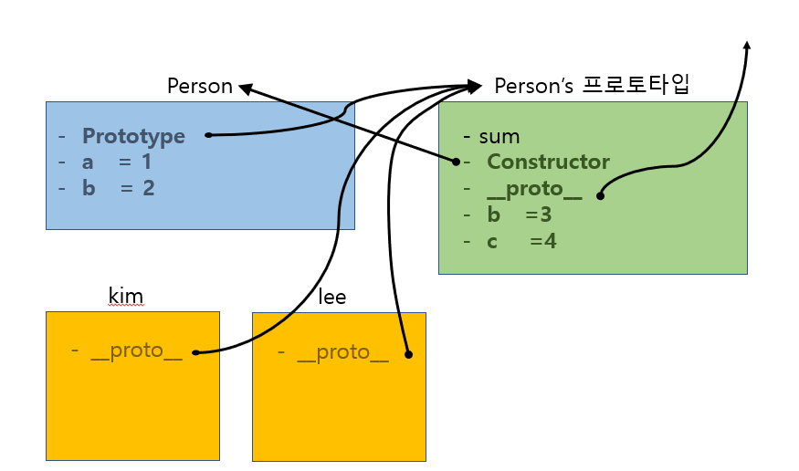

# 자바스크립트 공부
#### 추천 사이트
[모던자바스크립트집대성](https://ko.javascript.info/)
[자바스크립트 공부방법](https://perfectacle.github.io/2017/08/08/js-how-to-learn/)

#### 공부팁
- 새로운 언어를 배울때는 그 언어의 탄생 배경에 대해 이해하는것이 매우 중요하다.
누가 어떤 문제를 해결하기 위해 만들었고, 이것을 연마하면 어떤 분야에 활용하기 좋은지.
그러면 어떻게 연마할지 공부방법이 명확해진다.
- 20의 노력으로 80을 얻을 수 있지만 그다음 5을 얻기위해 80의 노력이 필요하다.
- 다 이해하려고 하지마라. 하려고하는것에만 집중해라. 안그러면 무조건 배보다 배꼽이 더 커진다.
- 분류, 구조화를 잘해야한다.
변하는 속도가 느린게 높은 학습 비용. 쉬운것부터 배우는것이 효과적이다. 그러나 쉬운것만 배워야하면 계속 배워야하는 문제가 생긴다. 때문에 쉬운것 위주로 배우면서 꾸준하게 변화속도가 느린 기술을 학습해야한다. 기초다.
  - 변하지않는 기술 : 네트워크, 운영체제, 컴퓨터시스템, 논리학, 대수학
  - 느리게변하는 기술 : 프로그래밍언어, 프로그래밍 패러다임, 자료구조, 보안, 알고리즘
  - 빠르게변하는 기술 : 프레임워크, 라이브러리, UI, UX, 디자인패턴
- 자바스크립트 입문서
자바스크립트 완벽 가이드
- 4가지 프로그래밍 역량
  - 일관성
  - 유연성
  - 확장성
  - 독립성

  #### 프로그래밍 팁
  - early return, early exit.
  예를들어 어떤 함수 안에 10이상일때 또는 로직이 있다면, 10미만일때 로직을 위에다 추가해서 그 경우는 빨리 해결해버려라.
  - Getter, Setter를 쓰는이유 : 사용자가 멍청하게, 또는 실수로 잘못된 값을 지정하거나 접근하는 것을 막을 수 있다.
  그리고 접근하거나 할당할때 내부적으로 getter, setter를 자동으로 호출하는 경우가 많다.

#### [브라우저의 험난한 역사](https://www.youtube.com/watch?v=wcsVjmHrUQg)
1993년. 첫번째 웹브라우저 mosiac가 탄생
 이 개발팀을 이끌던 Mark Adndeessen(마크 엔더슨)은 대학을 졸업하자마자 Nescape사를 창립.

1994년 주도자였던 마크엔더슨은 네스케이프사를 설립. 80%의 점유율. 이때는 정적인 웹사이트만 가능했다.
     scripting언어를 추가하자고 결심. 2가지언어를 고려했다. Sun사의 Java는 무거워서 패스, "Brendan Eich"를 스카웃해서 Scheme을 자바스럽게 변형.
     정말 짧은시간에 prototype을 기반으로한 언어를 개발함.

1994년 9월 순식간에 프로토타입을 베이스로 한 유연한 언어를 개발.
이것이 내부적으로는 모카라고 불린 새로운언어 탄생. 추후 LiveScript로 이름이 바뀌고 네스케이프의 엔진으로 포함.
이 당시 자바의 인기가 너무좋아서 인기에 편승하기 위해 이름을 JavaScript로 변경.

1995년 공식적으로 자바스크립트와 인터프리터(스크립트 해석기)가 포함된 넷스케이프 출시.
    Microsoft가 위기감을 느끼고 브라우저 출시. Netscape를 리버스 엔지니어링함. 고대로 배껴와서 저작권을 피하기위해 JScript로 이름지어 이를 포함한 Explorer를 출시.
    웹개발자들은 표준이없어서 혼란스러웠음.
    네스케이프사는 ECMA International이라는 단체를 찾아가서 우리것으로 표준안을 만들자고 제안.
    바로 이것이 자바스크립트의 탄생이며 주요 목적은 입력 유효성 검사였다.
    웹개발자들 고통의 시작. 규격이 너무나 달라 마치 2개의 개발하는 느낌.
    이당시에는 웹사이트에서 "우리 웹사이트는 네스케이프에서 더 잘보이니 네스케이프를 지금 다운받아주세요" 이런글이 흔했다.
1996년 11월. 네스케이프사는 ECMA협회에 찾아가서 자기들것을 표준화해달라고 제안.
1997년 7월. ECMAScript1
이후로 계속해서
1998년 ECMAScript2
1999년 ECMAScript3 : 문자열 다루는 방법, error handling, 정규표현식, 예외처리, 숫자형 출력 포매팅
                    3판부터 진정한 프로그래밍 언어로 간주하는 이유는 이 때문.
2000년 ECMAScript4 : 클래스(class), 상속, optional type annotaion, Enterprise scale
    익스플로러의 점유율이 95%가 되고 MS는 건방져짐. class가 추가되면 그것은 스크립트 언어
    IE의 시장점유율 95%. MS의 끼워팔기. 건방져짐.
    '개발자들 편하게 할려고 스크립트 언어만들었는데 클래스를 추가하면 더이상 스크립트 언어가 아니야'
    '너희는 너희 마음대로해라. 어차피 우리가 표준이다.'
2000년도부터는 표준화 진행이 뎌뎌짐
2004년 Mozilla의 Firefox탄생 (이제 이름이 좀 반갑죠)
    ECMA를 찾아가서 우리가 ActionScript3라는 멋진 언어를 만들었고 이걸 해석하는 Tamarin엔진이 있는데 표준화해줘.
    그런데 기존과 너무 달라서 표준화 안됨.
    2개가 3개가 되어버렸네?
2004년 Jesse James Garrett가 Ajax를 개발함.
    오페라 등 여러 브라우저들이 춘추전국.
    개발자들이 많아지며 강력한 커뮤니티가 형성.
    이당시 jqeury, dojo, mootools같은 라이브러리 탄생.
    라이브러리의 목적 : 브라우저마다 신경쓰지않도록 하겠다.
2008년 구글의 chrome 출시. 강력한 엔진이 포함. 자바스크립트를 실행하는 속도가 매우 빠름.
2008년 7월 위기감을 느낀 브라우저사들이 협업 시작.
2009년 ECMAScript5 : 중요한 버전이다. JSON.  스티브잡스의 no flash 정책.
2015년 ECMAScript6(ES2015) : default parameter, class, arrow function(화살표함수), const, let
                    이때부터는 그냥 나온 년도를 쓰기 시작했다.
                    import, export 모듈의 탄생. 스크립트태그와 다르다.
                    여기부터 '모던 자바스크립트'라 부른다.
2016년 ECMAScript7(ES2016) : 제곱연산자, Array추가
2017년 ECMAScript8(ES2017) : async, await
2018년 ECMAScript9(ES2018)
2019년 ECMAScript10(ES2019)

이전 브라우저들은 최신버전을 지원하지 않기 때문에 개발은 최신걸로 하더라도 BABEL로 5.0버전으로 변환하여 배포한다.
가장 중요한 ECMAScript6 이후 부터는 조그만 변화들만 일어났다. 성숙하고 정착된 언어가 되었다.
그래서 jqeury같은 도움없이도 모든 브라우저에서 잘 동작하는 서비스를 만들수있게 되었다. 바닐라스크립트.
개발은 자기가 편하거나 최신버전으로 개발하고 Babel 사이트에서 변환한다음 배포한다.


###### [바벨](https://babeljs.io/)
브라우저 호환을 위해 tanscompiler인 BABEL 활용.
웹브라우저에서 돌아가는 프로그래밍언어는 only 자바스크립트.
바벨 등으로 타입스크립트로 개발하든, 리엑트로 개발하든 결국은 자바스크립트로 변환된다.

###### ECMAScript란?
ECMA(유럽 컴퓨터 제작자 협회. European Computer Manufacturers Association)는 정보통신기술, 전자제품을 위한 국제 표준기구다.
자바스크립트를 개발한 Netscapte가 더 향상된 표준화를 위해 기술 규격을 Ecma에 제출했고, 그에 따라 Ecma가 새롭게 제정한 표준이 바로 ECMA-262이다.
ECMAScript란 기술 규격에 따라 정의하고 있는 표준화된 스크립트 프로그래밍 언어를 말한다. ES라고도 한다.
발음할때는 보통 에크마스크립트라고 한다.
ECMAScript의 여러 버전을 '판'이라고 부른다.

ecma-international.org : 공식사이트


#### 요즘
요즘은 SPA(싱글 페이지 어플리케이션)이 유행
  하나의 페이지에서 부분적으로 업데이트.
  이걸 쉽게 만들기위한애들이 리액트, 앵귤러, 뷰 같은것들.

웹을 벗어난 혁명. NodeJs의 등장. 백엔드에서 자바스크립트를 활용.
리액트등으로 mobile앱
일렉트론으로 desktop앱 가능

가장 많이 사용되는 언어 8년동안 1위

---
#### 소개
웹앱의 구성요소는 HTML, CSS, JavaScript
HTML의 정보, CSS의 디자인, JAVASCRIPT의 기능.
JS의 핵심은 상호작용. 사용자의 조작에 반응.

정적 웹페이지, 동적 웹페이지.        그리고 어제 배운 반응형 웹페이지.
무엇이 움직이고 무엇이 가만히있는가? 화면의 요소가 아니다. 바로 '정보'


#### 학습환경
1. visual studio code, 아톰같은 에디터 설치
2. 확장프로그램
  - debugger for chrome
  - nodejs 공식홈피에서
  - parceljs(공식홈피에서. webpack같은 프론트엔드 번들러. nodejs설치되어야함. npm으로)
  - typescript(nodejs설치되어야함. npmjs.com 검색에 typescript 치면 npm install -g typescript 이렇게 설치하라고 함.)
  - 브라우저 호환성을 위해 엔지니어링. npm이 생겼기 때문이죠. 번들러의 탄생.(대표적으로 webpack. 브라우저에서 자바스크립트 파일을 실행하기전에 연쇄적으로 다 이어서 하나의 파일로 만들어준다.)
  - 트랜스파일러 : 브라우저가 이해할수있는 프로그래밍 언어는 자바스크립트가 유일하다.
    내가원하는 언어로 개발하고 그것을 원하는 자바스크립트 버전으로 변환해주는 변환기.

##### 웹개발에 필요한 추천 사이트 ###
1. http://www.tcpschool.com/
1. caniuse.com


##### 자바스크립트의 구성 3요소
코어(ECMAScript), 문서객체모델(DOM), 브라우저객체모델(BOM)
1. 코어(ECMAScript)
  문법, 타입, 선언문, 키워드, 예약어, 연산자, 객체 등의 언어의 저수준에 해당하는 부분을 정의한다.
  액션 스크립트, 플래쉬, NodeJS, JavaScript 등은 이러한 명세를 구현한 언어
2. 문서 객체 모델(DOM : Document Object Model)
  XML을 HTML에서 사용할 수 있도록 확장한 애플리케이션 프로그래밍 인터페이스.
  전체 페이지를 노드의 계층 구조로 변환한다.

3. 브라우저 객체 모델(BOM : Browser Object Model)
  BOM을 이용하면 브라우저에 표시된 페이지와는 별개의 컨텍스트에서 브라우저와 상호작용 할 수 있다.
  BOM을 주관하는 자바스크립트 표준이 존재하지 않는다는 문제가있었으나 HTML5가 BOM을 공식명세의 일부로 표준화하고 있기 때문에 크게 개선되었다.
웹브라우저는 ECMAScript를 구현하는 호스트환경일뿐. 다른호스트환경으로 NodeJS, 어도비 플래시 등이 있다.


#### 사용법
CSS는 HTML과 완전히 다른문법인데 HTML위에서 동작하도록 만들어졌죠.
`<link>`로 인해서 가능해졌습니다.
마찬가지로 JavaScript 는 HTML과 완전히 다른문법인데 HTML위에서 동작하도록 만들어졌습니다.
바로 `<script>`태그로 인해서 가능합니다.
'웹브라우저야. 지금부터는 javascript소스니까 스크립트 태그가 끝날때까지 HTML이 아닌 자바스크립트로 이 코드를 해석해'라는 태그입니다.
css는 3가지 방법이있었고 javascript는 2가지 방법이 있다. 인라인과 외부파일.

#### 핵심 문법
- 대소문자를 구분한다.
- 식별자(함수, 프로퍼티, 매개변수의 이름)는 관습적으로 카멜케이스로 쓴다. 예) firstSecond
- 한줄주석은 //, 여러줄주석은 \/* 내용 \*/
- 세미콜론이 없으면 엔진이 자동으로 찍어서 처리하지만 항상 세미콜론으로 닫기를 권장한다.
- 제어문에서 문장 하나만 실행하더라도 항상 코드 블록 {}을 쓰길 권장한다.
- 느슨한 변수 타입을 사용한다.
- 5가지 원시타입(primitive) : Undefined, Null, Boolean, 숫자, 문자열
- typeof연산자를 통해 데이터 타입을 알 수 있다. 함수가 아니라 연산자이기 때문에 괄호를 쓰지않는다.
- 정의했지만 초기화하지 않았다면 undefined가 할당된다.
- Null은 빈 객체를 가리키는 포인터. undefined는 일부러 할당하는것이 아니고 null은 명시적으로 값이 없음, 이용할수 없음을 표현하는 메세지다.


##### HTML속 스크립트태그의 위치
스크립트 태그는 6가지 옵션이 있다.
`async, charset, defer, language(폐기됨), src, type`
1. HTML 인라인
2. HTML안 묶어서
  2.1. head안
    : 자바스크립트 코드를 전부 내려받고, 파싱하고, 해석을 끝낼때까지 렌더링이 멈추기 때문에 사용자가 웹을 그리기 까지 많은 시간이 소요된다.
  2.2. body의 마지막
    : 페이지를 다 그린다음 스크립트를 실행한다. 브라우저에 빈 화면만 떠있는 시간이 줄었으므로 빠르다고 느끼지만 자바스크립트 의존적인 웹사이트라면 정상적인 페이지를 볼 수 없다.
  2.3. head안 + async
    : 외부 스크립트에만 적용되며 해당요소를 만나는 즉시 코드를 내려받는다.
    정의된 순서와 상관없이 다운이 완료된 순서대로 실행한다.
    body끝보다 다운시간이 절약된다. 자바스크립트가 파싱되기 전에 실행되기때문에 조작시점에 html의 요소가 아직 정의되지 않아서 위험할 수 있다. 순서의 의존성이 있는경우 사용하면 안된다.
    사용 예 = <script async src="main.js"></script>
  2.4. head안 + defer
    : 외부 스크립트에만 적용되며 해당요소를 만나는 즉시 코드를 내려받는다.
    완전히 다 받고나서 정의한 순서대로 실행한다.
    파싱이 끝난다음 병렬로 다운받은 스크립트를 실행한다. 가장 좋은 옵션이다.
    사용 예 = <script defer src="https://javascript.info/article/script-async-defer/long.js"></script>

3. 외부파일
   : 외부파일을 해석하는동안, 내려받는동안 페이지 처리가 멈춘다.
   외부파일을 쓰면 생기는 장점
   1. 관리하기 쉽다 : js코드가 여기저기 HTML페이지에 흩뿌려져 있으면 코드관리가 어렵다.
   2. 캐싱 : 여러 서로다른 페이지에서 같은 파일을 사용한다면 한번만 내려받는다.
   3. 미래에도 안전 : CDATA섹션이나 주석편법을 쓰지않아도 된다.

#### 출력방법 3가지
- conlole.log()
- document.write
- alert()

## 변수
https://developer.mozilla.org/ko/docs/Learn/Getting_started_with_the_web/JavaScript_basics
- 목적 : 데이터의 저장
- 어떻게? : 메모리에
        참고로 주메모리가 RAM. 보조메모리가 하드디스크,SSD
- 메모리설명
        프로그램이 실행되기 위해서는 프로그램소스가 메모리에 로드되어야 하고, 프로그램에서 사용될 변수들을 저장할 메모리의 공간이 필요하다.
        - 코드(텍스트) 영역 : 코드
        - 데이터 영역 : 전역변수, static변수
                        프로그램의 시작부터 종료가 될때까지 메모리의 공간을 차지함.
        - 힙 영역 : 지역변수, 매개변수. "참조타입"
                        사용자가 직접 관리할수있고 해야만 하는 영역. 자바는 가비지컬렉터가.
                        런타임시 크기가 결정된다.
        - 스택 영역 : "원시타입값", 실행컨텍스트 저장
                        호출될때 할당되고 종료되면 메모리가 해제됨.
                        스택영역의 크기와 힙영역의 크기는 반비례. 스택이 힙에 비해 훨씬 빠르다.
        https://curryyou.tistory.com/275

- 변수의 종류
- 변수의 선언과 초기화
    - 명명규칙 : 대소문자 구분함. 명사형. 뜻을 명확하게. 데이터타입을 생략하면 자동으로 var를 붙여줌. 예약어 사용안됨
    - [var](https://developer.mozilla.org/ko/docs/orphaned/Web/JavaScript/Reference/Statements/var) : variable(변하기쉬운).
    재선언, 재할당 가능. 호이스팅때문에 선언도안한것을 쓸수있음, 블록 유효범위를 무시하기 때문에 사용을 지양해야한다. 뒷통수를 많이 맞고 그것을 해결하기 위해 let이 탄생했다.
    - [let](https://developer.mozilla.org/ko/docs/Web/JavaScript/Reference/Statements/let) : 약자아니고 그냥 영어에서 말하는 let. 블록 유효범위를 가지는 지역변수. 전역변수로 쓸수없다.
전역변수는 프로그램이 끝날때까지 메모리의 공간을 항상 차지하므로 최소한으로 사용.
    - [const](https://developer.mozilla.org/ko/docs/orphaned/Web/JavaScript/Reference/Statements/const) : constant(불변의). 변하지 않는 데이터를 담는 그릇. 한번할당하면 값을 바꿀수없다.(원시형변수에 한해서)
    변수선언과 초기화를 동시에 진행해줘야 한다.
사용하면 좋은점은 보안, thread safety, 실수막음
예) daysInWeek = 7;  PI = 3.14;

### var 와 let의 명확한 차이
- var 연산자는 변수를 로컬 스코프에서 정의한다는 점을 반드시 기억해야 한다.
- 함수외부에서 선언한var함수는 모두 전역변수 처럼 된다.
  var를 생략하면 var를 자동으로 붙이기 때문에 마찬가지로 전역 변수처럼된다.
- (**중요**) var키워드로 선언된 변수는 [오로지 함수]의 코드 블록만을 지역 스코프로 인정한다.
  즉 함수안이 아닌곳에서는 전역변수 취급한다는 말이다.
```javascript
var a = 1
if (true) {
  var a = 5
}
console.log(a) // output: 5
//if문은 함수가 아니기 때문에 if문안에서 선언한 var는 전역변수 취급되어서 5가 찍히는것이다.
```
- 반면에 let, const로 선언한 변수는 모든 코드블록을 지역스코프로 인정하는 블록레벨 스코프를 따른다.


### scope
식별자의 유효범위를 뜻한다.
선언된 위치에 따라서 유효범위는 달라지는데 전역에 선언된 변수는 전역 스코프, 지역에 선언된 변수는 지역 스코프를 가진다.
자바스크립트에서는 모든 코드 블록(if, for, while, try/catch 등)이 지역 스코프를 만든다.


---
### 호이스팅 (hoisting .끌어올림)
function키워드로 선언한 모든 식별자(함수선언문)는 호이스팅 된다.
자바스크립트 엔진에서 런타임 이전에 먼저 함수를 선언한다.
반면에 함수표현식은 런타임 이전에 값을 undefined로 초기화만 시키고 런타임타이밍에 객체가 된다.
---
### 데이터타입. 자료형
어떤 프로그래밍 언어든 primitive(원시), object(객체) 2가지 타입이 있다. 원시형이 아니면 다 객체형이다. 세세하게 메모리 관리 가능하는것이 목적. 객체는 중요하기 때문에 따로다룸.
- ☆☆☆ 자바스크립트의 유의 ☆☆
Dynamic Typed Language. 데이터타입이 런타임때 결정됨.
C, Java등은 Static Typed Language. 선언할때 명시하고 컴파일때 타입에러를 발생함.
장점 : 프로토타입으로 빠르게 돌려볼때 좋음.
단점 : 런타임때 에러가 발생. 뒷통수. -> 결국 타입스크립트의 탄생
-  #### primitive(원시)
    - 더이상 작게 쪼갤수없다. 값을 그대로저장.
    - 종류 : Number, string, boolean, null, undefined, symbol
    - ##### Number
    자바스크립트에서 숫자는 정수형 소수형 구분없이 모두 Number이지만 특별한 3놈이 있다.( infinity, -infinity, Nan(NOt a Number) )
    최근에 BigInt라는 타입이 추가됨. 숫자뒤에 n을 붙이면됨. 크롬과 사파리에서만 지원됨. Number는 (2^53-1)~-(2^53-1)까지 범위 표현가능. 대략 +-9000조
    왜그런지 [설명](https://tc39.es/ecma262/#sec-ecmascript-language-types-number-type) 보다가 머리터짐.
    ```javascript
    let pi = 314159265358979323846264338327950288419716939937510582097494459230786406286208998628034825342117067982148086513282306647093844609550582231725359408128481117450284102701938521105559644622948954930381964428810975665933446128475648233786783165271201909145648566923460348610454326648213393607260249141273724587006606315588174881520920962829254091715364367892590360011330530548820466521384146951941511609433057270365759591953092186117381932611793105118548074462379962749567351885752724891227938183011949129833673362440656643086021394946395224737190702179860943702770539217176293176752384674818467669405132000568127145263560827785771342757789609173637178721468440901224953430146549585371050792279689258923542019956112129021960864034418159813629774771309960518707211349999998372978049951059731732816096318595024459455346908302642522308253344685035261931188171010003137838752886587533208381420617177669147303598253490428755468731159562863882353787593751957781857780532171226806613001927876611195909216420198959515076069479451096596094025228879710893145669136867228748940560101503308617928680920874760917824938589009714909675985261365549781893129784821682998948722658804857564014270477555132379641451523746234364542858444795265867821051141354735739523113427166102135969536231442952484937187110145765403590279934403742007310578539062198387447808478489683321445713868751943506430218453191048481005370614680674919278191197939952061419663428754440643745123718192179998391015919561814675142691239748940907186494231961;
    console.log(pi);
    ```

    - ##### string
    자바스크립트에서는 문자와 문자열을 구분하지 않는다. 따옴표(\' \') 나 쌍따옴표(\" \") 안으로 감싸면된다.
        - 다양한 문자열 함수
        ```javascript
        charAt(인덱스), IndexOf("찾을문자"), lastIndexOf("찾을문자"), replace("비포","애프터")최초만,  substring(시작인덱스, 끝인덱스), substr(시작인덱스, 문자갯수), split("기준문자") 배열로 리턴, toLowerCase(), toUpperCase(), length, concat("합칠문자열"), +, trim()
        ```
    - 템플릿 리터럴
    ```javascript
    `문자열블라블라 ${변수} 블라블라` 과 같이 양쪽백틱안에 달러{}를 쓰면 해당 변수의값을 쓸수있다. 문자열 열었다가, +로 연결했다가 귀찮음이 줄어든다.
    ```


    - ##### boolean : 참과 거짓.
    false : 0, null, undefined, NaN, ''
    true : 다른 모든 값

    - ##### null
    존재는 하되 아무값도 가지지 않은 상태. 명시적으로 값이 비어있음을 나타내는데 사용.
    typeof null 은 object 라는 것에 주의해야 함.
    현재는 비어있지만 소스 어디서인가 할당될거라는 의미.
    - ##### undefined
    존재는 하는데 아무값이 할당되지 않았음.
    선언만 했을때 기본값
    - ##### Symbol
    고유한 식별자가 필요하거나 우선순위를 주고싶을때 사용.
    ```javascript
       const symbol1 = Symbol('하하');
       const symbol2 = Symbol('하하');
       console.log(symbol1 === symbol2);

       또는 같게 만들수도있음.
       const symbol3 = Symbol.for('id');
       const symbol4 = Symbol.for('id');
       console.log(symbol1 === symbol2);
     ```
- "call by value" vs "call by reference"
    - 원시 : 값에 의한 호출.   이름으로 호출하면 값을 참조한다.
    - 객체 : 참조에 의한 호출.  이름으로 호출하면 데이터가있는 메모리의위치를 참조한다.
- 놀라운사실
	 var a = 10; 을 하면 자바스크립트 엔진에 의해서 var a = new Number(10); 으로 자동형변환되어 실행된다.
	 그래서 typeof(a) 하면 Number가 찍히는것.
---
## 연산자 Operator
연산은 어떤 언어든 거의 같다.
```javascript
산술연산자 + - * / % **
증감연산자 ++ --
할당연산자 =  *=  /=  %=  +=  -=  !=
비교연산자 == !=    === !==     <  <=  >  >=
비트연산자(안중요) & | ^ ~  <<  >>
논리연산자 ||(또는)   &&(그리고)   !(not)
문자열 연산자 +
조건(삼항)연산자  조건? 반환값1 : 반환값2


```

## 조건문
//영어 그대로 해석하면된다. else if나 else는 생략가능하다.
개념 : 일반적으로 if문을 쓰고
매우간단할때는 삼항연산자, 조건이 많을때는 switch문
if문을 연속으로 쓰는것과 if문다음에 else if오는것들의 차이 :
    if는 위의조건이 만족하더라도 계속 검사,
    else if는 위의조건이 만족하면 검사안함.

- if문
if(조건){
    조건을 만족할때 실행할 본문;
}else if(그 외의 조건){
    조건2를 만족할때 실행할 본문;
}else if(그 외의 조건){
    조건2를 만족할때 실행할 본문;
}else{
    그외에 아무것도 만족하지 않았을때 실행할 본문;
}


- switch문
switch(조건){
    case 만족값1:
        만족값1일때의 본문;
        break;
    case 만족값2:
        만족값2일때의 본문;
        break;
    default :
        그밖의 값일때의 본문;
}
break; 를 만나면 조건문에서 아예 나간다.
break; 가 없으면 그다음 문장도 실행한다.
조건에 범위를 사용할 수 없다.


## 반복문
- for (시작; 조건; 스탭){본문}
    예) for(let i=3; i>0; i--){
        console.log(i);
    }
  -이중for문. BigO(O^2)이기때문에 cpu에 좋지않다. 그러나 이중for문으로 구구단 2단부터 9단까지 쉽게 출력하는거 만들어보기

- 향상된 for
    - for(자료형 변수명 : 배열명){
        문장
    }

    - for(변수 in 리스트){   //모든 객체에서 사용가능. 벨류에는 접근할수 없음. Enumerable true이기 때문에 반복가능.

    }

    - foreach는 array에서만 사용가능.
    -for in 반복문 : 객체의 모든 열거 가능한 속성에 대해 반복
     for of 반복문 : [Symbol.iterator] 속성을 가지는 컬렉션 전용(반복가능한). String, Array, Map, Set

- while (조건){본문}        //for는 횟수가 포인트일때, while은 범위가 포인트일때
- do {본문} while(조건);    //최소한 한번 실행.
- break
    반복문안에서 break; 를 만나면 완전히 반복문을 끝냄.
- continue
    반복문안에서 continue; 를 만나면 continue아래에 실행해야될문장을 안하고 다음 반복문을 시작한다.

- ##### 실습1.
    점수로 수우미양가 등급나누기 (어려우면 몇점 이상 이하만 나누기)
    입력받은 구구단 출력
    구구단 2단부터9단까지 출력(단끼리는 줄띄우기)

    ### 함수
* 인풋(인자)을 받아 가공하여 아웃풋(리턴. return)을 반환하는 작업을 재사용하기위해 뽑은것.
* 함수는 return을 만나면 더이상 실행하지 않고 호출한지점에 결과값을 반환한다.
* 네이밍규칙 : 한번에 하나의 일을 하는 동사. 소문자로 시작. 무슨일을 하는지 명확하게.
            이름짓기가 어렵다면 한번에 여러일을 하는 함수라는 것.
* 함수정의.
    - 함수선언식 (function Declaration)
            호이스팅 됨.
            일반적으로 우리가 쓰는것. function 함수이름(인자)
            예) function print(){
                console.log('print');
            };

    - 함수표현식 (function Expression). 익명함수. 리터럴방식.
            호이스팅 안됨.
            선엄함과 동시에 변수에 할당. 자바스크립트이기에 가능한것(객체취급)
            예) const print = function(){
                    console.log('print');
            };
	- 어떨때 선언식쓰고 어떨때 표현식쓰나?
	=> 리터럴방식으로 만들면 익명함수이기 때문에 재사용하지 않고 빨리만드는 용도.

* 함수호출법 : 함수이름(인자);   //함수이름은 함수그자체의 개념일뿐. 실행하려면 ()를 써줘야된다. 인자가 있다면 ()안에 인자를 넣어서.
/* 주의. 함수이름만 넘겨주는것과 함수이름()은 다른것. */
* 인풋
  - 매개변수. 파라미터(parameter)  : 정의부분에 있는 변수
  이 함수를 만드는 사람이 이 함수가 실행되기 위해서는 인자가 몇개가 필요하고 그 인자를 이 이름으로 쓰겠다. 라고 지정하는 아이
  사용하는사람이 n번째 요소로 무엇을 넘기든지 나는 n번째 요소는 이걸로 이름붙여 쓸거야.
    - 전달인자. 아규먼트(argument) : 호출시 전달되는 실제값
  이 함수를 사용하는 사람이 함수를 호출할때 넘기는 실제 데이터
  이름이 중요한게 아니다.  정의시 들어간것과 호출시 들어간것이 다르다는 개념이 중요하다.
  ```javaScript
  let dan = prompt("몇 단을 출력할지 입력하세요");

  function printDan(dan) {  //위의 dan과 이 함수를 정의할때 쓰인 dan은 서로 다른아이다. 우연히 이름이 같을뿐.
    for (let i = 1; i < 10; i++) {
        console.log(`${dan} X ${i} = ${dan*i}`);
    }
  }
  printDan(dan);
  ```
* 호출할때 유의점
   데이터 그 자체를 넘기지마라. 안녕 이라고 하면 안녕이라는 변수를 찾는다. "안녕"을 넘겨야지.
* ☆☆☆ 자바스크립트에서 유의해야할점 ☆☆☆
    - 매개변수의 수가 맞지 않아도 해당 함수를 에러없이 호출할 수 있다.
    - 넘겨지지않은 인자는 undefined,   파라미터보다 많으면 무시
    ```javascript
      //함수인데 이름이 명사네? 생성자
      function Animal(name, age){
            console.log("Animal 생성됨");
        }

        Animal("이름", "나이");
        Animal("이름");
        Animal("이름", "나이", "키");
    ```


* 즉시실행함수 IIFE
Immediately Invoked Function Expression
이름없는 함수를 바깥괄호로 싸주면 된다. 당연히 파라미터까지 쌀수는 없으니까 그 앞까지.
    ```javascript
    (function (){
        내용
    })();
    ```

* ###### 콜백함수
인자로 넘겨주는 함수.   프로그래밍에서 콜백은 다른코드의 인자로 넘겨주는 실행가능한 코드를 말한다.  인자로 전달한후 조건을 컨트롤하여 언제 실행할지 결정할 수 있다.
    예) 이때의 printTrue와 printFalse가 콜백함수.
    ```javascript
    function matchQuiz(answer, printTrue, printFalse){
        if(answer[0]==="무령왕릉"){
            printTrue();
        }else{
            printFalse();
        }
    }

    ```
    일반함수와 다른것 아니다. 그저, 호출방식에 의한 구분이다.
    그러면 버튼에 클릭이벤트가 발생했을때 실행하는 함수도 콜백함수겠네? 응, 맞다.
    사용하는 이유는 비동기적 프로그래밍을 할 수 있기 때문.
    **동기 :** synchronous. 동시에 일어나는.   요청을 하면 응답이 와야 다음동작을 수행함. 받을때까지 대기하고있음.
        설계가 매우 간단하고 직관적. 계좌전송. 카드결제.
    **비동기 :** Asynchronous. 동시에 일어나지않는. 던져놓고 다른일함. 시험채점, 집안일.


* ##### 화살표함수 (Arrow function)
- 함수를 매우 간결하게 만들어주는 좋은 놈. 항상 이름없는 함수임.
- [MDN설명](https://developer.mozilla.org/ko/docs/Web/JavaScript/Reference/Functions/Arrow_functions)
- [설명잘된곳](https://poiemaweb.com/es6-arrow-function)
- 문법
(매개변수) => {본문}
화살표함수는 이름이 없고 this가 없다.
```javaScript
// 매개변수 지정 방법
    () => { ... } // 매개변수가 없을 경우
     x => { ... } // 매개변수가 한 개인 경우, 소괄호를 생략 가능
(x, y) => { ... } // 매개변수가 여러 개인 경우, 소괄호를 생략 불가

// 함수 몸체 지정 방법
x => { return x * x }  // single line block
x => x * x             // 함수 몸체가 한줄의 구문이라면 중괄호를 생략할 수 있으며 암묵적으로 return된다. 위 표현과 동일하다.

() => { return { a: 1 }; }
// 화살표 함수의 유일한 문장이 'return'일 때 'return'과 중괄호({})를 생략할 수 있다.
() => ({ a: 1 })  // 위 표현과 동일하다. 객체 반환시 소괄호를 사용한다.

() => {           // multi line block.
  const x = 10;
  return x * x;
};
```

```javascript
// ES5
var pow = function (x) { return x * x; };
console.log(pow(10)); // 100

// ES6
const pow = x => x * x;
console.log(pow(10)); // 100

// 보통의 예제
예1) array1.forEach(element => console.log(element));
//forEach를 만든사람이 첫번째 요소로 함수를 받을것이라고 지정했다.
array1.forEach( 함수명 );
호출하는것이 아니라 함수를 인자로 전달한것.

function 함수명 (element) = {
console.log(element)
}
위는 화살표함수 문법에 의해 아래와 같다.
(element) => console.log(element)   //그런데 인자가 하나일때 ()가 생략가능해서
element => console.log(element)가 된다.
즉 함수 이름을 전달한것이다.

array1.forEach(function(element){
  console.log(element)
})
즉 맨위와 맨아래의 이 함수는 같은것이다. 3줄을 한줄로 표현
맨위와 맨 아래의 혼용에 익숙해져야한다.
```

```javaScript
/* 아래 2개는 완전히 같은 말 */
function(){
  console.log("hi!");
};
() => console.log("hi");


/* 아래 2개는 완전히 같은 말 */
let sayHi2 = function(){
  console.log("hi!");
};
let sayHi2 = () => console.log("hi!");
```

* 디폴트 파라미터(default parameter)
```javascript
showMessage('Hi!');

function showMessage(message, from = 'unknown'){
  console.log(`${message} by ${from}`);
}
```
* Rest parameter : 파라미터를 배열형태로 전달 할 수 있다. 몇개의 파라미터를 전달할지가 고정되지 않을때 사용.
```javascript
function printAll(...args){
  for (const arg of args){
    console.log(args);
  }
}
```

---

### 객체 Object
[모질라 설명](https://developer.mozilla.org/ko/docs/Learn/JavaScript/Objects/Basics)
- 속성과 행동의 집합  (=데이터와 기능의 집합)(=변수와 함수의 집합)
- 객체 생성 방식 3가지
    1. 객체 리터럴.   자바스크립트 변수처럼
        var 변수명 = { 키1 : 밸류1, 키2 : 밸류2};
        {}안에 키 : 밸류를 ,로 연결한다. 함수도마찬가지 say : function() 식으로
    2. 생성자 함수.   자바처럼.
        var myObj = new Object();
    3. Object.creat().   프로토타입 상속을 통해
        var parent = {a:10, b:20};
        var child = Object.create(parent);  //프로토타입을 parent로 가지는 오브젝트 생성
- 객체의 프로퍼티/메소드에 접근방법
    객체명.프로퍼티
    객체명[키]          console.log(Tiger[weight]);
    객체명.함수명()
- 신규 프로퍼티 생성
    객체명.신규키 = 값 or 메서드;
    객체명[신규키] = 값 or 메서드;
- 프로퍼티 삭제
    delete 객체명.키
    delete 객체명['키']
- [예제](http://tcpschool.com/javascript/js_object_concept)

##### 일급객체. first-class Object
//대부분의 언어에서 함수가 안되는건데 자바스크립트의 함수는 일급객체이기 때문에 가능한것.
- 변수에 할당 가능.
- 파라미터로 전달가능.
- 다른함수의 결과로서 리턴가능.
- 실행도중에 생성가능
즉, 함수를 데이터 다루듯이 다룰수 있게 된다.
고차함수를 만들수있고, 콜백을 사용할 수 있다.

---
#### DOM (Document Object Model)
문서객체 모델.
* 자바스크립트에서 HTML이나 XML의 구조에 접근할수있는 표준.
* DOM은 페이지를 노드의 계층 구조로 변환한다.
* DOM지원은 브라우저 제조사들의 우선순위 맨 위에 있으며 이런 노력의 댓가로 판올림 할 때마다 지원상황이 좋아지고 있다.
DHTML(Dynamic HTML)을 지원하면서 개발자들은 웹페이지를 새로고침하지 않고도 콘텐츠의 모양을 바꿀수 있게 되었다. 그러나 넷스케이프와 MS가 개발한 DHTML은 완전히 달랐으므로 웹은 두 브라우저중 하나쪽만 지원하는 두 세력으로 갈라저 버릴것이라는 불안감이 팽배했다. 이때부터 웹통신 표준을 만들던 월드 와이드 웹 컨소시엄(W3C)에서 DOM 관련 작업을 하였다.
무수히 많은 언어에서 DOM을 구현하지만 웹 브라우저에서 DOM은 ECMAScript를 통해 구현된다.
* 각 마크업은 노드로 표현,  요소는 요소노드, 속성은 속성노드, 문서타입은 문서타입 노드 등 12가지 노드가있다.
* 모든 노드는 다른 노드와 관계가 있기 때문에 어느 노드든 도달할 수 있다.


* 요소핸들링. (실습 : 노드 추가, 노드의 속성 변경, )
    - HTML로 선택    [MDN HTML셀렉터](https://www.w3schools.com/js/js_htmldom_nodes.asp)
    ```javascript
    document.getElementById('아이디')
    document.getElementsByClassName(클래스)    //배열이 리턴됨.
    document.getElementsByTagName(태그 이름 : 'h1', 'div' 등)
    document.getElementsByName(이름 : name)
    ```

    - CSS로 선택    [MDN 쿼리셀렉터](https://developer.mozilla.org/ko/docs/Web/API/Document/querySelector)
    ```javascript
    document.querySelector(CSS선택자 : 'header > a')
    document.querySelectorAll(CSS선택자 : 'header a')
    document.querySelector("#main, #title, #footer");
    document.querySelectorAll("p.note, p.tip")
    ```
- 특이사항
1. 이미지 가로 너비를 반으로 줄이면 세로가 같이 줄어든다.
그래서 가로도 반, 세로로 반으로 해버리면 세로가 1/4이 된다.
한쪽만 지정하면 한쪽은 브라우저가 알아서 비율을 맞춘다.
1. p태그에는 value도 text도 없네. textContent로 가져옴


##### XHTML
Extensible HyperText Markup Language는 HTML에 XML을 적용한 것.
HTML보다 엄격한 문법 규칙
XML과 XHTML에서는 <를 태그의 시작으로 간주하기 때문에 CDATA섹션으로 감싸는걸 많이 보게될것이다.

---
#### BOM (Browser Object Model)
* 자바스크립트를 통해 브라우저 창을 조작할 수 있게 하는 인터페이스
(뒤로가기를 한다든지, 쿠키를 만들어서 다음 폼창을 입력할때 자동으로 가져와서 쓴다든지)
* Window, Screen, Location History, Navigator, Popup Alert, Timing, Cookies


---
#### 이벤트
* Event 인터페이스는 DOM에서 발생하는 사건을 처리한다.
[w3이벤트설명](https://www.w3schools.com/js/js_htmldom_events.asp)
* 이벤트를 처리하는 2가지 방법 : 프로퍼티로 이벤트핸들러 등록,  메소드로 이벤트 리스너 전달
* 이벤트 핸들러와 리스너는 공식적으로 정의된 차이는 없다.
    - 이벤트 핸들러 : 이벤트가 발생했을때 처리를 담당하는 함수.
                예) <input type="text" onclick="addNum(); printNum();">
                예) button.onclick = function(){}
    - 이벤트 리스너 : 이벤트가 발생하는지 듣고있는놈.
                예) button.addEventListener("click", function(event){
                    })

    - 실습 [w3 마우스 이벤트](https://www.w3schools.com/js/tryit.asp?filename=tryjs_addeventlistener_add_many2)

* 팁
    - onchange는 유저가 직접 입력한 값의 변경만 듣고있기 때문에 계산된 결과값이 변하는 경우 작동하지 않는다. 때문에 그런경우 아래와 같은 방법을 사용한다. 선택자.val('hello').change();

---
#### JSON
- JavaScript Object Notation. 데이터포맷의 한 종류. String으로만 이루어져있다.
  즉, 단순히 데이터를 표시하는 표현방법일 뿐.
- 객체이름{키, 밸류}
- 1999년 ECMA3의 자바스크립트 객체의 형식에 큰 영향을 받아 만들어졌다.
- [샘플데이터](https://jsonplaceholder.typicode.com/)
- 웹브라우저위에서 동작하는 클라이언트와 서버가 어떻게 통신할지 정해놓은 규격이 HTTP(HyperText Transfer Protocol)
    - 클라이언트가 서버에게 *요청(request)* 할수있고 서버는 *응답(response)* 하는 방식으로 진행된다.
- 사용이유 : 데이터의 갯수, 데이터의 프로퍼티 가 100개, 1000개가 되면 그것들을 하나하나 변수로 만들수있을까?
- 장점 : 가장간단한 포맷, 눈으로 읽기도 좋다. 언어나 플랫폼에 종속되지 않는다. 즉, 해당언어에만 특별한건 안쓰겠다는것.
- **표현법** : {}안에 "키" : 값 나열하고 ,로 이어붙임.   key는 항상 쌍따옴표로 감싸야한다.
- 속성추출법 : .키
```javaScript
[
  {
    "question": "저는 몇살 일까요?",
    "anwser": "1993년에 태어난 28살입니다.",
  },
  {
    "question": "저의 혈액형은 무엇일까요?",
    "anwser": "O형 입니다.",
  },
  {
    "question": "저는 어디에 살까요?",
    "anwser": "강남구 대치동에 살고 있습니다.",
  },
  {
    "question": "저의 고향은 어디일까요?",
    "anwser": "부산입니다.",
  },
];
```
- *직렬화* serialize : 데이터(객체)를 json포멧으로 변환. 함수는 전달되지않는다. 자바스크립트에서만 특별하게 취급되니까 다루지 않음.
두번째 파라미터로 전달하면 원하는 프로퍼티만 가져올수있음

- *역직렬화* deserialize. parse : json을 데이터(객체)로 변환
  ```javascript
  //객체
  const rabbit = {
    name : 'tori',
    color : 'white',
    size : null,
    birthDate : new Date(),
    jump : () =>{
      console.log(`${name} jumping!`);
    }
  };

  //직렬화. json으로 만들기
  let json = JSON.stringify(rabbit);
  console.log(json);  //전체 출력
  let jsonPart = JSON.stringify(rabbit, ['name', 'color']);
  console.log(jsonPart);  //뽑은것만 출력


  //역직렬화. object로 만들기
  const obj = JSON.parse(json);
  console.log(obj); //변환했다가 변환. 함수 없어짐
  rabbit.jump();  //점프잘됨
  obj.jump(); //점프못함

  ```

- 팁 : 이쁘게 만들기, 비교하기 -> 울트라에딧
JSON Diff checker 다른점찾기: http://www.jsondiff.com/
JSON Beautifier/editor: https://jsonbeautifier.org/
JSON Parser 오브젝트 json 변화: https://jsonparser.org/
JSON Validator 유효성검사: https://tools.learningcontainer.com/json-validator/
줄이기


---
#### 배열 Array
* 자료들이 줄줄이 늘어선 자료형
* 이모지 활용하면 재밌음 win + ;
* 배열의 핵심 포인트는 0부터 시작하는 인덱스
* 배열 생성법 2가지
    - 배열 리터럴 대괄호([ ])
        var arr = [];
        var arr = ['zero', 'one', 'tow'];

    - Array() 생성자
        var arr = new Array();
        var arr = new Array('zero', 'one', 'tow');
* 자바스크립트의 배열이 다른언어와 다른점
    1. 배열 내부의 데이터 타입이 서로 다를 수 있다
    2. 배열의 크기는 동적으로 변경될 수 있다

* 배열 요소에 접근, 검사
    ```javaScript
    배열이름
    배열이름[인덱스]
    indexOf(값)  //해당값과 일치하는것들의 처음index리턴
    lastIndexOf(값)  //해당값과 일치하는것들의 마지막index리턴
    includes(값) //포함되어있으면 true, 아니면 false 리턴\

    for(let 이름 of 배열)
    forEach()   //모든 요소에 대해 콜백함수(값,인덱스,배열) 실행
    //원형 : arr.forEach(callback(currentvalue[, index[, array]])[, thisArg])
    예1) array1.forEach(element => console.log(element));
    예2) fruits.forEach((fruit, index)=> console.log(fruit));
    예3) animals.forEach(obj =>{
            console.log(obj);
        });
    예4)input.forEach((currentElement, index, array) => {
            if(sortation(currentElement) == "실수"){
              console.log("요소 : " + currentElement);
              console.log("index : " + index);
            }
        });
      ```

* 배열 내장함수
    - 배열.from(유사배열객체)  //유사 배열 객체(array-like object)나 반복 가능한 객체(iterable object)를 얕게 복사해 새로운Array를 만든다.

    //추가
    push(요소)      //요소를 제일 뒤에 추가
    unshift(요소)   //요소를 제일 앞에 추가. 매우 느리다.
    splice(시작, ?갯수, ?추가데이터)  //원본이 변함. 갯수없으면 시작인덱스 뒤로 다지움. 추가데이터가 있다면 지운자리에 채움.
    concat(추가할배열)    //추가할배열을 기존의 뒤에합침

    //삭제
    pop()   //제일 뒤의 요소를 제거
    shift() //제잎 앞의 요소를 제거. 매우 느리다.
    plice(시작,갯수) // 인덱스0부터 2개를 삭제. 원본이 삭제되기 때문에 거의 사용하지 않는다.

    join(?'사이글자')  // 요소를 모두합쳐서 사이글자를 넣어 스트링으로 리턴

    sort()      //정렬. 원본도 바뀜
    reverse()   //요소들을 거꾸로 만들어줌. 원본도 바뀜.
    splice(시작인덱스, 몇개)    //삭제하고 삭제된 배열을 리턴
    slice(시작, 끝)    //배열의 특정 부분을 복사해서 리턴
    find()  //콜백함수가 첫번째로 true되는놈을 리턴
    예)
    ```javaScript
    find(function(student, index){
            return student.score === 90;
    })
      const result = students.find(  (student) => student.score === 90  );

    filter() 원하는 자료만 검색
    예) const result = students.filter(  (student) => student.enrolled);
        console.log(result);

      map() : 찾아서 다른 방식으로 변환
      예) const result = students.filter(  (student) => student.score);
         console.log(result);
    ```

    - unshift와 shift가 느린 이유
    n번째 데이터를 n+1번째에 넣고, n-1번째 데이터를 n번째 넣고, 이런일들을 반복해야 되기 때문

* [엘리 퀴즈](https://drive.google.com/file/d/1smYHFS5fbgdyGHjBmXx2P-IyY3VWJ9tm/view)


---
#### Collection
프로그래밍 언어가 제공하는 자료구조
자바스크립트가 제공하는 컬렉션 : Objects, Map, Set, Weak Map, Weak Set
원래 있던 객체, 배열.  현실세계를 반영하기엔 부족해서 2가지 추가됨.
객체의 특징은 키와 벨류,  배열의 특징은 순서(인덱스)
- ###### Set [집합]
    - (집합) 수학에서 배운 집합 완전 그거.
    - 목적 : 자신의 멤버인지 확인을 빨리하는것에 최적화.
    - 초기화 : new Set(데이터)
    - 내장함수 : has, size, add, delete, clear, forEach((value, valueAgain, set) => {    });
             반복잡업을 위한  keys, values, entries
                맵과의 호환성때문에 변수를 3개받도록 함. 이때문에 서로 교환하기 쉬워짐.
- ###### Map [맵](https://developer.mozilla.org/ko/docs/Web/JavaScript/Guide/Keyed_collections)
    [참고설명](https://maxkim-j.github.io/posts/js-map)
    - (키-밸류의 쌍)  객체는 키로 문자열,심볼만 가능, 맵은 객체가 가능.
    ```javaScript
    //객체로는 이런게 불가능하다.
    const errorMessageMap = new Map([
    [404, "페이지가 없습니다"],
    [500, "서버 오류입니다"],
    [401, "권한이 없습니다"],
    ])
    errorMessageObj.404         // unexpected number 에러
    ```
    - 맵 객체는 기존 객체와는 다르게 메소드만을 이용해 값을 넣고 뺀다.
    - 맵 객체는 객체의 프로퍼티를 자주 변경해야할 때 빛을 발한다.
    - 초기화 : new Map(데이터)
    - 내장함수
        get(키) = 밸류를 리턴.   객체는 user.name  맵은 user.get("name")
        set(키, 벨류)
        has(키)
        delete(키)
        clear()
        size
        forEach(벨류, 키),
        for of   // for (const [key, value] of 맵)
        //객체에서는 for in이나 .keys()로 순회했는데 키만을 순회하기 때문에 값을 얻으려면 또 작업을 해야한다. 그 불편함때문에 Object.entries가 등장.
    - 팁 : map[key]는 맵을 일반객체처럼 쓰는것이기때문에 조금의 제약이 생기므로  map.get을 이용
    - 반복작업 : map.keys() – 각 요소의 키를 모은 반복 가능한(iterable, 이터러블) 객체를 반환합니다.
                map.values() – 각 요소의 값을 모은 이터러블 객체를 반환합니다.
                map.entries() – 요소의 [키, 값]을 한 쌍으로 하는 이터러블 객체를 반환합니다. 이 이터러블 객체는 for..of반복문의 기초로 쓰입니다.
    - Object 를 써야할지 Map 을 써야할지 고민이라면 다음과같은 경우를 고려한다.
        - 런타임 전까지 key 를 알 수 없을때
        - 모든 key 가 동일한타입 or 모든 value 가 동일한 타입
        - key-value 가 자주 추가되거나 삭제된다
        - 문자열 key 이외의 다른 key가 필요
        - 데이터가 순회되어야 한다
        위의 경우들이 있다면 Object 보단 Map 을 쓰는것을 고려해본다.
```javascript
let dictionary = new Map([
  ['Apricot', '살구'],
  ['Grapefruit ', "자몽"],
  ['Grape',    "포도"],
  ['WaterMelone', "수박"],
  ['Mango', '망고'],
  ['Banana', '바나나'],
  ['Apple', '사과'],
  ['Melon', '멜론'],
  ['Pear', '배'],
  ['Peach', '복숭아']
]);

// 키를 순회
for (let word of dictionary.keys()) {
  console.log(word);
}

// 값을 순회
for (let amount of dictionary.values()) {
  console.log(amount);
}

// [키, 값] 쌍을 대상으로 순회합니다.
for (let word of dictionary) { // dictionary.entries()와 동일합니다.
  console.log(word);
}

let map = new Map();

map.set('1', 'str1');   // 문자형 키
map.set(1, 'num1');     // 숫자형 키
map.set(true, 'bool1'); // 불린형 키

// 객체는 키를 문자형으로 변환한다는 걸 기억하고 계신가요?
// 맵은 키의 타입을 변환시키지 않고 그대로 유지합니다. 따라서 아래의 코드는 출력되는 값이 다릅니다.
alert( map.get(1)   ); // 'num1'
alert( map.get('1') ); // 'str1'

alert( map.size ); // 3
```


---
#### Ajax
[링크1](https://webclub.tistory.com/195)
- 배경
단지 이부분만 원하는데 페이지 전체를 리로드 해야된다면, 이게 100배면?
바로 이런것을 도와주는것이 Ajax
우리는 이제 그물이 아니라 낚시하는법을 배울겁니다.
구글의 aj 치면 추천검색어 뜨는것처럼.
1999년 MS가 처음으로 익스플로러에 탑재. 꽤 오랜시간동안 화제가 되지 못했는데 2004년 구글의 지메일로인해 수면위로 부상. 페이지 전체를 새로고침하는것이 아님.
사용자에게는 좋은 UX, 서버에게는 낮은 네트웍 비용.

- 소개
**AJAX** (Asynchronous JavaScript And XML)
API(HTTP)로 브라우저에서 제공하는 *XHR*(XMLHttpRequest) 객체를 이용한다. 이것이 Ajax의핵심객체. ajax로 사용하면 $.ajax로 받아온다.  axious도.
최근에는 **fetch** API(프로미스 기반이라서 콜백지옥에 안걸림)를 사용한다.
어떤 정보를 서버에게 요청할것이고, 서버의 응답이 오면 실행할 콜백함수 전달. 이 2개만 신경쓰면된다.
```javaScript
const xhr = new XMLHttpRequest();
xhr.onreadystatechange = function(){
  if(this.readyState === this.DONE){
    const response = JSON.parse(this.responseText);

    const table = document.getElementById('list');
  }
}

```

```jqeury
url, method, success 등

```
[fetch설명](https://ko.javascript.info/fetch)
[모질라 fetch설명](https://developer.mozilla.org/en-US/docs/Web/API/Fetch_API/Using_Fetch)
[fetch와 바닐라js로 데이터 넘기기](https://gomakethings.com/how-to-send-data-to-an-api-with-the-vanilla-js-fetch-method/)

- 구현에서 유의사항
  1. 인코딩
  2. 넘길려는값 자바스크립트에서 일단 찍어보기
  3. 받아온값 서블릿이나 컨트롤러에서 찍어보기
  4. get, post 방식 유의
  5. ajax의 url부분은 절대주소로 하는게 마음 편함

- ###### XML
    - 계속 XML이라는 단어가 등장하는데 뭔가요?
    - XML(eXtensible Markup Language)은 W3C에서 개발.  HTML처럼 데이터를 보여주는 목적이 아닌, 데이터를 저장하고 전달할 목적으로 만들어짐. 설정파일로 많이 쓰임.
    - XML은 새로운 태그를 만들어 추가해도 계속해서 동작하므로, 확장성이 좋습니다
    - 그럼 다시 AJAX는 Asynchronous JavaScript And XML이니까 XML을 통해서만 가능한가요? ㅠㅠ 아니다. AJAX가 개발될 당시에 개발을 주도했던 MS Outlook팀이 XML을 쓰고있어서 이름이 이렇게됐다. 굉장히 큰 실수.
    함수나 오브젝트 이름을 정할때 이름이 얼마나 중요한건지 깨닫길 바란다.

- XMLHttpRequest의 핵심 메소드
    -  open(method, url, [async:true])
        매개변수를 초기화하는 메서드
    //- method : 데이터 전송방식(GET/POST)
      - url : 요청대상 URL 입니다.
      - async : 요청에 대한 응답을 기다리는 방식을 나타냅니다.   비동기(true: 기본값)와 동기(false) 방식이 있습니다.
    -  send(data)
        실제로 HTTP request를 실행하는 메서드
    - onload : 응답데이터를 다 읽어들였을때 발생함.
    - onreadystatechange : reaDyState가 계속 변하는것을 체크함.

- 실습
fetch로 함.
준비물 : 1.html, 2.html, 3.html
최종결과 : 프론트연습/생활코딩WEB2/Ajax1.html

- 실습2
servlet으로 함
doPost오버라이드.
안에서 request.getParamter

- 유의
POST방식은 헤더를 설정해줘야하고 전송할 데이터도 주소가 아닌 .send()메소드안에 넣어서 전송해야한다.

/* 1. 버튼클릭하면 서버로부터 정보를 받아오는 fetch함수 생성.*/
[또 참조할곳](https://yeri-kim.github.io/posts/fetch/)
/* 원본. 힘들지만 타이핑치기. html파일 만들고 fetch라는 버튼 만들어서 onclick달기 */
```javaScript
fetch('data/html').then(function(response){
    response.text().then(function(text){
        alert(text);
    })
})
```

/* 2. 해석해보자. */
fetch(파일명) = 웹브라우저야 서버한테 파일명을 요청해줘
.then  = 서버가 응답을 해줄건데 시간이 많이 걸릴수 있다. 그 시간동안 기다리지 않고 다른일을 하다가 작업이 **끝나면 콜백함수 실행**시켜줘. 바로 이것이 비동기. Ajax의 어싱크로노스.
Fetch는 브라우저가 제공하는 api 라서 사용가능하고 then은 fetch안에 있는거라서 쓸수있다.
then안에는 콜백함수가 올거라고 미리 정의되어있고 그 인자는 파라미터를 하나 받을건데 response라는 객체를 줄거라고 정해져있다. 사용설명서를 보면 그렇게 적혀있다.

```javaScript
//그래서 가장 쉬운 함수형태는 아래와같다.
function loadItems(){
    return fetch('data/data.json').then(response => console.log(response));
}

//그리고 가장 많이 쓰는 형태는 다음과 같다.
function loadItems(){
    return fetch('data/data.json')
        .then(response => response.json())
        .then(json => json.items);
}
```


/* 3. 원본 소스를 이해했으니 바꿔보자. */
```javaScript
2. 함수로 분리
fetch('data/html').then(콜백함수)
    이니까
fetch('data/html').then(callbackMe)
로 변환된다. 함수를 호출하는것이 아니라 함수명을 전달하는것에 유의.

선언형이였으면
function callbackMe(response){
    response.text().then(function(text){
        alert(text);
    })
}

표현형이였으면
var callbackMe = function(response){
    response.text().then(function(text){
        alert(text);
    })
}


3. callbackMe함수 업그레이드 : 데이터확인
function callbackMe(response){
    console.log(response);  //어떤 데이터가 담겨오는지 확인. status가 있는거 확인
    response.text().then(function(text){
        alert(text);
    })
}

4. callbackMe함수 업그레이드 : 결과값에 따라 분기처리
function callbackMe(response){
    if(response.status == '404'){
        alert("해당 파일이 없습니다.");
    }else{
        response.text().then(function(text){
        alert(text);
        })
    }
}

5. callbackMe함수 업그레이드 : alert가 아니라 HTML요소에 넣어서 보여주기
function callbackMe(response){
    if(response.status == '404'){
        alert("해당 파일이 없습니다.");
    }else{
        response.text().then(function(text){
            document.querySelector('article').innerHTML = text;
        })
    }
}

6. 데이터 가져와야할 css, javascript에도 적용하고 네트워크 확인
```

- 에러
에러1. 로컬에서 json파일을 불러오니 'null' has been blocked by CORS policy: Cross origin requests are only supported for protocol schemes
= 서버가 없기 때문에 발생한것.]
 해당위치에서 파일을 더블클릭한것과 //file:///E:/%ED%9C%B4%EB%A8%BC%EA%B5%90%EC%9C%A1%EC%84%BC%ED%84%B0/WEB/apache-tomcat-9.0.50/apache-tomcat-9.0.50/webapps/ROOT/%EA%BB%8D%EB%8D%B0%EA%B8%B0.html
 서버를 켜서 localhost로 들어간것은 다르다.
SOP (Same Origin Policy - 동일 출처 정책)
이유 : 먼저 MDN의 javascript modules에 관한 설명에 따르면 문제가 된 부분같이 type을 module로 설정한`<script>` 태그가 포함된 HTML 파일을 로컬에서 로드할 경우 자바스크립트 모듈 보안 요구사항으로 인해 CORS 오류가 발생한다고 합니다. 그 때문에 ajax로 요청한 것임 아님에도 불구하고 CORS 오류가 발생.
로컬의 리소스를 요청할 때의 origin(출처)은 null이다
해결법 : tomcat으로 로컬서버 켬. 웹서버의 기본포트인 80으로 변경

에러2.  Unexpected token e in JSON at position 32
원인 : JSON파일내용에 형식이 안맞는게 있음.

에러3. object, object이런식으로 나올때
해결 : JSON.stringify(객체) 를 써서 JSON형태로 변환

---

#### tomcat 톰캣
가장 대표적인 무료 웹서버.
- 톰캣을 설치하려면 자바와 자바홈이 설정되어있어야 한다.
  그래서 우리는 live-server package를 깔았다.
  단축키는 ctrl alt 3 ~8
  Packages탭에서 끄고 켜고 할수있다.
- 첫페이지
  web.xml을 실행하는데 이파일안에 welcome-file이 시작페이지를 설정하는곳이다.
  webapps/ROOT폴더에 필요한 리소스들 바꿔놓고 시작 페이지를 변경한다음
  server.xml에서 포트 확인한다음
  웹브라우저에서 localhost:8080을 입력.


#### 디버깅 [링크](https://ko.javascript.info/debugging-chrome)
- Debug : 버그를 없애는것. 1940년대초 계산기(컴퓨터)가 고장났을때 그레이스호퍼 장군(개발자)이 분명히 잘못된게 없는데 잘못된 결과값이 나와서 본 결과, 기계 안에 죽은채로 말라 붙어있던 나방을 제거해서 오류를 고친것에서 유래
즉, 오류를 없애는것.   디버깅 : 오류를 없애는 과정
- 디버깅 하는법
1. 디버깅툴을 연다. 자바스크립트는 크롬(브라우저)의 UI형태로 구현해놓은 디버깅툴 이용하면 됨. //열고 프로그램을 실행해야함.   실행할 부분이 지난뒤에 디버깅을 실행하면 안됨.
2. 토글버튼을 누르면 현재 사이트와 관련된 파일들이 보임
3. JS파일을 열고 중단점(breakPoint) 지정.
  툴에서 숫자부분을 클릭해도되고, 소스의 원하는지점에 debugger;를 입력해도된다.
4. 새로고침해서 중단점에서 멈춰서 값을 확인해본다.
5. watch탭 :  +로 원하는 표현식을 입력후 엔터를 누르면 값을 보여준다.
   Call Stack탭 :  콜백순서를 보여준다.
   Scope탭 :  현재정의된 모든 변수를 보여준다.
6. F8 : resume. 다음중단지점까지 쭉쭉 실행
  F9 : Step. 다음 명령어 실행. 함수안까지 들어감
  F10 : Step over. 다음 명령어를 실행. 함수안까지 들어가지 않음
  F11 : Step ino.  Step과 같은데 비동기동작은 무시
  F12 : 현재 실행중인 함수의 실행이 끝날때까지 계속 실행
- console.log 같이 로그를 적절히 활용해서 디버거 없이도 파악할수있음.
로그의 레벨(error, warn, info, log, debug//특별한조치를 취해야 보이고 앞으로는 사라질예정. log사용권장.)


---
##### 프로토타입 (원형 : 원래의 형태)
[모질라링크](https://developer.mozilla.org/ko/docs/orphaned/Web/JavaScript/Inheritance_and_the_prototype_chain)
한번듣고 잊어도된다. 사용할 기회도 흔치 않다. 너무 이해하려고 노력안해도된다. 이걸로 씨름할 시간에 많이 쓰고 기본적인것 복습하는것이 낫다. 일반인이 양자역학 다큐멘터리 보는꼴.

* 쉬운 개념
    - 자바스크립트는 프로토타입을 통해 상속의 개념을 구현하고있다.
    - 객체.속성  으로 접근했을때 자기가 그 값이 없다면 자바스크립트는 그것이 프로토타입에는 있는지 확인한다.
    "느그아부지 뭐하시노? " 상속을 받을수있는놈인지 체크합니다.
    없으면 또 부모. 없으면 그놈의 부모. 계속 타고 올라간다. 그렇게해서 있다면, 나한테 없지만 부모에게 있는 그것을 사용할 수 있다.
    "느그 고조 할애비꺼 쓰면 되겠네" 이렇게 타고올라가는것을 프로토타입체인.  이것으로 상속을 구현.
    ```JavaScript
    자, 그럼 여기서
    let zoo = ["tiger", "lion", "rabbit"];
    zoo.sort(), zoo.length();
    이런걸 어떻게 쓸수있었을까요?

    let zoo = new Array("tiger", "lion", "rabbit");
    로 만든것이 된것이고, Array 또는 Array에 부모에 그 기능이 있는것.
    Array.prototype 쳐보세요.
    ```

    [MDN의 sort설명](https://developer.mozilla.org/ko/docs/orphaned/Web/JavaScript/Reference/Global_Objects/Array/sort)
    - **모든 객체는 사실 prototype이라는 속성을 가진다.** 그말은 나의 prototype도 prototype을 가지고있고 이것이 반복된다. 결국 null을 prototype으로 가지는 Object에서 끝이난다. 즉, 애미애비없는 Object가 바로 모든것의 부모. 태초의 객체.
    - 클래스는 객체를 생성할때마다 동일한 함수를 매번 생성하지만 프로토타입은 하나로 공유한다.

* 어려운 개념
    - 자바스크립트는 함수가 일급객체이기 때문에 함수도 속성을 가질수 있다. 그렇기 때문에 모든함수에도 prototype이라는 속성이 있다.
    - 사실, 자바스크립트는 함수가 정의되면, 그 이름의 '객체'가 생성되고 (위에서 한 말)
    **그 객체의 프로토타입 객체를 또 생성**하고 있었다.
    즉, '나'는 prototype이라는 프로퍼티가 있고 그것은 '나의 본질'라는 나의 프로토타입 객체를 가리킨다.
    그다음에, '나의 본질'도 '나'에 소속되어있다는 것을 알리기 위해서 costructor 라고 하는 프로퍼티를 자동으로 만들고 '나'를 가르키게 된다. 상호참조.
    - 부모라고 이해해서는 곤란하다. 말그대로 원형이라고 해석해야한다. 나의 부모가 아니라 나의 원형

* prototype 과 __proto__ 의 관계
    


* 자식함수가 부모의 프로토타입을 상속받기 위해 해야하는것
    1. 자식함수내에서 부모함수를 call하여 부모객체를 리턴받는다.
    2. 자식의 프로토타입 객체를 부모의 프로토타입 객체로 설정
    안하면 Object임. 이자식은 이부모를 상속받았음을 프로토타입 체이닝을통해 알려주는 것.
    3. 자식의 프로토타입 객체가 참조하는 생성자도 부모로 설정
* 장점 : 메모리 절약
* 단점 : 참조를 저장하기 때문에 부모프로토타입의 속성이 바뀌면 이를 상속받은 자식 모두에게 영향을 줌.( 어떻게 보면 장점)

* 코드로 설명
```javascript
let Person = function(){
    this.a = 1;
    this.b = 2;
}
let kim = new Person();  //a:1, b:2
Person.prototype.b = 3;      //Person.b:2  이지만 Person.prototype.b :3
Person.prototype.c = 4;      //human의 프로토타입에 c라는 속성이 추가되고 값이 4가됨.

console.log(kim.a);   //1
console.log(kim.b);   //2
console.log(kim.c);   //4
console.log(kim.d);   //undefined

//그리고 현재의 kim는 Person으로부터 받은 a:1, b:2가 있고, Person의 prototype으로 부터 받은 b:3, d:4 이 있다.
console.log(kim.prototype);  //undefined
console.log(kim.__proto__);  //undefined  이지만 b:3, c:4, constructor : human
console.log(kim.__proto__.b); //그래서 3
```


---
#### FORM(폼)
[MDN주소](https://developer.mozilla.org/ko/docs/Web/HTML/Element/form)
- 폼태그
    - 사용자로부터 데이터를 입력받아 서버에 보낼때 사용. HTTP프로토콜을 사용.
    - **HTTP** : HyperText Transfer Protocol
    인터넷에서 웹서버와 클라이언트(브라우저)간에 문서를 전송하기 위해 사용되는 통신규약. **요청(request)**과 **응답(response)**으로 이루어졌다.
    - 요청을 받는 서버측은 JSP, Servlet, ASP, ASP.NET, PHP, RUBY, PYTHON 등의 언어를 사용한다.
    - 프론트는 id로 선택하고 서버측에서는 name으로 선택한다.

- 폼태그의 속성
    - name : 폼을 식별하기 위한 이름
    - target : 현재창, 새창
    - accept-charset : 문자 인코딩
    - action : 수신대상. 서버로 전송한 데이터를 수신할 URL
    - method : 전송방법. 데이터를 전송할 방식
        - get : (네이버에서 form태그 키워드로 전송하고 url이 어떻게 바뀌나 살펴보기.   ?와 =과  &)
        "이보시게 서버. 난 이러한 리소스들을 원하네"
        예) http://localhost:8080/form.jsp?name=joon&address=suwon
        body는 비어있고 url에 데이터를 태워서 파라미터의 형태로 전송.(=쿼리스트링)
        전송가능한 정보의 길이가 제한
        정보가 노출

        - post : HTTP프로토콜의 BODY에 담겨서 전송
        "이보시게 서버. 이 데이터를 보고 이거에 맞는 데이터를 보내주시오"
        전송가능한 정보의 길이의 제한이 없다.
        정보가 숨겨짐. 보안성이 유지.
        예) http://localhost:8080/form.jsp

        - 그럼 정보가 노출도안되고 데이터 크기도 제한이 없는데 무조건 POST쓰는게 좋지 않나요? GET의 장점은 url을 통해 해당 페이지에 접근가능. 즉 URL을 통해 페이지의 공유가 가능하기 때문.

- 네이버에서 아무거나 검색해보고 nextwork탭의 header 보기

locolhost : 현재 이 파일을 열고있는 자신의 컴퓨터를 말한다.

- [데이터 주고받기](https://developer.mozilla.org/en-US/docs/Learn/Forms/Sending_forms_through_JavaScript)
    웹이란 간단히 말하면 클라이언트에서 서버로 HTTP프로토콜을 사용해 요청을 하고, 응답을 받는것이 기본 구조이다. 여러 방법중 FORM이 가장 사용자 친화적이다.
- 구현해보기
톰캣켜고 주는쪽에
http://localhost:8080/폼데이터/register.html

받는쪽에서는
```javaScript
<%@ page contentType="text/html; charset=UTF-8" pageEncoding="UTF-8"%>
<!DOCTYPE html>
<html>
    <head>
        <meta charset="utf-8">
    </head>
    <body>
        <h1>전달받은 데이터</h1>
        <ul>
            <li>이 름: <%= request.getParameter("name") %></li>
            <li>이메일: <%= request.getParameter("email") %></li>
            <li>비밀번호: <%= request.getParameter("password") %></li>
        </ul>
    </body>
</html>
``
// 또는 String name = request.getParameter("name")
한다음 <%= name %> EL 표기법

- input type
    - radio   name끼리 그룹지어진다. label은 선택을 쉽게하기 위한 ux증가가 목적.
    선택한값 가져오기 : document.querySelector('input[name="네임값"]:checked').value;

    /* ☆☆☆☆ input의 값은 value로 바꾸고 div의 값은 innerHtml로 바꾼다.
    알고보면 당연한거였는데 실수하기 쉽네.☆☆☆*/

    -
```


---
##### this
```javascript
var o = {
    a : 2,
    m : function(b){
        return this.a + 1;
    }
}
```
    이때의 this가 뭘까?   m이 아니다.   m이라는 변수를 만들고있는 나 자신. 바로 o
---
##### 프로미스 promise
- 자바스크립트와 Node는 **비동기 프로그래밍으로 이벤트 주도 방식을 활용**하면서 콜백 함수를 많이 사용하게 된다. 콜백 함수 자체가 복잡한 것도 있고, 이해하기 어려운 자바스크립트 내용 중 하나이기도 하다.
- 이에 ES2015부터는 콜백 대신 API들이 프로미스 기반으로 재구성되고 있다. 따라서 프로미스에 대해 잘 이해하고 사용하게 된다면, 복잡한 콜백 함수의 지옥에서 벗어날 수 있으니 확실히 알고 있어야 한다.
- 생성 : new Promise 로 프로미스를 생성할 수 있다. 그리고 안에 `resolve와 reject`를 매개변수로 갖는 콜백 함수를 넣는 방식이다.
이제 선언한 promise 변수에 `then과 catch` 메서드를 붙이는 것이 가능하다.
resolve가 호출되면 then이 실행되고, reject가 호출되면 catch가 실행된다.
```javascript
const condition = true;

const promise = new Promise((resolve, reject) => {
    if (condition){
        resolve('성공');
    } else {
        reject('실패');
    }
});

promise
    .then((message) => {
        console.log(message);
    })
    .catch((error) => {
        console.log(error);
    });
```


```javascript
function findAndSaveUser(Users) {
    Users.findOne({}, (err, user) => { // 첫번째 콜백
        if(err) {
            return console.error(err);
        }
        user.name = 'kim';
        user.save((err) => { // 두번째 콜백
            if(err) {
                return console.error(err);
            }
            Users.findOne({gender: 'm'}, (err, user) => { // 세번째 콜백
                // 생략
            });
        });
    });
}
```

<br>

보통 콜백 함수를 사용하는 패턴은 이와 같이 작성할 것이다. **현재 콜백 함수가 세 번 중첩**된 모습을 볼 수 있다.

즉, 콜백 함수가 나올때 마다 코드가 깊어지고 각 콜백 함수마다 에러도 따로 처리해주고 있다.

<br>

프로미스를 활용하면 아래와 같이 작성이 가능하다.

```javascript
function findAndSaveUser1(Users) {
    Users.findOne({})
        .then((user) => {
            user.name = 'kim';
            return user.save();
        })
        .then((user) => {
            return Users.findOne({gender: 'm'});
        })
        .then((user) => {
            // 생략
        })
        .catch(err => {
            console.error(err);
        });
}
```

<br>

`then`을 활용해 코드가 깊어지지 않도록 만들었다. 이때, then 메서드들은 순차적으로 실행된다.

에러는 마지막 catch를 통해 한번에 처리가 가능하다. 하지만 모든 콜백 함수를 이처럼 고칠 수 있는 건 아니고, `find와 save` 메서드가 프로미스 방식을 지원하기 때문에 가능한 상황이다.

> 지원하지 않는 콜백 함수는 `util.promisify`를 통해 가능하다.

<br>

프로미스 여러개를 한꺼번에 실행할 수 있는 방법은 `Promise.all`을 활용하면 된다.

```javascript
const promise1 = Promise.resolve('성공1');
const promise2 = Promise.resolve('성공2');

Promise.all([promise1, promise2])
    .then((result) => {
        console.log(result);
    })
    .catch((error) => {
        console.error(err);
    });
```

<br>

`promise.all`에 해당하는 모든 프로미스가 resolve 상태여야 then으로 넘어간다. 만약 하나라도 reject가 있다면, catch문으로 넘어간다.

기존의 콜백을 활용했다면, 여러번 중첩해서 구현했어야하지만 프로미스를 사용하면 이처럼 깔끔하게 만들 수 있다.


---

##### 자바스크립트 라이브러리와 프레임워크
- 웹개발에서 가장 어려운부분 중 하나는 어떤 라이브러리를 사용할지 결정하는 것이다. 왜냐하면 라이브러리에 의존하여 코드를 작성하면 바닐라 js보다 훨씬 쉬워지지만 나중에 변경하기가 어렵게 되어 의존성이 높아지기 때문이다.
- 웹 프레임워크
  - jQuery UI
  - jQueryMobile
  - Dojo
  - Sencha
  - QooxDoo
  - Closure
  - KendoUI
- CSS프레임워크
  - Twitter Bootstrap
  - ZURB Foundation
  - Pure CSS
  - Topcoat
  - Skeleton

- JS응용프로그램 아키텍쳐 라이브러리
큰 규모로 개발할때 객체 지향 프로그래밍 법칙대로 모델을 뷰계층으로부터 분리해 코드를 잘 정리하도록 해준다.
  - Facebook의 React 와 Flux
  - Backbone
  - AngularJS
  - EmberJS

---

##### jQuery
    - [배경](https://www.samsungsds.com/kr/insights/jQuery.html)
    - 문법 : $(선택자).동작함수();
    - 예제 :
    ```javascript
    //javascript
    document.querySelector('article').innerHTML = text;

    //jquery
    $('article').html = text;
    ```

#### 에러 모음
1. Uncaught TypeError: is not a function
태그 ID, NAME이 자바스크립트 함수 이름과 같으면 발생한다.
태그 혹은 함수 이름을 변경하면 해결이 된다.

1.
